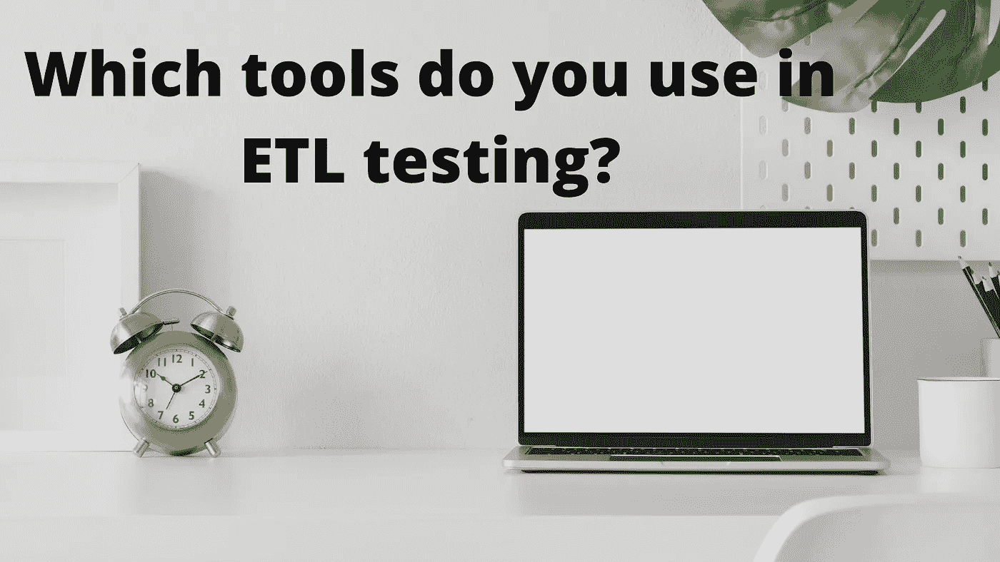
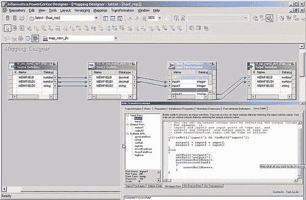

# 你在 ETL 测试中使用哪些工具？

> 原文：<https://blog.devgenius.io/which-tools-do-you-use-in-etl-testing-55fa15dce7ab?source=collection_archive---------12----------------------->

虽然软件测试工具有几种先进的 [ETL 测试工具](https://www.bloglovin.com/@shormistha/posts)，但是软件测试公司专门使用 **Informatica 数据验证**。**Informatica Data Validation**是著名的 [ETL 工具之一，](https://www.bloglovin.com/@shormistha/posts)集成了 PowerCenter Repository &集成服务。这个高级工具允许业务分析师和开发人员创建规则来测试映射的数据。

虽然不同的 ETL 测试方法容易出错，非常耗时，并且很少提供全面的测试覆盖。Informatica 数据验证选项提供了一个 ETL 测试工具，可以在生产环境和开发&测试中加速和自动化 ETL 测试，这意味着您可以在最短的时间内交付可重复的、完整的和可审计的测试覆盖，而不需要任何编程技能。自动化 ETL 测试减少了时间消耗，并有助于保持准确性。

**Informatica 数据验证的主要特性(** [**ETL 测试工具**](https://www.bloglovin.com/@shormistha/posts) **)** :

*   ***信息数据验证给出数据验证的完整结果以及数据完整性***
*   ***识别并防止数据问题，提高业务效率***
*   ***直观的用户界面和内置的操作符*** 最大限度地减少了编程工作量
*   ***有向导生成测试查询，不包含用户编写 SQL*** 的要求
*   ***更复杂的测试工具还提供了设计库&可重用的查询片段***
*   ***在分钟内分析几百万个数据行&列***
*   ***协助比较来自源文件&数据仓库和目标数据仓库*** 的数据
*   ***生成信息报告、更新和自动发送电子邮件结果。***
*   使用 Informatica 数据验证工具可以节省 50%到 90%的工作和成本。

自动化 ETL 测试允许在没有任何用户干预的情况下进行日常测试，也有助于支持在每个新版本发布后对旧代码进行自动回归测试。最终，这个复杂的工具将节省您的宝贵时间，您的用户将欣赏您的商业智能交付的质量。

***你可以关注我:***

*   **Dzone**:[https://dzone.com/users/3854036/shormistha.html](https://dzone.com/users/3854036/shormistha.html)
*   **Quora**:[https://www.quora.com/profile/Shormistha-Chatterjee](https://www.quora.com/profile/Shormistha-Chatterjee)
*   **博主**:[https://shormistha4.blogspot.com/](https://shormistha4.blogspot.com/)，[https://qaandsoftwareblog.blogspot.com/](https://qaandsoftwareblog.blogspot.com/)
*   **布洛格洛文**:[https://www.bloglovin.com/@shormistha](https://www.bloglovin.com/@shormistha)