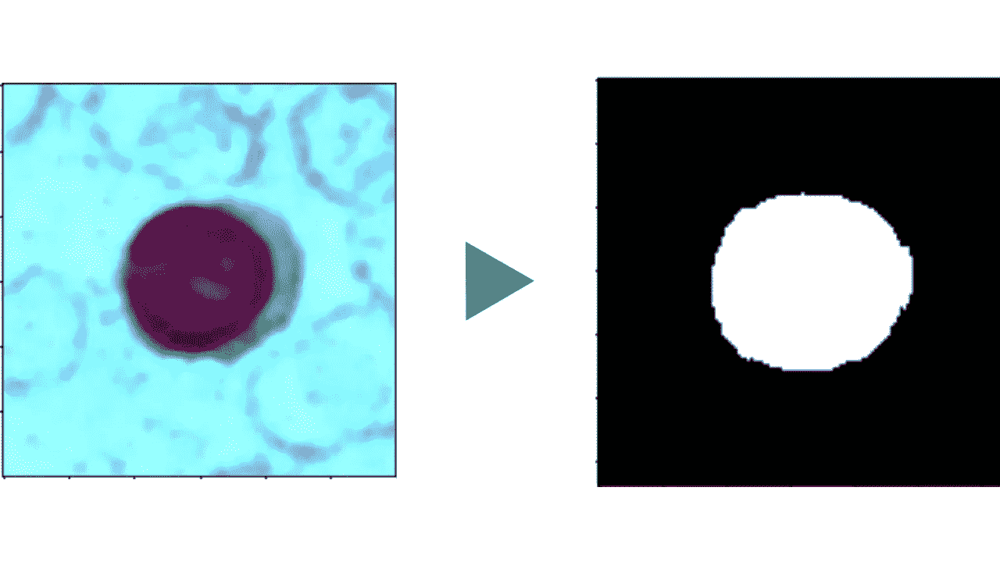
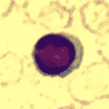
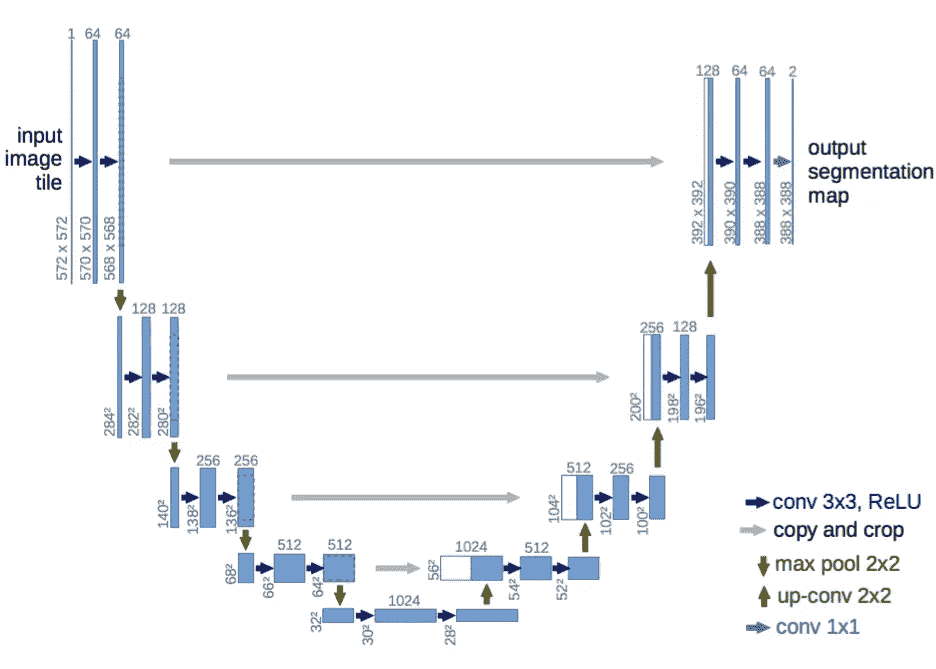
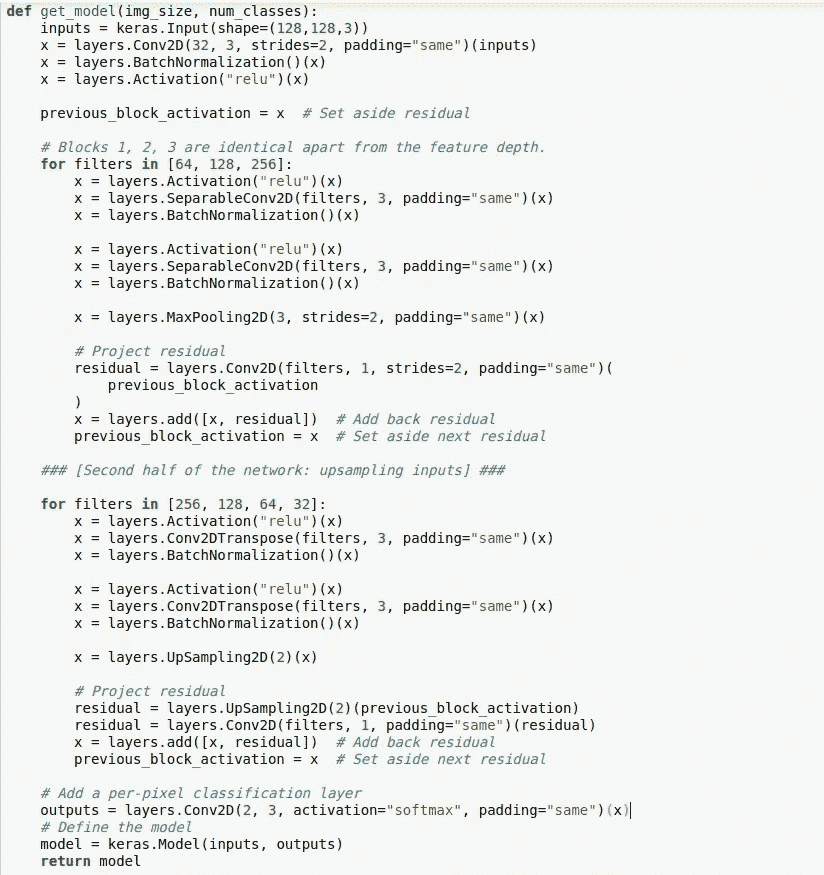
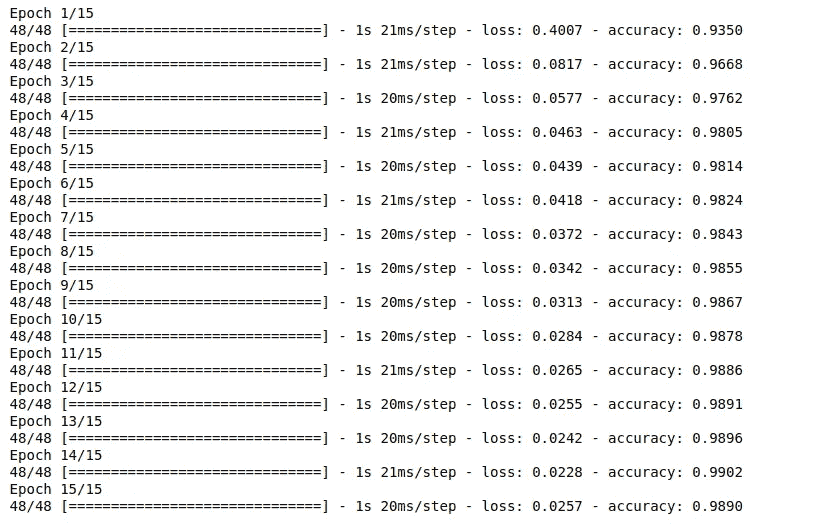
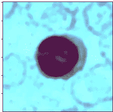
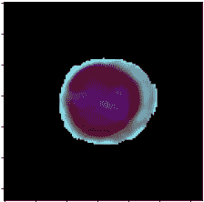

# 使用 Unet 的 Keras 白细胞分割

> 原文：<https://blog.devgenius.io/white-blood-cell-segmentation-with-keras-using-unet-7a81c6bd2f3b?source=collection_archive---------1----------------------->

通常，卷积神经网络和机器学习/深度学习已经在各种领域中实现。医学成像是最有趣的领域之一，因此我决定使用人工智能来解决显微图像中的细胞分割问题。

## 什么

请看下图——一张包含一堆细胞的显微镜载玻片，其中包括一个白细胞。如果一个人想要分析白细胞，他们首先必须弄清楚白细胞实际上是哪一个。如果让计算机对白细胞进行分析，你也必须做同样的事情。分离图像各部分的问题被称为**分割。**有多种方法可以做到这一点，但我执行了**语义分割**——将图像中的每个像素分配到一个类别。在这种情况下，分类是白细胞和非白细胞。为了更透彻地理解语义分割，我推荐阅读[这篇伟大的文章](https://towardsdatascience.com/understanding-semantic-segmentation-with-unet-6be4f42d4b47)。

## 怎么做

为了执行语义分割，我使用了一个名为 [Unet](https://arxiv.org/abs/1505.04597) 的流行模型，它是为像这样的医学图像分割而创建的，但后来也被用于许多其他类型的图像。你可以在这里阅读更多关于 Unet [的内容，但它基本上是使用一个 CNN 来生成图像的特征图，然后使用上采样层来输出最终图像，与输入图像的大小相同。](https://arxiv.org/abs/1505.04597)

Unet 架构

在我的 Unet 中， [Inception](https://towardsdatascience.com/a-simple-guide-to-the-versions-of-the-inception-network-7fc52b863202) 被用作‘主干’。下面是这个模型的代码。

我决定使用[这个](https://github.com/zxaoyou/segmentation_WBC#:~:text=WBC%20Image%20Dataset,evaluate%20cell%20image%20segmentation%20methods.&text=It%20contains%20three%20hundred%20120,color%20depth%20is%2024%20bits.)数据集，它包括图像和遮罩(我将其二进制化)，并将图像的大小调整为 128x128，以便与网络一起工作。经过 15 个纪元的训练，我能够达到令人印象深刻的 98%的准确率。

下面是我测试模型的图像，以及应用了模型生成的二进制蒙版后的图像。

正如你所看到的，它工作得很好！关于演示、完整代码和更多信息，请查看 Github 上的[项目。](https://github.com/zarif101/blood_cell_segmentation_unet)

## 结论

虽然这里的任务可以被认为是简单的，但它实际上对世界各地的医疗专业人员非常有帮助，尤其是在第三世界国家，他们可能需要更多一点的帮助。它还可以帮助不同的人工智能，因为分析程序更容易处理分割的图像，其中主要主题被清楚地呈现出来。通过利用数据集中的其他要素，可以进一步改进该模型。虽然我使用了二进制掩码，并且只有 2 个类，但数据集实际上提供了包括 3 个类的掩码——背景、细胞质和细胞核。总的来说，我认为很明显，细分只是人工智能如何应用于现实生活以真正帮助人们的另一个很好的例子。感谢阅读，继续创作！

在 Github 上看看这个项目的链接:【https://github.com/zarif101/blood_cell_segmentation_unet 

