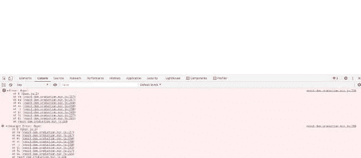

# 使用 REACT 2022 像专业人员一样处理错误

> 原文：<https://blog.devgenius.io/white-screen-of-death-in-react-c96672fa1b75?source=collection_archive---------11----------------------->

React 中处理错误的生命周期方法和途径

照片由[康纳·塞缪尔](https://unsplash.com/@csbphotography?utm_source=medium&utm_medium=referral)在 [Unsplash](https://unsplash.com?utm_source=medium&utm_medium=referral) 拍摄

任何使用过 react 的人都会遇到这样的情况:react 应用程序由于某种原因或错误而崩溃，并显示一个空白屏幕，也就是众所周知的死亡白屏，如果你是最终用户，你无法理解哪里出错了。

发生这种情况的主要原因是因为一些语法错误，我们推动了构建，例如试图映射一个对象，或者我们试图访问一个嵌套的对象，而该对象的键不可用。

通常，这是因为收到的 API 签名发生了一些变化，前端无法按预期呈现它。

仅仅显示空白屏幕并不是一种非常用户友好的显示错误的方式。

为此，我们有错误边界，到目前为止，我们在功能组件中没有错误边界，但是如果我们有一个生命周期为**componentiddcatch**和**getderivedstatefromrerror 的父级组件。**

这不仅有助于控制我们的应用程序在遇到错误时的显示方式，还有助于调度不同的操作，如路由和进行网络呼叫，以帮助跟踪错误并尽快找到解决方案。

简而言之，错误边界是 React 组件，**捕捉子组件树中任何地方的 JavaScript 错误，记录这些错误，并显示回退 UI** 而不是崩溃的组件树。

`**getDerivedStateFromError vs componentDidCatch**`

`**getDerivedStateFromError**` **配合服务器端渲染使用。** componentDidCatch 是一个提交阶段生命周期，但是服务器上没有提交阶段。getDerivedStateFromError 是一个呈现阶段生命周期，因此它可用于在服务器上启用错误处理。

**渲染阶段恢复更安全。**通过`componentDidCatch`进行错误恢复的故事有点滑稽，因为它依赖于出错组件下的所有内容的中间提交“null”。这可能会导致实现 componentDidMount 或 componentDidUpdate 的树中更高位置的任何组件内部出现后续错误，并假设它们的引用将为非空(因为它们总是处于非错误情况下)。

`**getDerivedStateFromError**` **不强制同步渲染**。因为来自提交阶段生命周期的状态更新总是同步的，并且因为 componentidcatch 是在提交阶段调用的，所以使用 componentidcatch 进行错误恢复并不是最佳选择，因为它会强制回退 UI 总是同步呈现。(无可否认，这不是一个大问题，因为错误恢复应该是一种边缘情况。)

如果出现错误，将首先调用错误边界的`getDerivedStateFromError()`方法(更新状态)，然后调用 render()方法(实际呈现回退 UI)，然后调用`componentDidCatch`(一旦回退 UI 被提交到 DOM)。

如果您的错误边界定义了其他生命周期方法(例如 componentWillUpdate、componentDidUpdate ),它们也会被调用，就像它们在任何其他渲染上一样。

希望这篇文章能给不断学习和努力的人一些新的启示。