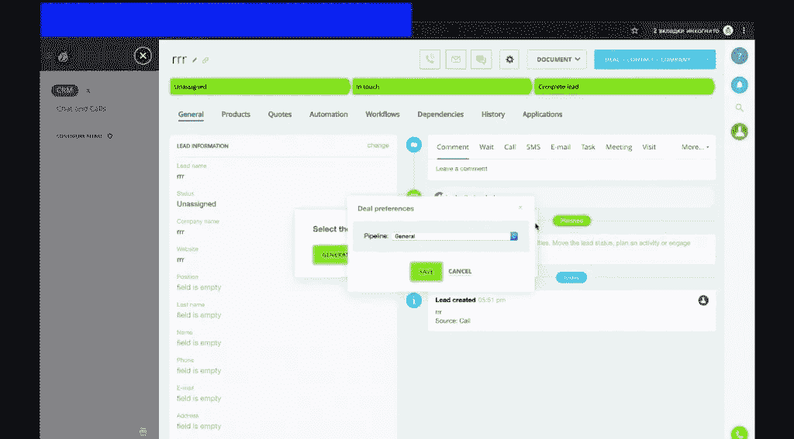

# 谁可以访问您的 CRM 上的内容？

> 原文：<https://blog.devgenius.io/who-can-access-what-on-your-crm-b9bc19444af6?source=collection_archive---------4----------------------->

顾名思义，你的客户关系管理系统是一个非常有效的管理工具。在 CRM 中，您可以监控企业内部的一切，从与客户的互动到员工的工作效率。本质上，像 [Bitrix24](https://it-sputnik.pro/) 这样令人垂涎的 CRM 系统的好处总结如下:

*   高效的时间管理
*   远程访问您的业务运营
*   流程自动化
*   改善客户体验
*   降低劳动力成本
*   团队成员之间的实时协作
*   客户保留

然而，如果您的业务流程运行顺利，并不是您团队的每个成员都可以不受限制地访问您的 CRM。此外，如果您的 CRM 数据的完整性不会受到损害，您需要检查您的 CRM 的用户数量。

从您的管理员到您的服务或销售团队，您的经理和业务主管，任何两类人都不应该对您的 CRM 有类似的访问权限。

每个员工对您的 CRM 的访问程度应该取决于他们的工作，因为他们的独特授权应该让他们能够舒适地工作。不多不少。还要记住，在你的客户关系管理中，与你的客户直接互动的团队成员应该得到优先考虑。毕竟这叫客户关系管理，你的客户应该是你在使用系统时最优先考虑的。

因此，在本图中，我们将向您展示如何主动授予不同的人不同级别的 CRM 访问权限。但是，这种集成只能在自托管的 Bitrix24 上实现。

1.  首先，我们导航到控制面板中“设置”下的“用户列表”。

2.导航至用户列表中的“Partner4 ”,您可以看到我们将他列入了“Partners with deals”部门。

3.接下来，我们导航到该组，并将他分配到“销售和营销”组。

4.在这种情况下，“partner4”将无法访问 Bitrix24 界面中的任何内容。

5.为了让 Partner4 访问 crm，我们导航到“内容”菜单中“文件和文件夹”下的“CRM”。

6.在“crm”下，我们从下拉菜单中选择“访问权限”。

7.在访问权限下，我们授予销售和营销组完全访问权限，然后保存更改。

8.保存更改后，Partner4 现在可以从 excel 导入销售线索，但他仍然无法创建新交易。

9.此外，Partner4 无法转换销售线索，因为即使他尝试，也不会反映出变化。

10.为了解决上面 8 和 9 中的问题，我们回到控制面板中的文件和文件夹。然后，我们选择 Bitrix，然后选择“管理”下的“访问权限”,以授予 Partner4 完全访问权限。之后，保存。

11.仍然在 Bitrix 下，我们导航到“组件”，然后选择 Bitrix(在组件下)。在 Bitrix 下，我们导航到销售和营销，然后在保存更改前授予完全访问权限。

12.回到 Bitrix24 主页，Partner4 现在可以创建新的销售线索，并将其转化为交易。

13.此外，为了让不同类型的合作伙伴访问 CRM 功能，我们从主页导航到“设置”。接下来，我们单击权限，然后单击角色。

14.在这些角色下，有不同类别的合作伙伴，从没有交易权限的合作伙伴到有交易权限的合作伙伴。

15.为了配置“无权访问交易的合作伙伴”的设置，我们授予个人对联系人、公司和销售线索、我们的访问权限，但无权访问交易。然后我们拯救。

16.为了配置“具有交易访问权限的合作伙伴”，我们为联系人、公司、销售线索和交易的每个部分提供个人访问权限。

17.对于不同的部门，我们可以通过单击“添加访问权限”来创建完全唯一的访问权限。

18.接下来，我们选择“部门”，然后选择“从结构中选择”。之后，我们在 Partners: NO deals 下勾选“所有部门员工”,然后选择。

19.在上面第 14 个 CRM 角色下，我们选择无权参与交易的合作伙伴。

20.对于“有交易的合作伙伴”，我们的选择与 18 中的类似，但这次是“有交易的合作伙伴”结构。

21.现在，我们有不同的合作伙伴有不同的访问权限。

你希望给你的团队成员多少访问 CRM 的权限？

[今天就让我们知道](http://it-sputnik.pro/new/contacts/)！

[今天联系我们](https://it-sputnik.pro/new/contacts)！

邮箱:[导演@it-sputnik.pro](mailto:director@it-sputnik.pro)

网址: [www.it-sputnik.pro](http://www.it-sputnik.pro/)

www.facebook.com/Itsputnik.bitrix24 页面:[脸书](https://www.facebook.com/Itsputnik.bitrix24)

YouTube 频道:[www.youtube.com/channel/UCXf8483CbMOiB2RT0uld2iA](https://www.youtube.com/channel/UCXf8483CbMOiB2RT0uld2iA)

领英简介:[https://www.linkedin.com/company/69762422/](https://www.linkedin.com/company/69762422/admin/)