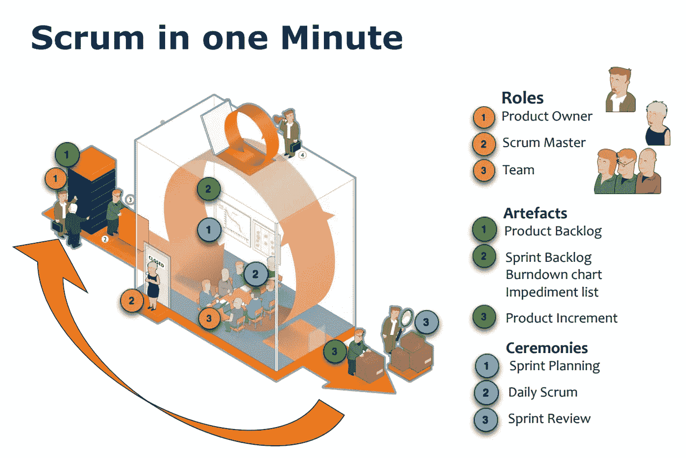

# 整个 SCRUM 在 5 分钟内完成。

> 原文：<https://blog.devgenius.io/whole-scrum-in-5-minutes-4b3883cf1c01?source=collection_archive---------7----------------------->

## 因为少即是多，这里没有一个无用的词。

# 角色

## Scrum 团队

*   该团队是跨职能的团队，由 5-9 人组成
*   团队中没有**设定的项目角色**
*   团队定义任务和分配
*   团队是**自组织**和自我管理的
*   维护 Sprint 积压工作
*   进行冲刺评审

## 产品所有者(PO)

*   负责**产品成功** ✅
*   定义所有产品**特性**
*   负责**优先考虑**产品特性
*   维护产品积压
*   确保团队致力于**最有价值的功能**🥇

## Scrum 大师(SM)

*   举行每日 **15 分钟**团队会议(每日讨论)
*   移除**障碍** 🪨
*   保护团队不受外界干扰🛡️
*   维护 Sprint 燃尽图
*   在冲刺结束时进行冲刺回顾
*   促进者不是管理者吗

 [## 在东欧创建远程团队的完整指南。

### 时局艰难。预算将被冻结，远程是新的黑色。

medium.com](https://medium.com/code-store/it-departments-a-complete-guide-to-creating-a-remote-team-in-eastern-europe-e27adc74439a) 

# 史前古器物

## 产品积压— (PB)

*   **所有**期望产品特性列表
*   列表可以包含**bug**和非功能性项目🐜
*   产品负责人负责**优先**
*   任何人都可以随时添加物品
*   每个项目都应该分配一个**业务值**💸
*   由产品所有者维护

## 冲刺积压— (SB)

*   Sprint 的待办事项列表(也称为待办事项)📝
*   由 Scrum 团队创建
*   产品所有者已将**定义为最高优先级**

## 燃尽图—(公元前)

*   显示冲刺阶段剩余工作量的图表
*   以剩余小时**计算⏰**
*   由 Scrum Master **每日维护**

## 发布积压—(经常预算)

*   与产品积压相同。可能涉及一个或多个 sprints，具体取决于确定的发布日期🚀

# 会议

## 冲刺规划—第 1 天/上半年

*   在会议之前**准备好产品积压**
*   前半部分—团队选择提交到**完成**的项目
*   在实际冲刺阶段，会对 PB 进行额外的讨论

## 冲刺规划—第一天/下半年

*   发生在上半场结束后— **PO** 可供提问
*   团队全权负责决定**如何构建**👷
*   创建/分配的任务— **产生的冲刺积压**

## 每日混战

*   每天举行**冲刺期间**
*   **持续 15 分钟**⏱️
*   团队成员相互汇报，而不是 Scrum Master
*   在会议期间问 **3 个问题**
*   "自从上次每日混战以来，你**做了什么**？"
*   "在下一次每日混战之前，你会做什么**？"**
*   **"哪些障碍阻碍了你的工作？"**
*   **团队成员同步工作的机会**

## **冲刺回顾**

*   **团队将“完成”代码提交给 **PO** 和利益相关者**
*   **未“完成”的功能**未显示**🙈**
*   **生成的反馈— **按钮**可能会重新调整优先级**
*   ****Scrum Master** 设置下一次冲刺评审**

## **冲刺回顾**

*   **出席人员— **SM** 和**团队**。采购订单是可选的**
*   **问题—哪些进展顺利，哪些**可以改进**？📈**
*   **SM 帮助团队发现— **不提供答案****

** [## 如何应对“来自地狱的客户”

### (优柔寡断、怪人、梦想家、糟糕的付款人——如何应对他们中的每一个人)

medium.com](https://medium.com/@maximetopolov/how-to-deal-with-clients-from-hell-63b607da7adc) 

# 判断

## 用户故事

*   客户希望系统做什么的非常高层次的定义。
*   每个故事都被捕获为产品待办事项中的一个单独的项目
*   用户故事**不依赖于其他故事**
*   故事模板:"作为一个 **<用户** >我想要 **<功能>** 以便 **<想要的结果>**
*   故事**举例**:作为用户，我想打印一份菜谱，这样我就可以做菜了。

## 故事要点

*   最初**评估**预期开发工作水平的简单方法
*   故事点是特征难度的一个**相对度量**
*   通常按 1-10 分制评分。1 =非常容易到 10 =非常困难
*   例如:“发送给朋友”故事点数= 2，但“购物车”故事点数= 9

## 商业价值

*   **产品待办事项中的每个用户故事**都应该被赋予相应的商业价值。
*   通常分配(L，M，H)低、中、高
*   PO 根据**最高值**对积压项目进行优先级排序

## 团队能力

*   能力= #队友 x(生产小时数 x 冲刺天数)
*   例如:团队规模为 4 人，生产时间为 5 小时，冲刺时间为 30 天。
    产能= 4 x (5 x30) = 600 小时
*   注意:冲刺阶段要考虑**休假**时间！

## 速度

*   团队在单次冲刺中把项目转化为“完成”的速度——通常用故事点来计算。

 [## 如何正确估算项目时间？

### 一个完整的，一步一步的指南，估计在 10%的误差范围内。

medium.com](https://medium.com/@maximetopolov/how-to-correctly-estimate-time-for-a-project-a2add63f030b) 

# 工具

## 任务板

*   包含团队冲刺目标、待办事项、任务、正在进行的任务、“已完成”项目和每日冲刺消耗图的白板。
*   Scrum 会议最好在任务板周围召开
*   ****人人可见****

** [## 你必须奖励错过的截止日期，或者激励是如何真正发挥作用的。

### 作为经理，当团队成员错过截止日期时，你会怎么做？

medium.com](https://medium.com/@maximetopolov/you-must-reward-missed-deadlines-or-how-motivation-really-works-dbe14366e32d) 

# 术语表

*   **时间框** —完成一项任务的一段时间。结束日期已设定，不能更改
*   **胆小鬼**——不致力于项目并且不对可交付成果负责的人🐔
*   猪——负责项目成功的人🐖
*   **单扭颈** —这就是产品负责人！

 [## 如何在 18 个月内将一个开发机构从 0 美元发展到 250 万美元？

### 我会透露所有的细节和数字。你会学到时间、运气和人脉的重要性。

medium.com](https://medium.com/@maximetopolov/how-to-grow-a-development-agency-from-0-to-2-5m-in-18-months-bd41d1a89e9d) 

# 常见问题解答

*   谁决定何时发布？在任何给定的冲刺阶段结束时，采购订单可以启动发布。
*   谁负责管理团队？团队负责管理自己。
*   **一个任务的时长是多少？**任务耗时不应超过 16 小时。如果时间更长，那么任务应该进一步分解。
*   谁来管理障碍？Scrum Master 是主要的责任。然而，团队必须学会解决他们自己的问题。如果不能，则上报给 SM。
*   Scrum 中最大的两个挑战是什么？团队不能自我管理，Scrum 大师不能领导。

****