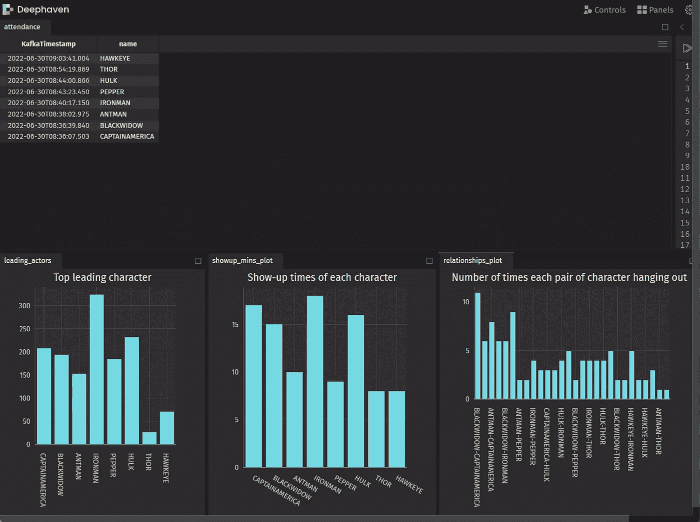

# 谁是谁？:实时人脸识别

> 原文：<https://blog.devgenius.io/whos-who-real-time-face-recognition-241c7b69cff3?source=collection_archive---------12----------------------->

## 如何将图像流导入 Deephaven IDE

杰里迈亚·程


面部识别技术是一个强大的工具——计算机视觉可以通过扫描一个人的面部来识别他。每当你的手机识别朋友来帮助你整理照片时，或者如果你需要面部扫描来进入你的绝密实验室时，你都会遇到这种情况。更严重的是，面部识别技术为执法和监控专家提供了重要的用途。我们会把这个留给专业人士。

在这篇博客中，我使用 Deephaven 强大的实时分析工具，在电影*复仇者联盟 4：终局之战*中实时实现了面部识别。我们将向您展示如何轻松地将数据吸收到一个平台中，在这个平台上，您可以即时操作、分析和学习这些数据。

下面是我们如何做到的，通过三个简单的步骤:

1.  建立一个卡夫卡流。为此我们喜欢[小熊猫](https://redpanda.com/)。
2.  创建主题。
3.  运行面部识别脚本。

这是一个有趣的例子，但我的工作流可以应用于许多其他用例。我将带您了解设置[面部识别](https://en.wikipedia.org/wiki/Facial_recognition_system)机制以及通过 [Redpanda](https://redpanda.com/) 将图像流数据导入 Deephaven 的过程。请继续关注其他详细介绍在 Deephaven IDE 中分析图像数据的步骤的文章。

# 认识复仇者联盟

在这个演示中，我面对着电影《复仇者联盟》的网络摄像头。我们可以看到，随着电影的播放，所有的角色都被打上了标记。在我的 Deephaven 会话中，在左上角，一个流表记录了所有角色第一次出场的出席情况。在左下方，有三个图表:

1.  `Top leading character`比较所有主要角色的总出场次数。
2.  `Show-up times of each character`显示每个角色的总出现时间(以分钟为单位)。
3.  `Number of times each pair of characters hanging out`追踪哪些角色比其他角色更频繁地出现在一起。在这里，我基本上是在追踪人物之间的关系。



下面，我给出了关于我是如何做到这一点的一般细节，并为您提供了根据自己的目的定制代码的指导。

# 计算机视觉和面部识别[](https://docs-staging.deephaven.io/deploy-preview/0174c2e6ed28c96bd088cb08b56153d4345f7d09/blog/2022/07/05/real-time-face-recognition/#computer-vision-and-facial-recognition)

现在，我将带您完成设置一个程序的步骤，该程序检测电影中的角色，然后输出这些角色的名字以及他们出现在屏幕上的时间。

为了训练人脸识别模型，我们需要建立一个人脸数据库，其中包含我们想要识别的所有角色的人脸/图像。有很多方法可以做到这一点——在这里，我们只是从互联网上抓取所有角色的图像。

一旦图像数据库准备好，使用[人脸识别](https://face-recognition.readthedocs.io/en/latest/face_recognition.html)和 [Open_CV](https://pypi.org/project/opencv-python/) 软件包开发算法。

示例代码如下所示:

```
cap = cv2.VideoCapture(0)
name_re=set()
while True:
    """capture the pics from webcam, doing face encoding, face detection and face comparion, return the most matched face name
    draw rectangle around all the faces, and all the information"""
    degree=0.25
    ret, img = cap.read()
    # resize the image tp 0.25 of the orginal one ## make it faster
    imgS = cv2.resize(img,(0,0),None,degree,degree)
    imgS = cv2.cvtColor(imgS, cv2.COLOR_BGR2RGB)
    # find the face location in the resized image
    facesCurFrame = face_recognition.face_locations(imgS)
    # encoding the img
    encodesCurFrame = face_recognition.face_encodings(imgS,facesCurFrame)
```

`facesCurFrame = face_recognition.face_locations(imgS)`在网络摄像头捕捉到图像后运行。它实现了一个训练有素的 HOG 算法，该算法测量图像局部的梯度方向，以检测人脸的形状。

下一步是对从图像中检测到的每张脸进行编码，并将其翻译成计算机可读的语言。我们使用深度学习模型为每张脸生成 128 个独特的测量值。`face_recognition.face_encodings()`做所有的重活。

一旦图像经过处理，我们需要在数据库中找到最相似的一个。我们使用[余弦距离](https://en.wikipedia.org/wiki/Cosine_similarity)来计算来自网络摄像头(或电影)的人脸之间的距离！)与我们数据库中的人脸进行比较，然后输出距离最小的人脸的名称。到最后，我们应该有一个数据流，包括第一次出现的时间和角色的名字。

```
for encode_Face,face_Loc in zip(encodesCurFrame,facesCurFrame):
    matches = face_recognition.compare_faces(encodeListKnown,encode_Face)
    faceDis = face_recognition.face_distance(encodeListKnown,encode_Face)
    print(faceDis)
    matchIndex = np.argmin(faceDis)
    if faceDis[matchIndex]<0.5:
        name = person_name[matchIndex].upper()
    else:
        name=re.sub(r'[^a-zA-Z]', '', name)
```

# 使用 Redpanda [](https://docs-staging.deephaven.io/deploy-preview/0174c2e6ed28c96bd088cb08b56153d4345f7d09/blog/2022/07/05/real-time-face-recognition/#set-up-a-kafka-stream-using-redpanda)设置 Kafka 流

实时数据存储和访问在这里成为一个问题。我们如何存储数据以便于访问？而且，不同的数据流如何分别存储，新数据进来时，表如何自动刷新？

## 卡夫卡[](https://docs-staging.deephaven.io/deploy-preview/0174c2e6ed28c96bd088cb08b56153d4345f7d09/blog/2022/07/05/real-time-face-recognition/#kafka)

卡夫卡满足了我们所有的需求。 [Kafka](https://kafka.apache.org/) 可以将不同的数据存储到单独的主题中。有了主题名和键值，我们可以轻松地实时发布和消费数据。Redpanda，一个基于 Kafka 构建的服务器，结合 Deephaven 是一个强大的工具。

要启动服务器，请运行以下代码:

```
*git* clone https://github.com/deephaven-examples/cv_stream.git
cd cv_stream
*docker-compose* up -d
```

这为 Redpanda 和 Deephaven 构建了容器。要访问该流并体验 Deephaven 的所有分析工具，请导航到[http://localhost:10000/ide](http://localhost:10000/ide)。

# 创建主题[](https://docs-staging.deephaven.io/deploy-preview/0174c2e6ed28c96bd088cb08b56153d4345f7d09/blog/2022/07/05/real-time-face-recognition/#create-topics)

服务器启动后，我们需要为要生成和消费的数据创建主题。什么都可以，但是我们选择了“角色出席”和“角色关系”。运行:

```
*docker* exec -it redpanda-1 rpk topic create character_attendance --brokers=localhost:9092
*docker* exec -it redpanda-1 rpk topic create character_relation --brokers=localhost:9092
```

要检查现有主题，请运行:

```
*docker* exec -it redpanda-1 rpk cluster info
```

# 运行人脸识别脚本[](https://docs-staging.deephaven.io/deploy-preview/0174c2e6ed28c96bd088cb08b56153d4345f7d09/blog/2022/07/05/real-time-face-recognition/#run-the-face-recognition-script)

现在你已经知道面部识别模型是如何工作的了，下面是你可以自己尝试的完整脚本。

要运行这个脚本，首先在本地机器上安装`Kafka-python`、`face_recognition`和`opencv-pyth`，并使用一个简单的`pip install`:

```
pip *install* Kafka-python face_recognition opencv-python
```

然后:

```
# this python file analyzes the stream data
# all the packages used for the project
import re
import cv2
import numpy as np
import face_recognition
import os
from datetime import datetime
from kafka import KafkaProducer
import json
#from confluent_kafka import Producer
topic_name1 = 'character_relation'
topic_name2="character_attendance"
def json_serializer(data):
    return json.dumps(data).encode("utf-8")
producer=KafkaProducer(bootstrap_servers=["localhost:9092"],value_serializer=json_serializer)
person_name=[]
images=[]
# loop through the images, and processing
for pic in os.listdir("images"):
    if pic.endswith("png") or pic.endswith("jpg"):
        img=cv2.imread("images/{}".format(pic))
        name=os.path.splitext(pic)[0]
        images.append(img)
        person_name.append(name)
print(person_name)
def encoding(images):
    """encoding the all the images, and find the 128 measurements for the face"""
    images_encoding=[]
    #loop all the images
    for image in images:
        try:
            img=cv2.cvtColor(image,cv2.COLOR_BGR2RGB)
            encode = face_recognition.face_encodings(img)[0]
            images_encoding.append(encode)
        except:
            pass
    return images_encoding
encodeListKnown = encoding(images)
print('Encoding Complete')
# record the pic got by webcam
cap = cv2.VideoCapture(0)
name_re=set()
while True:
    """capture the pics from webcam, doing face encoding, face detection and face comparion, return the most matched face name
    draw rectangle around all the faces, and all the information"""
    degree=0.25
    ret, img = cap.read()
    # resize the image tp 0.25 of the orginal one ## make it faster
    imgS = cv2.resize(img,(0,0),None,degree,degree)
    imgS = cv2.cvtColor(imgS, cv2.COLOR_BGR2RGB)
    # find the face location in the resized image
    facesCurFrame = face_recognition.face_locations(imgS)
    # encoding the img
    encodesCurFrame = face_recognition.face_encodings(imgS,facesCurFrame)
    format= cv2.FONT_HERSHEY_COMPLEX
    for encode_Face,face_Loc in zip(encodesCurFrame,facesCurFrame):
        matches = face_recognition.compare_faces(encodeListKnown,encode_Face)
        faceDis = face_recognition.face_distance(encodeListKnown,encode_Face)
        print(faceDis)
        matchIndex = np.argmin(faceDis)
        if faceDis[matchIndex]<0.5:
            name = person_name[matchIndex].upper()
            name=re.sub(r'[^a-zA-Z]', '', name)
            y1,x2,y2,x1 = face_Loc
            # scale back the location
            #scale_back=1/degree
            y1, x2, y2, x1 = y1*4,x2*4,y2*4,x1*4
            # draw rectangle on the image
            cv2.rectangle(img,(x1,y1),(x2,y2),(0,255,0),2)
            cv2.putText(img,name,(x1+6,y2-6),format,1,(255,255,255),2)
            json_dic={"name":name}
            print(json_dic)
            producer.send(topic_name1, json_dic)
            print("yes")
            if name not in name_re:
                name_re.add(name)
                producer.send(topic_name2, json_dic)
    cv2.imshow('Webcam',img)
    if cv2.waitKey(20) & 0xFF == ord('q'):
        break
cap.release()
cv2.destroyAllWindows()
```

`producer=KafkaProducer(bootstrap_servers=["localhost:9092"],value_serializer=json_serializer`帮助建立与本地服务器的连接，这样数据就可以存储在本地，供 Redpanda 以后访问。

`producer.send(topic_name, json_dic)`数据流生成后，将数据发送到服务器。

# 试试看[](https://docs-staging.deephaven.io/deploy-preview/0174c2e6ed28c96bd088cb08b56153d4345f7d09/blog/2022/07/05/real-time-face-recognition/#try-it-out)

如果你用这个项目和博客帖子作为与 Deephaven 合作的基线，我们很乐意听到它。让我们知道你在我们的 [Github 讨论](https://github.com/deephaven/deephaven-core/discussions)或我们的 [Slack 社区](https://deephaven.io/slack)中提出了什么。

[](https://github.com/deephaven-examples/cv_stream) [## GitHub-deephaven-examples/cv _ stream:使用 OpenCV 和 deep haven 结合实时计算机…

### 通过 Redpanda/Kafka 将本地出勤或关系数据拉入 Deephaven。Redpanda 是一个开源的…

github.com](https://github.com/deephaven-examples/cv_stream)