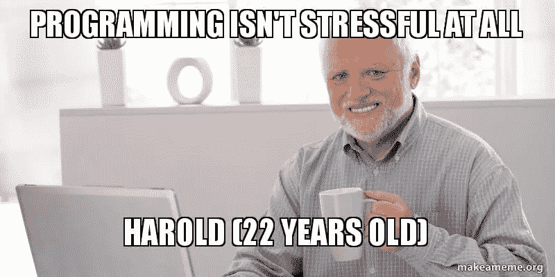
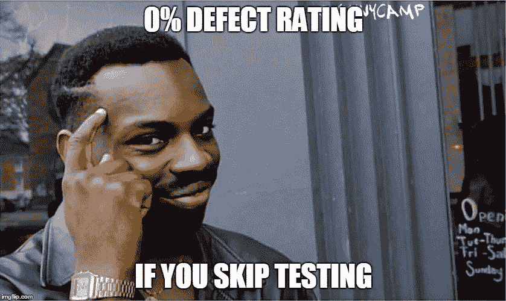
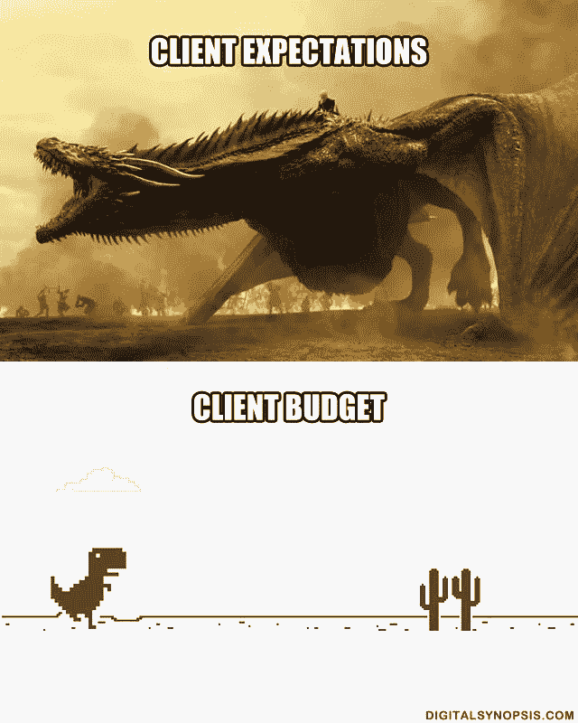

# 为什么敏捷可以让你成为更好的开发人员

> 原文：<https://blog.devgenius.io/why-agile-can-make-you-a-better-developer-b6e8ad9f63a4?source=collection_archive---------22----------------------->

让我们从开发者的角度来分析敏捷软件开发

[天一马](https://unsplash.com/@tma)在 [Unsplash](https://unsplash.com/) 上拍照

## 敏捷为何诞生

为了充分理解一种方法，理解它为什么被创造是很重要的。想象一下，作为一名开发人员，你的经理要求你和你的团队去会议室见他。在这个会议中，你的老板基本上是说你必须使用别人做的软件设计来实现一个产品。所以你不会抱怨并开始开发，因为时间表很严格，没有时间可以浪费。

图片来自 makeameme.org

当截止日期越来越近时，你意识到不完成所有事情的风险很高，但是客户要求一组功能，而你必须完成所有的功能，所以压力增加了。在这种情况下，您要求您的经理推迟发布日期，以便给团队一些额外的时间，因此在发布前几周，涉众被告知计划日期可能会有一些小问题。他们可以公平地问*“为什么你不在分析或设计阶段告诉我们这些？”。*

在几个周末的额外时间之后，产品实现就准备好了(*类似于*)。鉴于没有更多的时间，经理要求跳过测试阶段。

图片来自互联网

所以最终产品交付了。不幸的是，没有什么值得庆祝的，因为客户开始使用产品，缺陷列表开始增长。利益相关者不高兴，因为我们要求他们更多的时间，我们给他们一个充满错误的软件，他们有一个点，不是吗？管理层对产品团队非常愤怒，因为…你怎么敢运送一个全是垃圾的产品。最终，你也会不高兴，因为你知道你将不得不花很多额外的时间来修复所有这些错误。这是过去一千年中软件项目的一般情况。出了问题，出现了对更轻量级过程的需求。

因此，在 2001 年 2 月，17 名软件专家在雪鸟(犹他州)会面，讨论软件开发的现状。会议的名称是“轻量级过程峰会”。这份宣言是那次会议的成果:

*   过程和工具之上的个人和交互；
*   综合文档之上的工作软件；
*   合同谈判中的客户协作；
*   响应变化而不是遵循计划。

他们将这些理想称为 [**敏捷软件开发**](https://agilemanifesto.org/) 。

## 但是我为什么要领养呢？

我知道改变工作方法，或者部分改变工作方法，并不容易，你应该有一些好的理由来这样做。如果介绍中的故事似乎与你的情况相去甚远，如果你的代码有一个可管理的技术债务，你、你的公司和你的客户对产品都很满意，我的建议是不要改变任何东西。你已经拥有了敏捷试图创造的东西:好的、有效的产品！如果你对上述问题中的一个回答是否定的，你至少有一个改变的理由😉。

## 酷，但实际上呢？

正如我所说，敏捷软件开发是一套想法，但是我们开发人员是行动的人，所以让我们看看敏捷在实践中意味着什么。

图片来自 digitalsynopsis.com

客户总是期待一个好的、便宜的、快速的和完成的产品。坦白地说，我们知道，不幸的是，我们不能同时满足所有这些请求，所以这就是敏捷可以帮助的地方:这种方法在定义的时间内递归地产生真实的数据(又名*迭代)*。每一次迭代的输出都有助于我们得到一个**好的、便宜的、快速的、尽可能多完成的产品**。
总有这样的可能性，一些经理会要求你或你的团队更快地发布软件，跳过结对编程，避免重构、代码审查或编写测试，尽可能快地开发和发布。当有人让我这么做时，我喜欢引用罗伯特·马丁(又名鲍勃叔叔)的一句名言:

> 走得快唯一的方法就是走得好

我个人分享这句话的每一个字。我喜欢敏捷的另一点是，要做好它，我们应该首先考虑质量。事实上，manifesto 本身与一些旨在提高软件质量的技术实践有关:

[NESA 摄制作者](https://unsplash.com/@nesabymakers?utm_source=unsplash&utm_medium=referral&utm_content=creditCopyText)在 [Unsplash](https://unsplash.com/s/photos/software?utm_source=unsplash&utm_medium=referral&utm_content=creditCopyText)

*   过程和工具上的个体和交互 **→** 结对编程、可持续的步调、集体代码所有权
*   在全面的文档基础上开发软件→测试驱动开发、持续集成、简单设计、重构(我认识一个人，他写了一篇关于这个主题的好文章😁)
*   合同谈判中的客户协作→频繁发布、验收测试
*   响应变更而不是遵循计划→频繁发布、重构、测试驱动开发

这就是敏捷能让你成为更好的开发人员的原因，因为它帮助你建立一个面向产品质量的规程。此外，它与一些非常有用的技术实践密切相关。如果你不相信我，你可以自己试试，最坏的情况是你学到了新的东西，这从来都不是一件坏事。

## 结论

理解敏捷相当容易，宣言和 12 条[原则](https://agilemanifesto.org/principles.html)相当简单，但是敏捷完全是另一种努力。变得敏捷包括重新审视文化、思维、组织、客户关系和为公司工作的方式。为了做好这件事，有时你需要敏捷教练的帮助。在这篇文章中，我主要关注开发人员的前景，但是正如我所说的，敏捷不仅仅是这样。
如果我激起了你对这个话题的好奇心(我希望我这么做了)，并且你想知道更多，我可以推荐一本从一开始就接近敏捷的人写的书:Robert Martin，这本书是*[*干净敏捷*](https://www.oreilly.com/library/view/clean-agile-back/9780135782002/) 。*

*如果你知道更好的技术实践或者你想给我一个建议，请评论这篇文章，反馈总是受欢迎的👍。*

*感谢您的阅读！我希望这是有用的，如果你喜欢这篇文章，请随意分享👋*

* [## 《务实的程序员》一书中的 5 条经验

### 工程师和开发人员“必读书目”中的一些建议

medium.com](https://medium.com/dev-genius/5-lessons-from-the-book-the-pragmatic-programmer-b4549408880f)  [## 每个开发人员都应该阅读马丁·福勒的《重构》的 3 个理由

### 欢迎任何反馈😊

danilo-raspa.medium.com](https://danilo-raspa.medium.com/3-reasons-why-every-developer-should-read-refactoring-by-martin-fowler-8051dc39d9f3)*