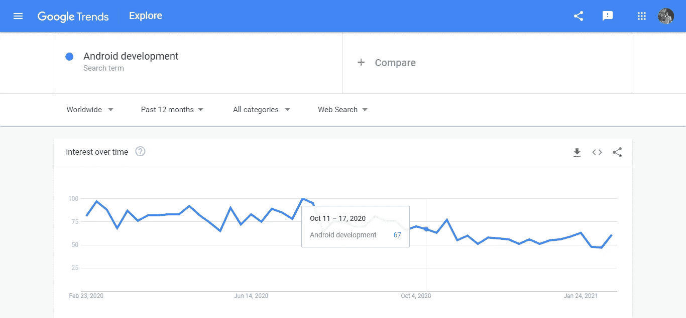

# 为什么 Java 总是 Android 开发者的首选？

> 原文：<https://blog.devgenius.io/why-always-java-be-the-first-choice-for-android-developers-9e6c15154c34?source=collection_archive---------7----------------------->

让我们来谈谈为什么在 android 开发中 java 获得第一优先，为什么 android 开发者选择 Java 作为 app 开发的第一语言。在这个技术时代，每一个人或公司都在发展自己的业务，当谈到在线业务增长时，最好的答案是构建自己的应用程序。

因此，正因为如此，Android 的发展受益匪浅。

让我们用谷歌趋势来看看这个证据。

开发语言还具有一些其他优势，但随着公司提到对你的商业应用有益的空前喜爱的开发语言，并且通常比其他语言更受青睐。JAVA 还以其全面的工具而闻名，该工具具有各种不同语言(如 C、C++)的全部功能和概念，它的得分几乎超过了所有其他语言。

# 让我们来看看 java 语言的一些优势。

卡斯帕·卡米尔·鲁宾在 [Unsplash](https://unsplash.com?utm_source=medium&utm_medium=referral) 上的照片

## 使用 OOPs 概念。

使用 JavaJava 进行应用程序开发的首要优势是，JavaJava 支持 OOPS(面向对象编程)概念，并且更有竞争力，因为它们具有可伸缩性、可扩展性和灵活性。

## 独立于平台。

独立于平台的特性在其他开发语言中并不常见。因此，它在真正意义上补充了“一次编写，随处运行”的口号，因为它为许多新的开发打开了大门。

## Java 社区支持。

JAVA 作为一个社区支持所有程序员的创造力和解决问题的能力。说到开发，从经验中给出和接受关于 Java 应用程序开发的建议真的是一种幸福，而且也是免费的。有助于为拥有最大和最丰富社区的开发者建立一个巨大的网络。

## 流行

Android 智能手机现在很容易从市场上买到。这就是你的想法，将 execution 作为一个创新的移动应用程序，对重要用户非常有用，可以提高成功率。

## 低投入高回报

我们需要的只是投资回报，而这有可能通过执行移动应用的成功率来实现。一家支持您所有需求的 Java 应用程序开发公司有可能实现低投资和高性能。

# 结论

Java 是开发任何优秀的商业移动应用程序最常用的编程语言之一。对于企业家和大型企业来说，它可以提供最适合用户的应用程序。