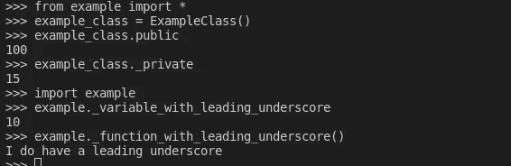

# 为什么我在 Python 代码中处处看到 _ 呢？

> 原文：<https://blog.devgenius.io/why-am-i-seeing-everywhere-in-python-code-92bf0fa93b9c?source=collection_archive---------3----------------------->

真的吗？！我不可能是唯一一个一开始就有这个问题的人！

图片由 [unsplash](https://unsplash.com/) 的 [Fernando Hernandez](https://unsplash.com/@_ferh97) 拍摄

答在 *Python* 开发部门工作了一段时间后，我注意到*下划线*被用在了很多我不知道的地方，在一家有很多人可以学习的公司工作。

自然，这让我既好奇又有点恼火，为什么我不理解一个简单的字符在 Python 编程语言中的全部潜力。

尽管这在这门语言中是一个相当简单的主题，但作为我这种类型的人，我不能完全满意，直到我经历了许多用法，对它们做了更多的研究，甚至亲自使用它们中的每一个。

就这样，当我追求我所需要的知识，并且在每天的代码中舒适地使用这些知识时，开始了另一条曲折的研究、调查和娱乐之路。

在这篇文章中，我将回顾一下在我的研究中发现的 *Python 代码*中下划线的不同用法，其中一些广为人知，而另一些则不那么广为人知。

W 当我们仔细研究如何使用*下划线*时，我们通常可以将其分成三个独立的部分:*命名、解释器、*和*有用的开发技巧。*

在你的日常代码中，这些都非常有用，可以帮助你更有效地编写干净的代码。

# 命名

*下划线*在 *Python、*中有多种用法，但是当看它如何用于命名时，有五种主要用法值得一提。

1.  [蛇案命名约定](https://en.wikipedia.org/wiki/Snake_case)。
2.  单前导下划线。
3.  单后下划线。
4.  双前导下划线。
5.  双前导和后置下划线。

## *蛇案命名惯例*

当我们提到 *snake case 命名约定*时，我们指的是在名称中使用下划线分隔单词的方式，这是根据 [PEP-8](https://www.python.org/dev/peps/pep-0008/#:~:text=module%20non%2Dpublic%22).-,Function%20and%20Variable%20Names,prevailing%20style%20(e.g.%20threading.py)%2C%20to%20retain%20backwards%20compatibility.,-Function%20and%20Method) 编写干净、漂亮的 *Python* 代码的函数和变量名的推荐命名约定。

## *单前导下划线*

当我们在变量、函数或方法名称前使用一个*前导下划线*时，是为了向开发人员表明它仅供类内部使用。

这样做的目的是将它视为非公共的，这意味着如果从一个使用*星号*、*的模块导入，所有以*前导下划线*开头的名字都不会被导入*。*

例如，如果我们将这些函数和变量保存在一个名为 *example.py* 的脚本中，并且我们试图导入它并访问变量和函数，那么我们将无法访问那些带有*前导下划线的变量和函数。*

然而，考虑到 *Python* 并不真正支持*私有*变量和方法，如果我们像下面这样直接从模块中调用它们，那么我们可以访问这些变量和函数。

我们还可以从上面看出，即使是类的成员也不是真正私有的，因此这主要是用来向使用所述代码的开发人员表明意图。

## *单条下划线*

下划线*的这种特殊用法有助于避免命名冲突，如果您想使用任何 *Python 关键字*作为变量、类或函数的名称，这种用法尤其有用。*

虽然这很有用，但我们不建议这样做，因为在应用程序中使用清晰简洁的名称是一个好习惯，如果你想指明所需的类型，还有更好的方法，比如 *docstring* 或 *type hinting。*

## 双前导下划线

*双前导下划线*用于 *Python* 中的[名称混淆](https://en.wikipedia.org/wiki/Name_mangling)。

这在 *Python* 中的本质含义是，我们将它用于我们不希望子类使用的类属性，这是通过给它们一个带有两个*前导下划线*的名称来实现的。

解释器是如何做到这一点的，在运行时，任何带有双前导下划线的标识符都被替换为 **_classname__identifier** ，其中 *classname* 是带有前导下划线的当前类名。

这对于让子类覆盖方法而不中断其他方法调用非常有用。这既可以用于方法，也可以用于变量，但是，重要的是要注意，这只有在类定义中完成时才会发生。

## 双前导和后置下划线

每当我们发现既有*双前导下划线*又有*双后置下划线*的方法时，这些方法就被称为 [*魔术或邓德方法*](https://www.tutorialsteacher.com/python/magic-methods-in-python) *。*

这些方法为名字提供了特殊的功能，但是，这种类型的命名应该完全避免，因为如果我们试图使用这种约定来命名变量或方法，将会导致冲突。

> “有时候最好不去管一些事情，暂停一下，编程也是如此。”乔伊斯·惠勒

# 翻译

*下划线*在 *Python* 中的另一种用法是在*解释器*中，我们不需要做任何事情来处理它。

本质上， *Python 解释器*会自动将最后执行的表达式的值存储到一个名为 **_** 的变量中。我们也可以把这个变量的值赋给另一个变量，如下图。

当想在代码中处理表达式的结果时，记住这一点会非常方便，而不必自己赋值。

# *有用的开发技巧*

当我们谈论与下划线相关的有用特性时，Python 中的*下划线还有另外三个有用的特性，在发现这些特性后，我发现在我的代码中使用它们非常方便。*

## 在循环和理解中使用

下划线*和*的一个方便用法是作为循环或理解中的变量，虽然有时你希望变量有一个描述性的名字，但有时你不需要担心。

## 分隔数字的位数

这与其说是一个技巧，不如说是一种简单地提高开发人员可读性的方法。

本质上，当你最终得到长数字、二进制、八进制或十六进制数字时，我们可以使用下划线来分隔它们，使人们更容易理解代码。

## 忽略值

这是下划线*和*的一种非常方便的用法，当我们在 *Python 中*解包*变量时尤其有用。*

> *什么是拆包？*

当我们在 *Python 中提到*解包*时，*我们指的是将变量的*元组*或*列表*放在操作符的左侧，甚至不需要使用括号，允许解释器根据*元组中的位置自动分配变量。*

这个动作可以在 *Python* 中用任何类型的 iterable 来完成，唯一的条件是 iterable 在接收*元组*或*列表*中为每个变量产生一个条目。

现在，当这样做的时候，你可能希望忽略一个特定的变量，甚至是除了第一个和最后一个变量之外的所有变量，正如下面演示的，这就是下划线*非常有用的时候。*

> 唷！那是一次深潜！

如果你坚持看完整篇文章，谢谢你，我希望通过这项研究，你能学到一些新的东西，一些你可能会在代码中用到的东西。

你可能想知道为什么我总是如此深入地研究那些看起来不重要的主题，但在我看来，当你想正确地学习一些东西时，你需要深入了解这一切背后发生的事情，不管这些知识有多么微不足道。

你是否也倾向于深入探究那些看似琐碎的知识？