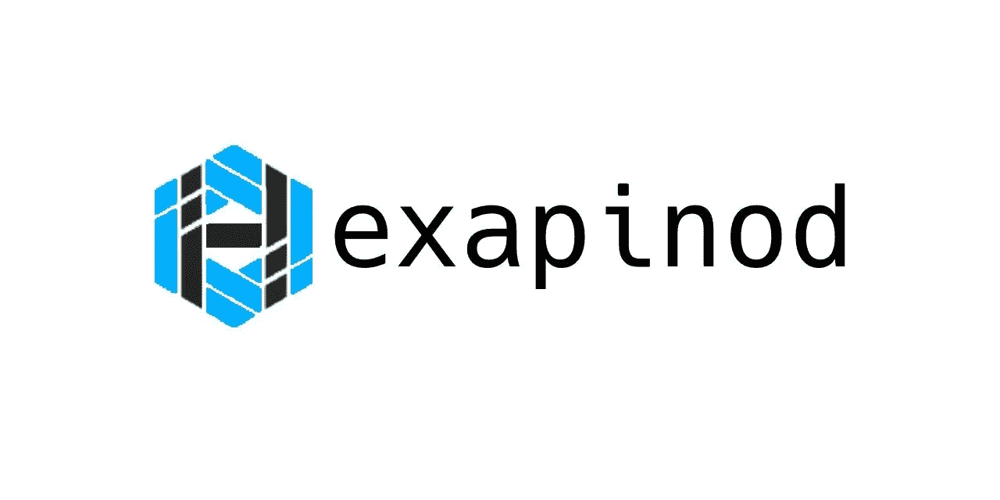

# 为什么以及如何用 nodeJS 在 Typescript 中启动一个 API 项目？

> 原文：<https://blog.devgenius.io/why-and-how-to-start-an-api-project-in-typescript-with-nodejs-5aa1855bb507?source=collection_archive---------9----------------------->


当你开始一个项目的时候有很多事情要做:**选择合适的技术**和语言，**选择合适的框架**(或者从头开始)，初始化框架(或者你的第一个代码文件)并编译第一个 hello world，开始学习它是如何工作的最后编码…

在这个过程的每一步，你都可能失败:选择错误的技术，选择错误的框架，等等。…没有人能事先告诉你什么是好什么是错。因为它必须在技术方面满足你的需求，当然，也要在资源(我的开发人员拥有哪些语言)、约束(可能是客户约束)等方面满足你的需求。…

在我的工作和公司中，我使用 JSON 为**应用程序后端**开发了许多**REST API，这篇文章将向你揭示为什么我使用这些技术(Typescript 和我将描述的所有库)来构建它们。我将展示我使用的文件夹结构，并建议看一看我构建的[bootstrap skeleton project Hexapinod](https://github.com/cecric/hexapinod)(也可以称为框架)。**

如果你已经知道为什么选择这项技术，跳转到技术细节可以直接跳转到段落“**如何在 Typescript 中开始一个项目？**”。

# 首先，为什么是 NodeJS 和 Typescript？

大约 15 年前，我开始用 javascript 进行开发，像许多开发人员一样，为浏览器环境编写 JQuery 脚本。当 NodeJS 出来的时候，我没有看到这项技术的真正优势。我只是告诉自己，这是另一种简单的语言工具，可以做伟大的事情。现在我可以说，我错了。**NodeJS 的优点是多重的**，缺点也是多重的。很多文章都谈到了这个问题(在媒体上也有很多)，所以我只用这句话来继续:如果你构建了一个解决方案，它有**大量的 IO** (“输入/输出”，比如在数据库、文件或队列上的“读/写”)，**而不需要大量的处理器计算**(我指的是需要大量时间的复杂算法)，并且应该在同一个平台上用相同的技术与其他独立项目一起运行，那么 **NodeJS 可能是一个好的解决方案【T19 在许多从数据库中提供文件或结果的 web 后端服务器中，这是一个非常好的解决方案。**

从它的名字可以看出， **NodeJS 读 JS** 的意思是 Javascript 文件。Javascript 是一种很棒的语言，但是它缺乏在大中型团队中使用的特性(比如“类型”)。例如，由于缺少这些特性，您无法指定函数的 in 和 out，也无法定义一些接口。这就是创建**打字稿**的原因。它**带来了“类型”**、接口和许多其他特性来更好地指定您的代码。它避免了开发过程中的错误，也有助于代码架构师和测试人员与开发人员合作。 **Typescript 会产生 Javascript** 。Javascript 已经是一种脚本语言，我的意思是它没有被编译成可执行文件，而是直接由浏览器 Ecmascript 引擎解释，或者像我们的例子一样，由 NodeJS 解释。所以我们会用脚本语言来产生脚本代码。

# 哪个框架？

组合 Typescript/NodeJS 的主要问题就在这里，你会找到一些库来制作 RESTAPIs 并使用 Javascript 和 Typescript，例如著名的 [ExpressJS](https://expressjs.com/) 。你会发现很多图书馆。但是我没有找到一个真正的用 Typescript 构建的后端框架，就像你可以在用[哈比神](https://hapi.dev/)或 [Restify](http://restify.com/) 的 Javascript 中找到的那样。 [**NestJS**](https://nestjs.com/) **和**[**AdonisJS**](https://adonisjs.com/)**可能是很好的玩家**，但是它们有太多的特性，你不能像构建一个经典的前端网站那样构建一个 REST API。框架[羽毛](https://docs.feathersjs.com/)是最接近我们所考虑的如果你想要一个经典的方法，但是因为它完全基于 ExpressJS，如果明天我不想再使用这个库，我将被迫改变所有的框架。我不会列举所有可用的项目和框架，我会让您发现一些新的。

看完所有这些项目并考虑到我之前所说的，我现在有了我为什么在这里开始创建自己的**[**框架**](https://github.com/cecric/hexapinod) 的理由。也可以构建其他库，比如 ExpressJS，但不要依赖它们。**

# **如何在 Typescript 中启动一个项目？**

**要启动一个 Typescript 项目，在我们的例子中，它几乎是一个 NodeJS 项目。首先，我们将执行此命令来初始化 NodeJS 项目:**

```
npm init
```

**在许多帖子中，你会看到在那之后在全局中安装了 typescript。我避免这种做法，因为我使用不同版本的库，甚至不同版本的 typescript 来处理许多项目。我更喜欢将它作为开发依赖项安装到我的项目的本地。**

```
npm install --save-dev typescript
npx tsc --init
```

**它将通过在项目的根目录下创建一个 tsconfig.json 文件来初始化您的 typescript 环境。这个配置文件将告诉 ts 命令您想要将编译后的代码部署到哪里，在**中您想要部署哪个版本的 EcmaScript】，在 typescript 中激活了哪些特性。我不会描述所有的参数，因为这是一个令人头疼的问题，但我会根据我的设想解释最重要的。****

**第一个是您将在其中编译的 EcmaScript 版本。默认情况下，它可能已经在 ES6 中设置好了，因为所有浏览器都支持它，但是我们通过 NodeJS 运行它。这在很大程度上取决于您将在服务器上使用哪个版本的 NodeJS。在我开始的项目中，我喜欢所有东西的最后版本，所以，在我写这几行的时候，是这个选项:**

```
"lib": ["es2021"],
"target": "es2021",
```

**如果您希望每次都在 NodeJS 的最新版本上，也可以编写 ESNext。下面是 EcmaScript 的**版本和符号的概述:****

```
es6 => es2015
es7 => es2016
es8 => es2017
es9 => es2018
es10 => es2019
es11 => es2020
es12 => es2021
es13 => es2022
```

**文件的一个重要参数是加载器的选择:[**CommonJS**](https://nodejs.org/api/modules.html)**【CJS】**或 [**EcmaScript 模块**](https://nodejs.org/api/esm.html) **(ESM)** 是 NodeJS 的两个主要选项。 **esM 在 CJS** 上有很多优势，但我建议你用 ESM 开始你的新项目，原因很简单，两个模块一起工作会更容易:完整的 ESM 模块和 CJS 模块(你会在许多帖子上找到差异和比较，这些帖子对优势有一些很好的解释:[战争中的节点模块:为什么 CommonJS 和 ES 模块不能相处](https://redfin.engineering/node-modules-at-war-why-commonjs-and-es-modules-cant-get-along-9617135eeca1)， [CJS vs ESM](https://webreflection.medium.com/cjs-vs-esm-5f8b90a4511a) ，[CJS，AMD，UMD，到底是什么](https://dev.to/iggredible/what-the-heck-are-cjs-amd-umd-and-esm-ikm))。ESM 也应该更有效率，但是凭经验，我可以告诉你，你应该看不出区别。这取决于您在“tsconfig.json”中选择正确的配置，如下所示:**

```
"module": "commonjs",
or
"module": "esm",
```

***注意，你应该在你的“package.json”中定义相应的类型(对于 ESM 项目，用 value 模块设置 key 类型，而不是为 CJS 项目设置这个 key)。***

**当您在代码中抛出错误时，为了能够找到您的类型脚本中的问题，您应该**激活源映射**以让命令 Tsc 在生成的 JS 文件和类型脚本文件之间生成源映射。**

```
"sourceMap": true
```

**它将在 NodeJS 命令中由一个参数调用(我建议只在开发执行中这样做，您可以避免使用在执行中有一些问题的 ts-node):**

```
node --enable-source-maps  ./dist/mycompiledapp.js
```

**在 typescript 中，为了避免导入中的复杂路径(例如这样的路径:`import '../../../../MyLibFolder/MyAwesomeLibFile';`)，您可以**定义主文件夹的别名**(例如代码将改为:`import '@dependencies/MyLibFolder/MyAwesomeLibFile';`)。你会发现很多帖子都在谈论化名，有利有弊。我会这样继续:**它使代码更容易调试，但是在编译过程中你会遇到很多路径问题**。我的建议是使用别名，即使在开始项目时编译过程可能很难构建。因为您的代码更容易调试，也更容易被新开发人员理解。当你在团队中工作时，考虑这一点是非常重要的。为此，您应该将路径声明到“tsconfig.json”文件中，如下所示:**

```
"paths": {
     "*": [
          "node_modules/*",
          "lib/types/*",
     ],
     "@core/*": [
          "src/core/*"
     ]
}
```

**在本例中，您可以看到我们声明了 core 用于您的导入路径。所以用这个你会导入会变成:**

```
import { MyAwesomeLib } from '@core/MyAwesomeLib';
```

**另一个问题是你的 lib 应该以“.”结尾。js”当你导入的时候。如果您像上面那样编写导入，它将会失败。我认为，当你用 Typescript 编写代码来实现这一点时，真的很令人不安，因为文件以“.”结尾。js”是一个编译后的文件。这不是您创建的文件。为了避免这种情况，我建议使用 [Tsc 别名](https://github.com/justkey007/tsc-alias)或 [Tsconfig 路径](https://github.com/dividab/tsconfig-paths)。**

****

# **我的项目六足动物**

**每次我为客户或我自己开始一个新的 API 项目时，我都使用相同的堆栈。相同的产品包、相同的入口点、相同的需求。在最流行的 NestJS 上构建它对我来说并不是一个好的解决方案，因为它附带了很多 API 不需要的函数。我认为这就像用火箭筒消灭一只苍蝇。**

**这就是我创建 [**Hexapinod**](https://github.com/cecric/hexapinod) 的主要原因:用**最小的引导**来启动一个项目，这个项目**包括创建一个 API** 的所有需求，例如 OpenAPI 规范、数据库支持、对象序列化、测试过程等通用特性**

**这是一个项目，旨在通过支持一些**

**与第三方工具的其他链接(例如 Jest 或 RabbitMQ)，但**不会变得更复杂**，也不会包含对大多数 API 项目不通用的工具。即使您不在项目中使用它，您也可以了解如何在 typescript 中概述如何启动项目，并从中获得一些灵感来构建自己的项目。**

**[](https://github.com/cecric/hexapinod) [## GitHub - cecric/hexapinod:六边形架构 API 框架/使用…

### TypeScript 中的六边形体系结构 API 框架/骨架，并通过 expressJS 使用 nodeJS。因为我在…

github.com](https://github.com/cecric/hexapinod)**