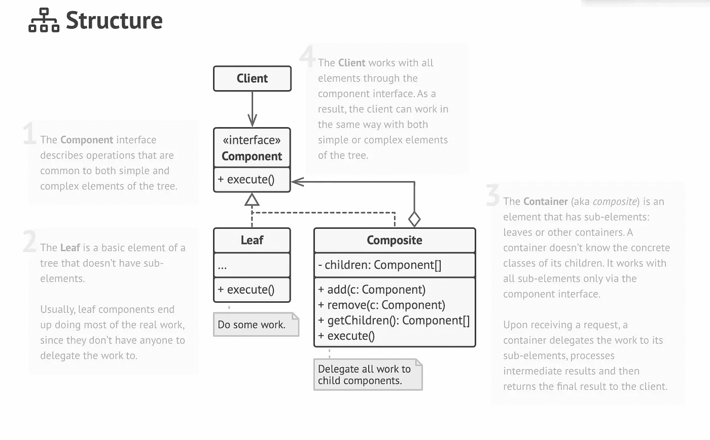

# 为什么设计模式对你的职业生涯至关重要？

> 原文：<https://blog.devgenius.io/why-are-design-patterns-essential-for-your-career-6d14b1837f86?source=collection_archive---------4----------------------->

## 我们在代码中需要设计模式吗？

paweczerwi ski 在 [Unsplash](https://unsplash.com?utm_source=medium&utm_medium=referral) 上的照片

我们都见过设计模式。从单一模式到策略设计模式。我们把它们当成编程之神送给它们的。让我们问 3 个问题，你应该经常问。

> 你会过度使用它们吗？
> 
> 你知道什么时候应用它们吗？
> 
> 你知道哪个最适合我的问题吗？

我们都犯有过度使用设计模式的错误。这种模式会解决我们的问题，但我们无法决定。

为什么设计模式在我们 OOP 开发人员的职业生涯中至关重要？让我们来回答这篇文章中的问题。

## 通用解决方案

> 设计模式是软件设计中常见问题的**试验和测试解决方案**的工具包。即使您从未遇到过这些问题，了解模式仍然是有用的，因为它教会您如何使用面向对象设计的原则来解决各种问题。— [重构大师](https://refactoring.guru/design-patterns/why-learn-patterns)

设计模式为出现的问题提供了通用的解决方案。对模式的推理，以及何时使用模式，培养了我们的技能。即使只知道一点点，也能提高我们作为开发人员的价值。

该模式带来了面向对象的思想。理解模式的意图可以带来新的发现。这些解决方案经过了时间的考验，解决了大多数出现的 OOP 问题。

我们现在可以使用 lambdas 或 strategy pattern 来讨论哪个更好。根据上下文，有时 lambda 就足够了。拥有可以适应 lambda 的小逻辑，你不需要它的整个策略。

## 通信特征

设计模式是一个很好的交流特性。设计模式揭示了问题的本质。设计模式的名字很能说明问题。

例如，如果您需要应用不同的算法。你会选择策略。策略详细地讲述了问题集。

再比如，有步骤的算法，订单处理。你可以看到模板方法可以完成这项工作。然后我们可以专门化来适应环境。

## 提高思维

我们总是会遇到需要设计模式的问题。这就是它们如此强大的原因。几乎任何出现的问题都可以实现设计模式。

复合模式是我遇到最多的一种。至少有一个保存对象列表的类。当列表中的对象拥有与持有者相同的接口时，我们可以实现一个复合模式。

不要过度使用复合模式。大多数情况下不需要复合，因为复合和叶子不共享同一个接口。关于何时应该使用的理由。

[复合图案](https://refactoring.guru/design-patterns/composite)

我喜欢复合模式的一点是它的易用性。我们可以使用递归来遍历树。不需要知道实现，因为我们有一个清晰的接口。

## 为什么需要一个模式？

在大多数情况下，您不需要模式。如果能做这项工作就简单了。如果你把最后期限也包括在内，那就简单点。

如果不符合，就不要为了吹牛而加。没有真正的意图，使用模式只能增加复杂性。准备你为什么需要这个模式的理由。详细阐述它们，并获得对你的解决方案的另一种意见。

不要在没有将模式放在应用程序的上下文中的情况下实现它们。适当地更改接口，因为命名总是可以改进的。如果更好的方法是`calculate`，就不要命名方法`execute`。这意味着您已经将模式复制粘贴到了代码库中。

 [## 如今设计模式真的很重要吗？

### 软件工程栈交换是一个为专业人士，学者和学生工作的问答网站

softwareengineering.stackexchange.com](https://softwareengineering.stackexchange.com/questions/70877/are-design-patterns-really-essential-nowadays)  [## 设计模式目录

### 按意图、复杂性和流行程度分组的设计模式目录。目录包含所有经典设计…

重构大师](https://refactoring.guru/design-patterns/catalog)