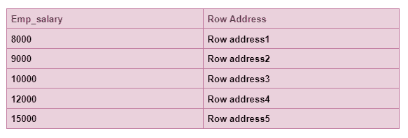

# 为什么索引在 SQL 中很重要？

> 原文：<https://blog.devgenius.io/why-are-indexes-important-in-sql-8c00c5aef16f?source=collection_archive---------13----------------------->

## 软件工程之旅

## 索引及其对 SQL Server 性能的影响


图片来自[specialacademy.org](http://www.specialacademy.org/gallery/creative-writing-gallery-2/gallery-by-olivia-trieu-my-first-book/)

# 概观

SQL 中的索引就像一本书中的索引或目录。索引是 SQL 中的**单个查找表**。它们是在表和视图上创建的。

# 为什么要使用索引？

索引用于通过查询表来加快数据检索过程。如果一本书没有索引，而我们被告知要找到某个特定的章节，我们需要从头到尾寻找这本书的每一页。但是，如果这本书包含索引，我们可以查找该章的页码，并根据索引中给出的页码找到该章。因此，书中的索引大大减少了查找书中章节的时间。同样，SQL 中的索引用于增强查询的性能。如果索引不存在，那么数据库查询引擎需要从第一条记录到最后一条记录在整个表中查找所需的数据，这意味着它需要执行**表扫描**。从性能角度来看，表扫描是不好的。

**例如:**


员工表

```
SELECT Emp_name, Emp_salary
from Employee
Where Emp_salary>8000 AND Emp_salary<15000
```

上面的雇员表现在没有任何索引。为了获取薪水大于 8000 且小于 15000 的所有雇员姓名，查询引擎需要从第一行到最后一行搜索整个雇员表。这将导致表扫描，进而降低性能，尤其是当表包含太多记录时。为了避免这些性能问题，我们现在将学习如何在表上创建索引，以及它将如何显著提高性能。

# 如何在表上创建索引？

使用 CREATE INDEX 命令在表上创建索引。语法如下所示:

```
CREATE INDEX index_name ON table_name column_name
```

因此，我们使用相同的语法在带有 Emp_salary 列的 Employee 表上创建一个名为 INDEX_Employee 的索引，如下所示:

```
CREATE INDEX INDEX_Employee
ON Employee (Emp_salary ASC)
```

创建的索引将存储每个雇员的工资，按升序排列，如下所示。


员工表



创建指数后按升序排列的员工薪资

(实际索引外观可能不同)

```
SELECT Emp_name, Emp_salary
from Employee
Where Emp_salary>8000 AND Emp_salary<15000
```

在使用 Emp_salary 列对 Employee 表创建索引 INDEX_Employee 之后，当我们再次使用上面的查询来查找薪金大于 8000 且小于 15000 的雇员时，该索引将帮助查询引擎获取所需的记录，因为这些记录是按升序排列的。它将快速占用所需的记录，并提高检索数据的速度。它被称为**索引查找。**

# SQL Server 中索引对查询性能的影响

SQL Server 索引格式在顶部有一个根节点，在底部有一个叶节点，中间有中间节点。这被称为 **B 树格式**。为了找到所需的记录，它从中间有中间节点的根节点遍历到末端的叶节点。叶级节点是 SQL Server 中的索引节点，如下所示。


下面是通过 BTree 索引查找所需行的步骤:

1.  它从根节点开始。
2.  然后，它转到与所需值范围相匹配的叶节点。
3.  从这个节点到第二层。
4.  查找所需的记录。

这个过程将重复进行，直到找到正确的行。

在 SQL server 中，主要有两种类型的索引:

*   **聚簇索引:**在数据表中，表示数据的物理顺序。一个表只能有一个聚集索引，但是一个聚集索引可以有多个列，这被称为**复合聚集索引。**
*   **非聚集索引:**在数据表中，它表示指向数据存储位置的指针。一个表可以有多个非聚集索引。

聚集索引比非聚集索引快。与非聚集索引相比，聚集索引占用较少的磁盘空间。

为了了解索引对 SQL Server 查询性能的影响，我们以一个名为 Techdata 的数据库为例，该数据库包含两个表 tblAuthors 和 tblBooks。tblAuthors 表包含 Id、Author_name 和 country 列，如下所示。


tblAuthors


tblAuthors 表包含 90 万条记录(为了举例说明，这是一个巨大的虚拟数据)。tblBooks 表包含 Id、Author_Id、Price 和 Edition 列，如下所示。


TBL 书籍

tblBooks 表还包含 90 万条记录(巨大的哑数据)。


目前，tblBooks 上没有任何索引。为了检索 SQL Server 中应用于某个表的所有索引，我们可以使用以下命令执行存储过程 **sp_helpIndex** 。


如消息所示，“tblBooks”没有任何索引。在 SQL server 中，当一个表没有任何索引时，它被称为**堆表**。假设，我们想获取所有书籍价格高于 70 美元低于 90 美元的记录。我们可以在 SQL Server 中执行以下 SQL 语句来查找查询的统计时间。


如图所示，该查询从 900，000 条记录中返回 341457 条记录。从上述查询的**执行计划**可以看出，它运行了一个**表扫描。**因此，为了检索特定的记录，它已经读取了表中的所有行。


当我们将光标悬停在表扫描上时，它将向我们显示表扫描的全部细节。在这里，我们可以看到我们的结果关系包含 341457 条记录，但是它已经读取了所有 900K 条记录。

*   **读取的行数为 900000**
*   **实际行数为 341457**

现在，我们可以想象包含数百万行的海量数据。在这里，我们的查询性能将会大大降低，因为要遍历所有数百万条记录来查找一些特定的记录。


让我们在使用**价格**列在 **tblBooks** 表上创建一个索引后，检查一下我们的查询性能，如下所示。


创建索引后，我们可以在表上调用 **sp_helpIndex** 存储过程来验证**结果**窗格是否包含我们刚刚创建的索引，如下所示。


让我们执行相同的查询来查找图书价格高于 70 和低于 90 的记录。但是，记住这次我们的表在**价格**列上有一个索引。


我们可以看到，检索到了 **341457** 条记录，这与我们之前在没有任何索引的表上应用的查询相同。但是，从下面的**执行计划**可以看出，这次它已经运行了**聚集索引寻道**，而不是之前**的**表扫描**。**


当我们将鼠标悬停在**聚集索引 Seek、**上时，我们将进入其详细信息，这表明这次读取的记录总数是 **341457** ，但实际读取的行数也是 **341457，而不是之前的 900K** 。这一次，SQL Server 查询优化器精确地读取了这些行，因为在 **Price** 列上创建了索引。

*   **读取的行数是 341457**
*   **实际行数为 341457**


现在，我们将在 SQL Server 中进行**显示计划分析，这是对两个执行计划的比较分析。看看下面突出显示的表扫描(无索引)和聚集索引查找(有索引)的参数和值。**

*   **表扫描的估计 CPU 成本为 0.990079，而聚集索引查找的估计 CPU 成本降至 0.37576。**
*   **表扫描的估计 I/O 成本为 2.72394，而聚集索引查找的估计 I/O 成本为 1.03498。**


*   **表扫描的实际逻辑读取计数为 3674，而聚集索引寻道的实际逻辑读取计数为 1402。**


## **结论**

我希望通过本教程，您已经清楚地了解了索引对我们的数据库查询引擎的影响。我们需要在表上创建索引，以优化查询性能并加快数据检索过程。我们将在下一个教程中学习 SQL Server 中的**性能调优。**