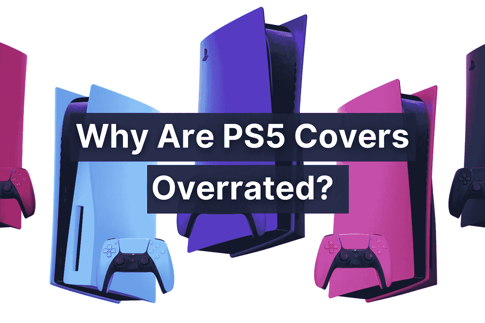
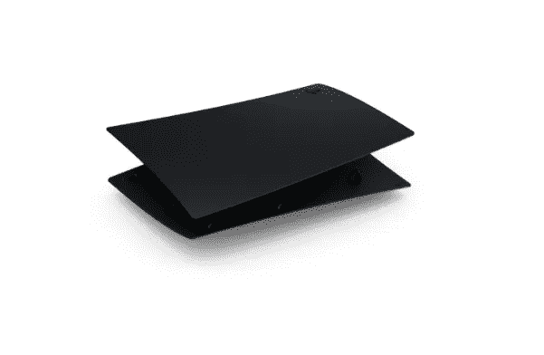
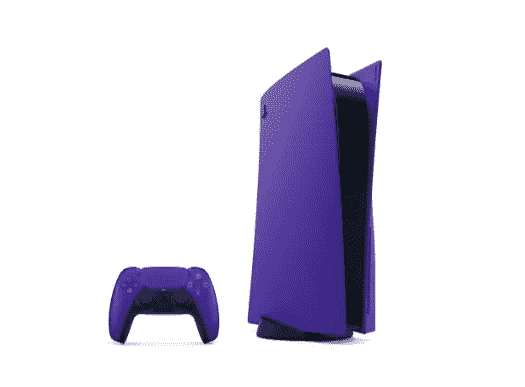
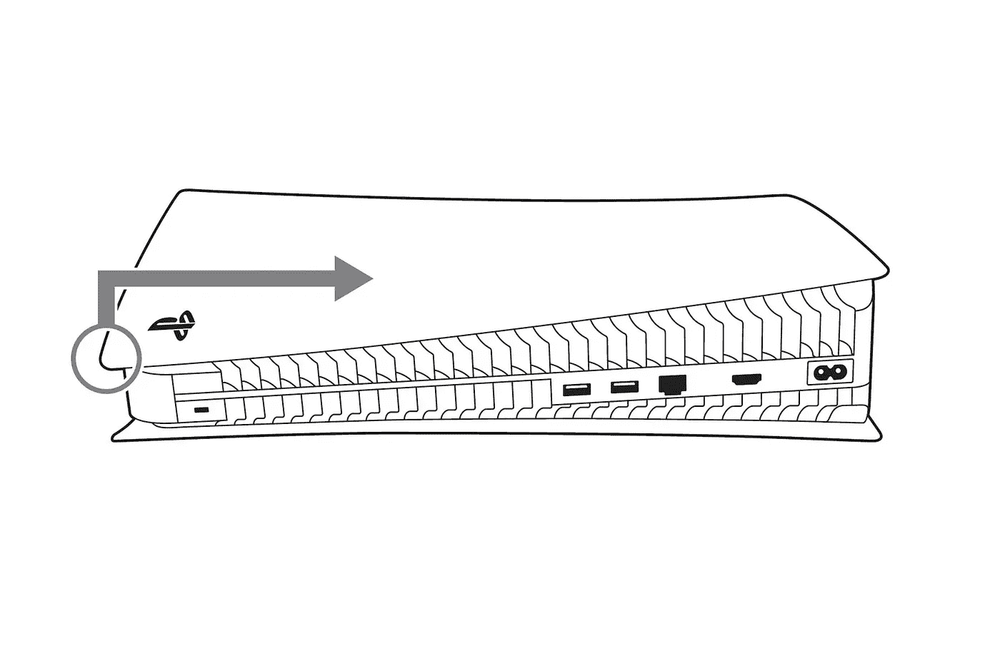
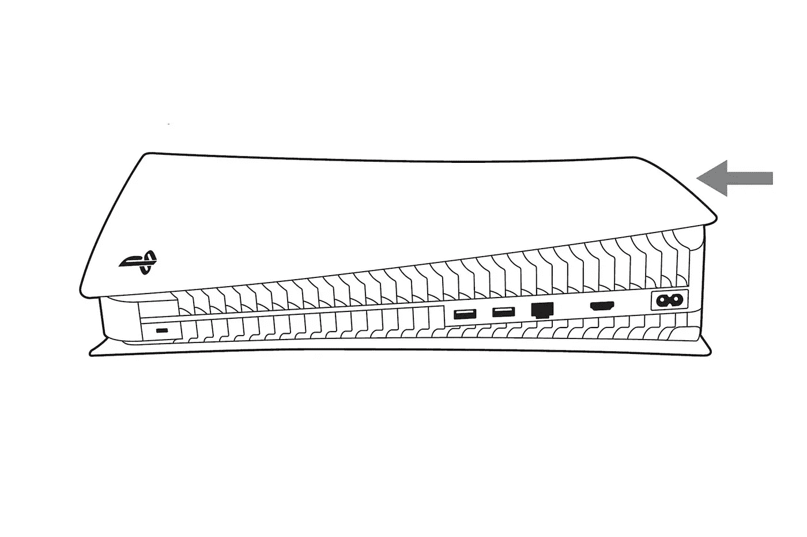
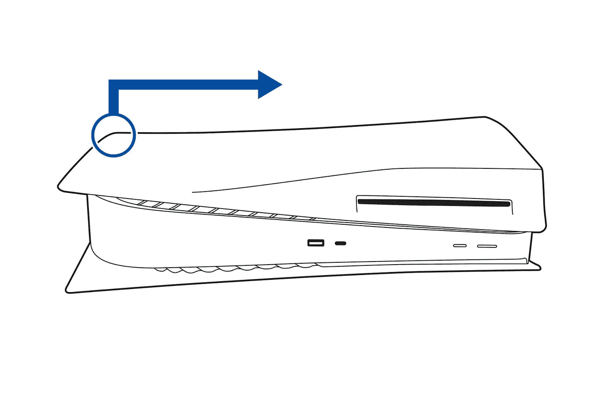
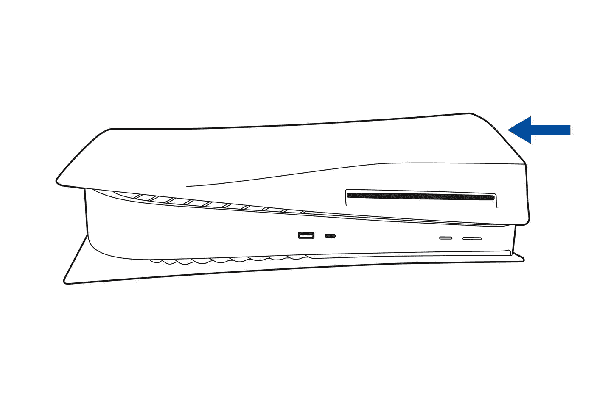

# 为什么 PS5 封面被高估了？

> 原文：<https://blog.devgenius.io/why-are-ps5-covers-overrated-cf77cddbbf94?source=collection_archive---------12----------------------->

## 新封面新 Playstation 体验？

## 了解有关新 PS5 外壳以及如何安装它们的更多信息

新的 PlayStation 5 外壳看起来很好，它们为想要更时尚一点的游戏玩家提供了一种令人愉快的美感。也许你们中的一些人甚至将控制台作为系统风格和外观的重要设备。如果是这样的话，那么封面肯定会很适合你。

然而，对于全球大多数游戏玩家来说，我怀疑事实是否如此。我们只是想要一个相对好看的主机，PS5 就是这样，我们重视更高的性能和尽可能流畅地运行游戏的能力，而不会失去令人惊叹的视图。

尽管如此，我个人认为封面被高估了，但我理解它们对其他人的用处。

# 变体

经过几个月对 DBrand 的威胁，索尼终于发布了新的可更换外壳，DBrand 通过今年早些时候发布的可更换外壳击败了他们。

图片由[索尼](https://www.playstation.com/)提供。

新的设计非常棒，它们有 5 种不同的变体，如午夜黑、宇宙红、星光蓝、银河紫和新星粉。然而，只有前两个变种可用，其他的据说很快就会发布。我相信我最喜欢的是银河紫队。

图片由[索尼](https://www.playstation.com/)提供。

你现在就可以直接从 PlayStation 获得。它从 1 月 21 日开始上市，从 2 月 18 日开始可以在网上和各地的零售商处订购。趁他们还活着，抓住他们。

这里讨论的东西不多；它们只是颜色的变化。每套游戏花费 54.99 美元，所以你获得一个美学上令人愉悦的版本的旅程将花费几乎一样多的游戏。

# 如何更换 PS5 外壳

更换外壳应该是一个简单的过程，不到 5 分钟，所以让我们来看看如何做到这一点的步骤。在继续阅读本指南之前，请确保您的 PlayStation 5 已关闭并冷却。

## 如何更换 PlayStation 5 顶盖:

*   首先，拔掉连接到设备的所有电线和电缆。
*   然后你需要把你的 PlayStation 放在一个平坦的地方。
*   转动你的设备，使电源按钮远离你，PlayStation 标志在前面。
*   然后，如图所示，向右上方拉起盖子，就可以从左上角提起盖子。

图片由[索尼](https://www.playstation.com/en-us/support/hardware/replace-ps5-console-cover/)提供。

*   您可以通过从右向左滑动来放置新外壳。当您听到咔嗒声时，它将被安全安装。

图片由[索尼](https://www.playstation.com/en-us/support/hardware/replace-ps5-console-cover/)提供。

## 如何更换 PlayStation 5 顶盖:

*   更换底盖的过程基本相同。将设备放在平坦的地方。
*   您必须将 PlayStation 的徽标朝下，电源按钮朝向您。
*   然后，如图所示，向右上方拉起盖子，就可以从左上角提起盖子。

图片由[索尼](https://www.playstation.com/en-us/support/hardware/replace-ps5-console-cover/)提供。

*   您可以通过从右向左滑动来放置新外壳。当您听到咔嗒声时，它将被安全安装。

图片由[索尼](https://www.playstation.com/en-us/support/hardware/replace-ps5-console-cover/)提供。

# 结束语

尽管封面对 PlayStation 5 主机来说是一个很好的补充，但许多人对此过于称赞索尼。在我看来，Dbrands 确实做得更好，他们的案例看起来也更好。

我很高兴他们现在设法找到了制作封面的方法，尽管他们在开始时遇到了诉讼问题。尽管价格有点贵，但对于真正想这样做的人来说，这种定制服务是值得的。

如果你对这篇文章有任何问题或建议，请不要犹豫，在评论区回复。喜欢你读的东西吗？为什么不关注我的媒体简讯，这样你就不会错过我未来的任何文章了？很简单，点击[这里](https://kgabeci.medium.com/subscribe)输入你的邮箱地址，按订阅。

你喜欢阅读媒体上的文章吗？考虑成为会员，这里有很多功能，你每月只需花 5 美元就可以获得所有创作者的内容。使用[这个链接](https://kgabeci.medium.com/membership)，你也帮我赚一小笔佣金，点击成为会员，输入你的信息。