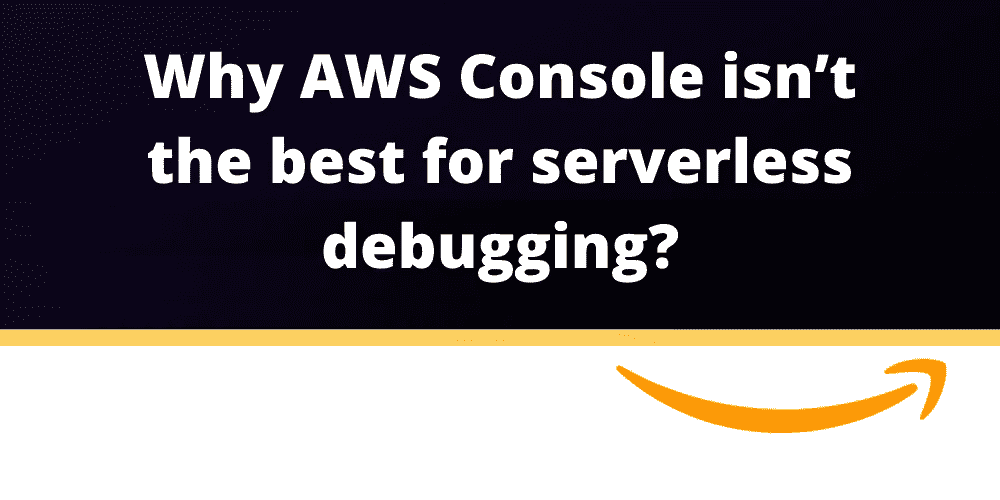
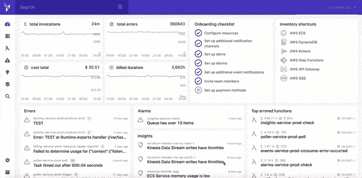
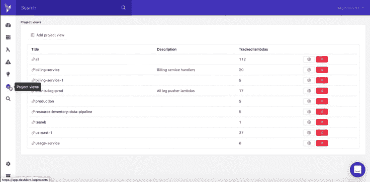

# 为什么 AWS 控制台不是无服务器调试的最佳选择？

> 原文：<https://blog.devgenius.io/why-aws-console-isnt-the-best-for-serverless-debugging-40b1edfc3105?source=collection_archive---------5----------------------->

我们都知道调试无服务器是费时费力的，AWS 控制台并没有让它变得更容易。CloudWatch 并不以易用著称。为什么？首先，它具有次优的搜索特性，日志分散在多个桶和组中，几乎没有可视化能力，并且没有 [Lambda 函数调用](https://dashbird.io/knowledge-base/logging/lambda-invocation-function-and-runtime-errors/)的结构。在整个 AWS 控制台中，不同类型的监控数据，如日志、指标和跟踪，分散在各个竖井中，给调试和故障排除工作增加了大量的摩擦。

> 使用 CloudWatch，你必须**查看多个地方，找出当你的延迟指标达到峰值时发生了什么执行**，这是单独调试 Lambda 函数的情况。

如果你的事务跨越多个 Lambda 函数和一堆其他托管服务，比如 DynamoDB 或 SQS，事情会变得更加混乱。然后是不同的地区和 AWS 账户。

> 所有这些断开使得调试无服务器应用程序变得非常痛苦。

这里有一个典型的案例场景[从无服务器](https://dashbird.io/blog/create-your-first-website-with-serverless-in-15-minutes/)开始。您开始构建您的无服务器应用程序，您被开发速度惊呆了，您在如此短的时间内构建了许多功能，自然地，您很快就爱上了无服务器技术。然后事情就出错了，因为，这就是软件开发的本质。一些错误配置的服务，或者你写的 Lambda 函数中的一些错误，现在是时候调试了。你被迫深入研究 CloudWatch、X 射线等等，只是为了找出你的错误所在。

每一个错误事件都会削弱您对堆栈的信心，最终，您会对快速移动变得谨慎，无服务器变得像之前的所有其他范例一样缓慢而脆弱。

> 但是你想要的是保持交付的速度，为此，你必须知道发生了什么。让我们面对现实吧，很多时候， [CloudWatch 是不够的](https://dashbird.io/customers/beatchain/)

# 这就是为什么你应该停止在 AWS 控制台里挖来挖去

在过去的几年里，许多无服务器倡导者向你出售这种新的模式，即像 AWS Lambda 一样的[功能即服务](https://dashbird.io/blog/what-is-faas-function-as-a-service/) (FaaS)解决方案，虽然能够让一小部分代码在云中运行很棒，而无需管理服务器或容器， **FaaS 只是无服务器**的催化剂。

你应该**将无服务器更像是功能即服务**，尽可能使用 AppSync、S3 和 Cognito 等托管服务，只有当事情不支持你的用例时才回退到 Lambda。

问题是，大多数监控解决方案走的是无服务器倡导者走过的同一条路，并且专注于 Lambda。**这导致了不和谐**；你可以在你的系统中获得全面的洞察力，但你必须用定制的 Lambda 函数来构建它的大部分，或者你可以通过托管服务获得无服务器的全部能力，但调试它们将是一件痛苦的事情。这让我们回到了失去信任的起点。

[Dashbird](https://dashbird.io/) 为您的所有 AWS 相关监控需求提供[一个真实来源](https://dashbird.io/docs/)。您将在一个地方找到度量、日志和跟踪，这使得关联因果变得更加简单。

Dashbird 试图专注于托管 AWS 服务，这样您就不会迷失在向您的项目扔大量手工定制的代码中。SQS、DynamoDB、Step Functions、API Gateway，所有这些可以缩短上市时间的服务在 Dashbird 监控平台中都感觉舒适。

# 按项目而不是类型对资源进行分组是有意义的

Dashbird 将你所有的资源按服务分组，就像你习惯从 AWS 控制台那样，而且**还允许按项目**分组。项目将在逻辑意义上**而非技术意义上**彼此相关的服务分组。例如，一个项目可以由 API Gateway、Lambda 和 DynamoDB 组成。

> 当您遇到错误时，它通常与通过您的服务管道的请求有关。

为了发现错误，你必须跟踪所有这些服务的请求。使用 AWS 控制台，它根据技术对服务进行分组，**您必须浏览多个页面才能找到您的错误**。在一个项目中，所有这些都是统一的，因此您可以在一个地方找到请求所涉及的所有服务。

# 在错误发生之前找到它们

很自然，你总是希望**把从发现一个 bug 到修复它的时间尽可能的缩短**。Dashbird 警报和见解基于 [AWS 架构良好的框架](https://sls.dashbird.io/aws-well-architected-framework-serverless)和 dash bird 多年来监控无服务器生产就绪系统的专业知识，可以帮助您做到这一点。

Dashbird 的洞察力**会立即通知您**是否出现故障、配置不正确或指标是否处于危险范围，以免导致错误。这样你可以不断地**改进**你的架构，并且**防止错误发生**。

对于像无服务器这样相当年轻的技术，找出最佳实践总是一件痛苦的事情。

> 如果使用得当，你会比所有用老方法的竞争对手更有优势；如果用错了，你可能比他们更惨。

因此，获取这些知识，不仅仅是从互联网上的一篇泛泛的文章，而是为您的特定系统量身定制的**将为您节省宝贵的时间******和** [**美元从您的云账单**](https://dashbird.io/customers/brisk-voyage/) 。**

# **结论**

**如果您在无服务器系统中遇到问题，在尽可能短的时间内找出原因是至关重要的。在 AWS 控制台的许多不同地方点击，将您的错误与导致它们的请求联系起来，这不是您在这里的最佳行动方式。当然，所有的数据都在那里，但是经常会有比你需要的多得多的数据，梳理这些数据也需要时间。**

**像 [Dashbird](https://dashbird.io/) 这样的第三方监控服务可以帮助你减少噪音和**极大地减少调试和故障排除的时间**。Dashbird 将所有日志、指标和跟踪数据整合到一个地方，以便您可以根据需要查询它们。有了项目，你可以对无服务器资源进行逻辑分组，这又减少了日志行。**

**最后，还有基于 [AWS 架构良好的框架](https://aws.amazon.com/blogs/aws/aws-well-architected-framework-updated-white-papers-tools-and-best-practices/)和 Dashbird 多年来在生产中监控无服务器系统的经验的 Dashbird 指标。这些指标可以在错误发生之前**为您找到错误**。**

> **甚至在第一个客户使用您的系统之前，许多有问题的配置就可能在 Dashbird 控制台中浮出水面。**

**虽然一个快乐的用户是好的，但这个特性尤其有助于解决与安全相关的问题，从长远来看，这是一个巨大的负担。**

**您可以[免费试用 dash bird](https://dashbird.io/features/):**

*   **没有代码更改**
*   **不需要信用卡**
*   **简单的两分钟设置**
*   **获得所有高级功能**
*   **立即开始处理您的数据**