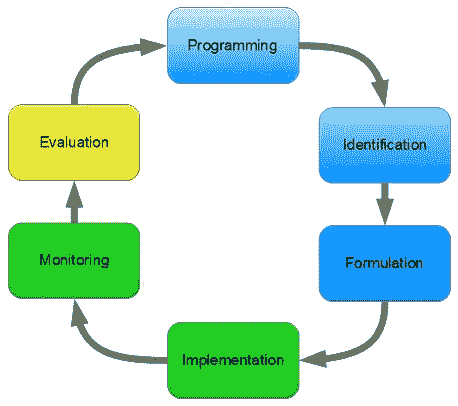

# 为什么成为一名伟大的程序员还不够

> 原文：<https://blog.devgenius.io/why-being-a-great-programmer-isnt-enough-b38a86425888?source=collection_archive---------7----------------------->

你的编程技能并不重要。编程什么很重要。

这一切都是从我想成为一名程序员开始的。但除了好钱，我找不到一个确凿的理由。在数据科学和人工智能之间犹豫不决。最后，我决定成为一名区块链开发者。无论如何，让我们深入了解为什么成为一名优秀的程序员是不够的。

## 1-这不是编程，而是针对某个问题编程什么

不幸的是，知道编程什么和编程完全不同。当我和我的开发人员朋友聊到项目经理时，这种差异变得更加明显，他们只是告诉我没有钱给程序员，只有管理他们的人才有钱。更有甚者，他们告诉我，只有项目经理知道开发什么，他们最终会成为公司技术领域的高管。

## 2-你需要了解某些应用

尤其是当你需要考虑 B2B(企业对企业)编程解决方案的时候。要想获得晋升，在区块链赚更多的钱，你需要知道一些应用程序，用你现有的编程工具解决问题。阅读关于如何使用编程语言解决问题的用例可以真正帮助你成为大公司的项目主管，让你对技术决策负责。

## 3-你需要了解多个平台

不仅仅是你使用的编程语言，你需要知道至少五种编程语言和两种平台，才能成为一名高级开发人员或软件经理。此外，如果你从事软件项目的质量保证和测试工作，精通平台对于企业为客户带来优秀的产品至关重要。

## 4-你需要学习独立于技术课程的课程

尤其是在项目管理和商业应用方面。因为关于商业应用程序编程的课程给出了一个如何在所有阶段解决问题的想法，而项目管理的目的是管理项目中的资源。此外，参加 Scrum 方法论、敏捷方法的课程，甚至是额外的项目管理课程，也可以帮助你从一名程序员晋升为一家知名公司的潜在 CTO。在一个有一群员工支持你的公司里管理技术运作，这是一个很好的名声。

根据你的说法，为什么做一个好的程序员还不够？在下面的评论区分享你的想法和经历。