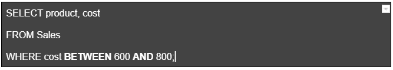
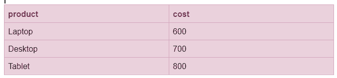
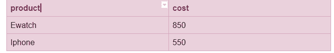
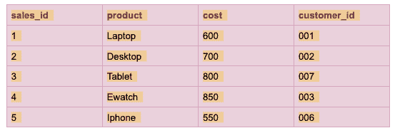
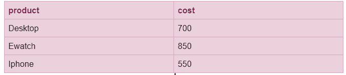
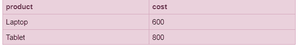

# 为什么 BETWEEN 运算符在 SQL 中很重要

> 原文：<https://blog.devgenius.io/why-between-operator-is-important-in-sql-fc4f462c1dc7?source=collection_archive---------10----------------------->

## 软件工程之旅

## SQL 中 between/not between 运算符的使用

照片由来自 unsplash.com 的卡斯帕鲁宾拍摄

# 概观

SQL 是一种结构化查询语言，用于检索数据、定义数据、修改数据以及对数据应用安全约束。在本教程中，我们将通过示例讨论在 SQL 中使用 BETWEEN 运算符。

如果操作数在给定的范围内，SQL 中的 BETWEEN 运算符将给出 true，这意味着它将获取包括该范围的起始值和结束值在内的记录。它只支持**和操作员**。

**例一:**

下面的销售表包含四列，分别命名为 sales_id、product、cost 和 customer_id。要查找成本范围在 600 到 800 之间的产品，即成本大于等于 600 且小于等于 800，请在 sql 语句中使用 between 运算符，如下所示:

销售表

Sql 语句(运算符之间)

将返回产品名称为 Laptop、Desktop 和 Tablet 的记录，因为这些产品的成本分别为 600、700 和 800，介于 600 和 800 之间。

结果

# 不在 SQL 运算符之间

SQL 中的 Not Between 运算符用于不提取包含给定范围的记录。它返回不符合匹配范围的所有记录。

**例 2:**

下面的销售表包含四列，分别命名为 sales_id、product、cost 和 customer_id。要查找成本范围不在 600 到 800 之间的产品，即成本不大于等于 600 且不小于等于 800，请在 sql 语句中使用 not between 运算符，如下所示:

使用“非介于”运算符的 Sql 语句

不带 between 运算符的 Sql 语句

将返回产品名称为 Ewatch 和 Iphone 的记录，因为这些产品的成本分别为 850 和 550，不在 600 和 800 之间。

# 在 SQL 中运算符与字符之间

带有字符串的 BETWEEN 运算符为具有字符串值的记录提供给定范围的起始值和结束值之间的第一个字符。

**例 3** :

下面的销售表包含四列，分别命名为 sales_id、product、cost 和 customer_id。要查找名称在“D”和“I”之间的产品，请在 sql 语句中使用 between 运算符，如下所示:

结果关系包含名为 Desktop 和 Ewatch 的产品。它不会提取产品名称为 Iphone 的记录，因为 Iphone 在“I”之后，这意味着它不在“D”和“I”之间的范围内。

**例 4:**

要查找名称在“D”和“L”之间的产品，请在 sql 语句中使用 between 运算符，如下所示:

结果关系返回名为 Desktop、Ewatch 和 Iphone 的产品。它不会获取产品名称为 Laptop 的记录，因为 Laptop 位于“L”之后，这意味着它不在“D”和“L”之间的范围内。

# 不在 SQL 中带有字符串的运算符之间

SQL 中带有字符串的 NOT BETWEEN 运算符用于返回记录，不包括给定范围内以字母开头的字符串值。

**例 5:**

要查找名称不在“D”和“L”之间的产品，请在 sql 语句中使用 not between 运算符，如下所示:

结果关系包含产品名称为 Laptop 和 Tablet 的记录，因为它排除了产品名称为 Desktop、Ewatch 和 Iphone 的记录，这些记录在给定的范围内(在“D”和“L”之间)

# 结论

这是 SQL 中所有关于操作符之间的内容。在上面的例子中，我们已经看到它可以和数值以及文本值一起用作范围的上限和下限。它还可以用在复杂的 SQL 查询中，使我们的任务更容易。我希望您了解了如何以及为什么在 SQL 查询中对数字和字符串使用“between operator and not between operator”。在下一个教程中，我们将学习 SQL 中的索引。谢谢你。