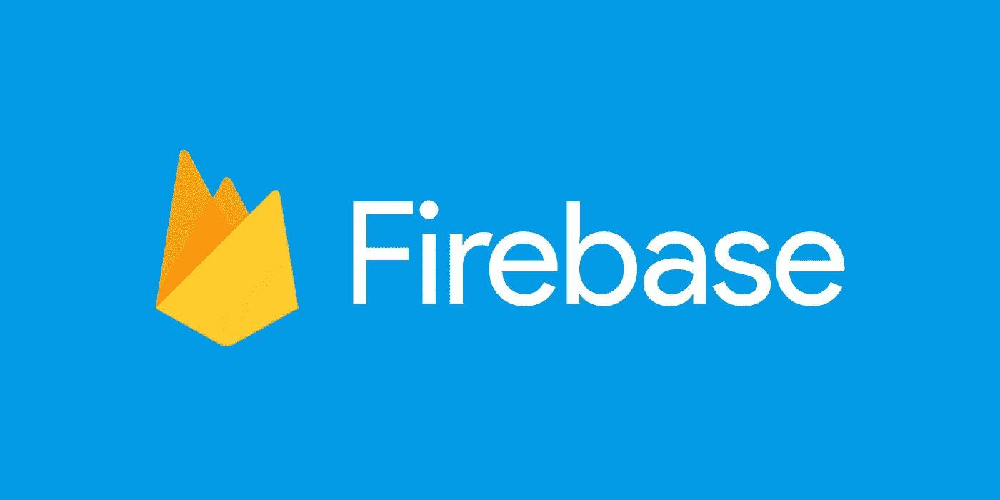

# 为什么用 Firebase 构建您的下一个项目

> 原文：<https://blog.devgenius.io/why-build-your-next-side-project-with-firebase-e3246e42bde3?source=collection_archive---------7----------------------->

## 第一部分:Firebase 简化了开发

我已经建立了许多辅助项目，决定在哪里举办是一个重要的决定。

托管家庭服务器是一个有趣的项目，可以节省成本，但不能很好地扩展，没有什么东西可以“开箱即用”，可靠性需要更多的关注。更不用说动态 IP 和不稳定连接等问题。

有了数字海洋，你支付的是基础设施，而不是流量。因此，你是在自掏腰包主持一个个人兼职项目。

## 我从托管解决方案中寻找以下内容:

1.  简单的开发体验——我不想在服务器上瞎折腾。总的来说，我在寻找尽可能平稳的开发体验。
2.  经济实惠—我更喜欢按流量和存储收费，这样我可以便宜地进行实验。
3.  可扩展—如果一个项目变得流行，我想确信它会自动扩展。
4.  很明显，很可靠。

**Firebase 符合这些标准。**

# Firebase 简化了开发

Firebase 简化了每个阶段的开发。Firebase 方便了本地开发、测试、部署、实现细节、存储等等。

## 证明

Firebase 身份验证可以节省大量时间，提高安全性，并改善应用程序的印象。身份认证很难建立，它对安全性至关重要，并且已经被做过上千次了。在大多数情况下，使用嵌入式解决方案是有意义的。

Firebase 最酷的特性之一是身份验证 SDK。

例如，可以使用以下代码片段将 Google 登录添加到 React web 应用程序中:

上面的代码片段实现了如下所示的 Google 登录:

Google 社交登录

Firebase 还支持脸书、Twitter、传统的电子邮件/密码和双重认证。

## 批准

Firebase 还简化了授权。一旦用户登录，就可以使用 Firebase 安全规则直接控制他们可以访问什么。使用安全规则，您可以按路径设置数据访问规则。例如，您可以为尚未登录的用户禁用某些信息。

这可以使用`firebase.rules`配置文件来实现。例如，假设您希望将对整个数据库的读写限制为只有经过身份验证的用户，下面的`firebase.rules`文件将实现这一点。

这里就不一一赘述了。Firebase 有关于`firebase.rules`语法的[完整文档](https://firebase.google.com/docs/storage/security/core-syntax)。

## **后端 API**

许多流程需要后端服务器。例如，信用卡支付。为了安全起见， [Stripe](https://stripe.com/en-pt?utm_campaign=paid_brand-PT_en_Search_Brand_Stripe-2078033274&utm_medium=cpc&utm_source=google&ad_content=373071375004&utm_term=kwd-308032378313&utm_matchtype=e&utm_adposition=&utm_device=c) 支付平台要求在后端服务器上创建订阅。有了 Firebase 函数，事情就简单了。

Firebase 函数很容易定义。部署后，这些功能运行在 Firebase 服务器上，与客户机环境安全隔离。

例如，通过 Stripe 创建订阅的 Firebase 函数可能如下所示:

请注意，向客户端返回一个值是多么简单，只需调用`res.json()`。

这个函数可以用下面的客户端代码调用(第 22 行):

这与在服务器上运行 API 并从客户端调用 API 端点是一样的。

## **储存**

存储决策对于可扩展性和性能至关重要。借助 Firebase 存储，您可以存储任何数据类型—照片、视频、用户生成的数据等等。Firebase 存储对后端经验较少的移动工程师特别有用。

对于存储，有很棒的 Firebase SDKs。举一个例子，假设您想要存储客户的电子邮件地址。下面的 Firebase 函数检查电子邮件是否已经存在，如果不存在，则将它存储在客户“集合”中。

访问“收藏”就像`db.collection('<collection name>').doc(email)`一样简单。要了解更多关于 Firestore 的 NoSQL 数据模型(包括“集合”和“文档”)，查看文档[这里](https://firebase.google.com/docs/firestore)。

# 入门简单

Firebase 有很好的文档，这是一个巨大的优势。youtube 上甚至有一个入门系列。查看以下内容

*   [在 Web 上开始使用 Firebase](https://www.youtube.com/watch?v=rQvOAnNvcNQ&list=PLl-K7zZEsYLnfwBe4WgEw9ao0J0N1LYDR&index=1&t=4s)
*   【Firestore for the Web 入门
*   [网上 Firebase 认证入门](https://www.youtube.com/watch?v=rbuSx1yEgV8&list=PLl-K7zZEsYLnfwBe4WgEw9ao0J0N1LYDR&index=3)

我希望下一次当你把一个想法变成现实时，你能被说服去尝试一下 Firebase。留下评论，我很乐意回答问题和讨论。

# 额外资源

*   [Firebase 认证](https://firebase.google.com/docs/auth)
*   [消防基地授权](https://firebase.google.com/docs/storage/security)
*   [消防基地功能](https://firebase.google.com/docs/functions)
*   [燃料库储存](https://firebase.google.com/docs/storage)