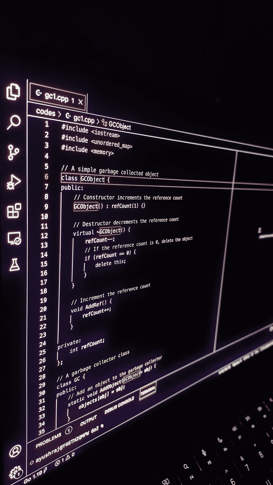

# 为什么 C/C++没有垃圾收集器？我们能造一个吗？

> 原文：<https://blog.devgenius.io/why-c-c-dont-have-a-garbage-collector-can-we-build-one-427992121c1e?source=collection_archive---------10----------------------->

像 Java、Python、Go、C#等许多语言都已经建立了垃圾收集器，但是像 C/C++这样的原始语言却没有。我们将在 C++中通过引用计数来构建垃圾收集。



图 1:通过引用计数的 GC 代码(被我点击)

**条款范围**

*   什么是垃圾收集？我们为什么需要它们？
*   为什么 C/C++缺少垃圾回收？
*   我们能造一个吗？
*   通过引用计数进行垃圾收集

# 简介-什么是垃圾收集？我们为什么需要它们？

在第一部分，我们将探索什么是垃圾收集以及对它们的需求。

我们的程序涉及内存，以变量和对象的形式。对象被分配在堆栈或堆上。堆栈存储局部声明的变量，如“int a = 10”在函数的堆栈框架上，因此当函数返回时，值从堆栈框架中弹出，使它们不存在。所以我们不需要对栈进行垃圾收集。

另一方面，堆是不同的。使用“new”或“malloc”函数分配堆变量。为这些东西创建的对象空间在 RAM 中。当我们使用完它们时，必须显式地释放它们，因为它们比函数作用域和执行时间都长。对于堆，我们需要一个内置于编程语言中的自动内存恢复特性，称为垃圾收集器。缺少垃圾收集器会导致内存泄漏和悬空指针。

# 为什么 C/C++缺少垃圾回收？

1.  性能:垃圾收集可能是资源密集型的，会对程序的性能产生负面影响。在 C/C++中，开发人员能够手动管理内存，这可以更有效地利用资源。C/C++必须能够在裸机上快速运行。
2.  控制:C/C++允许开发人员完全控制内存的分配和释放，允许他们针对特定的用例优化代码。使用垃圾收集，开发人员可能无法控制内存的分配和释放。
3.  兼容性:C/C++常用于编写低级系统库和驱动程序，需要对内存管理进行精确控制。垃圾收集可能与这些类型的应用程序不兼容。
4.  复杂性:在 C/C++中实现垃圾收集可能很复杂，因为它需要向语言中添加额外的代码。这可能会增加语言的复杂性，对于一些开发人员来说可能不值得这样做。
5.  遗留代码:C/C++已经存在了很长时间，并且拥有大量依赖于手动内存管理的现有代码库。向语言中添加垃圾收集可能会破坏这些代码库，并给依赖它们的开发人员带来问题。

# **我们能造一个吗？**

是的，为 C/C++建立一个垃圾收集系统是可能的。有几个第三方库为 C/C++提供了垃圾收集，比如博姆-德默斯-魏泽垃圾收集器。但是，这些系统可能无法处理所有 C/C++代码，并且与手动内存管理相比，可能会有一些性能开销。此外，在 C/C++中实现垃圾收集可能比在本机支持垃圾收集的语言中更复杂，需要更多的努力。

在 C 和 C++中，可以使用引用计数、标记和清除、跟踪垃圾收集等方法实现垃圾收集。

**奖励:通过引用计数进行垃圾收集。**

```
#include <iostream>
#include <unordered_map>
#include <memory>

// A simple garbage collected object
class GCObject {
public:
    // Constructor increments the reference count
    GCObject() : refCount(1) {}

    // Destructor decrements the reference count
    virtual ~GCObject() {
        refCount--;
        // If the reference count is 0, delete the object
        if (refCount == 0) {
            delete this;
        }
    }

    // Increment the reference count
    void AddRef() {
        refCount++;
    }

private:
    int refCount;
};

// A garbage collector class
class GC {
public:
    // Add an object to the garbage collector
    static void AddObject(GCObject* obj) {
        objects[obj] = obj;
    }

    // Remove an object from the garbage collector
    static void RemoveObject(GCObject* obj) {
        objects.erase(obj);
    }

    // Collect garbage by deleting objects with a reference count of 0
    static void Collect() {
        for (auto& [obj, count] : objects) {
            if (obj->refCount == 0) {
                delete obj;
            }
        }
    }

private:
    static std::unordered_map<GCObject*, GCObject*> objects;
};

// Initialize the static objects map
std::unordered_map<GCObject*, GCObject*> GC::objects;

int main() {
    // Create a garbage collected object
    GCObject* obj = new GCObject();

    // Add the object to the garbage collector
    GC::AddObject(obj);

    // Remove the object from the garbage collector
    GC::RemoveObject(obj);

    // Collect garbage
    GC::Collect();

    return 0;
}
```

在这个`GCObject`类中，通过维护一个`refCount`字段来实现引用计数。`GCObject`构造函数增加引用计数，析构函数减少引用计数。如果引用计数变为 0，对象将删除自身。

`GC`类是一个简单的垃圾收集器，它维护对象及其引用计数的映射。`AddObject`和`RemoveObject`方法分别在地图上添加和移除对象。`Collect`方法遍历地图中的对象，删除任何引用计数为 0 的对象。

**总而言之……**

总之，虽然垃圾收集是编程语言中管理内存的有用工具，但它有可能对性能产生负面影响，并且可能与某些类型的应用程序不兼容。C/C++开发人员可以选择手动管理内存，这可以提供更多的控制，并可能更有效地利用资源。然而，在 C/C++中实现垃圾收集可能会很复杂，对于一些开发人员来说可能不值得这样做。此外，在 C/C++中，大量依赖手动内存管理的遗留代码库可能会给将垃圾收集合并到语言中带来挑战。