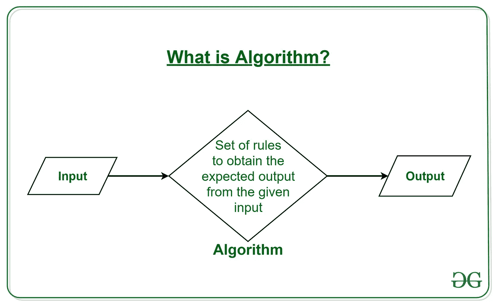
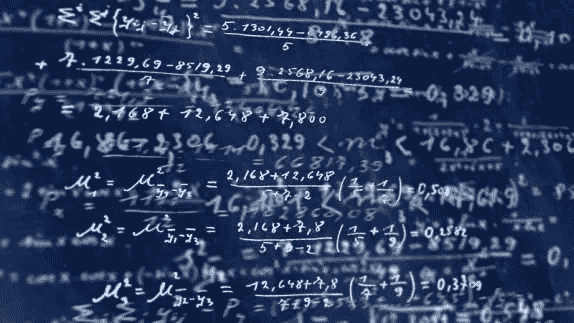

# 为什么微积分很重要

> 原文：<https://blog.devgenius.io/why-calculus-is-important-e71a12f85213?source=collection_archive---------4----------------------->

*与线性代数相同，微积分也与编程密切相关。*

你可能知道计算机科学与工程一年级的前两门课(剩下的系我就更不用说了)。你会想知道它们在真实场景中的表现如何。在这里，我们将说明为什么微积分在编程中很重要。以下是细节。

## 算法的逻辑依赖于一个数学主题

这是微积分中的函数。当你在第一年学习微积分的时候可能会觉得奇怪，你可能会问为什么。我问了同样的问题，并在开始学习微积分后，同时关注可汗学院的话题。然后我意识到**它们只是为理解计算机科学和编程铺平道路的基础数学**。

更重要的是，当我学习计算机科学时，我意识到算法的逻辑高度依赖于函数的主题，因为算法是通过设计解决问题的步骤。由于存在一个问题和一个问题的解决方案(算法)，即使在你的领域中有许多解决方案，你也只能从一组解决方案(g(x))中为你的问题(f(x))选择一个。

## 为统计规划提供基础

尤其是你开始学数据科学，概率，人工智能的话。当你学习统计学的基础知识时，可能首先不需要它，但是当你进入概率的话题并进一步进入统计学时，你需要每一个可用的数学来解决你的问题。此外，线性代数、微分方程和多元微积分等主题需要对微积分有全面的了解。

## 为数学编程提供基础

统计编程也是如此。它们都需要微积分，因为它们是建立在微积分每个主题的基础上的，尤其是导数和积分。这些主题相互补充，并在数学和编程的不同主题中频繁使用，以构建复杂的系统、教学、创建具有高价值的项目来改善他人的生活。

## 生活依赖于数学

不仅仅是编程。*整个生命系统都建立在数学的基础上*，我们的生存依赖于数学，我们也变得越来越依赖数学。任何中级到高级数学的基础都依赖于微积分。理解数学和源自微积分的生命系统是力学、化学和其他我们理解的系统。

根据您的观点，为什么微积分对编程很重要？在下面的评论区分享你的想法和经历。