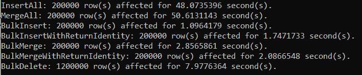
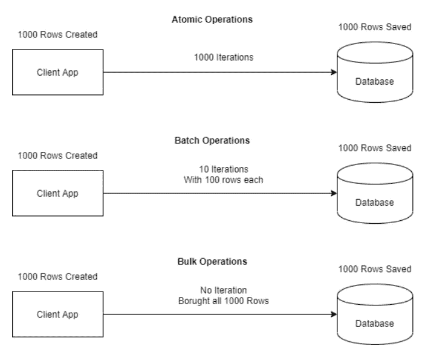
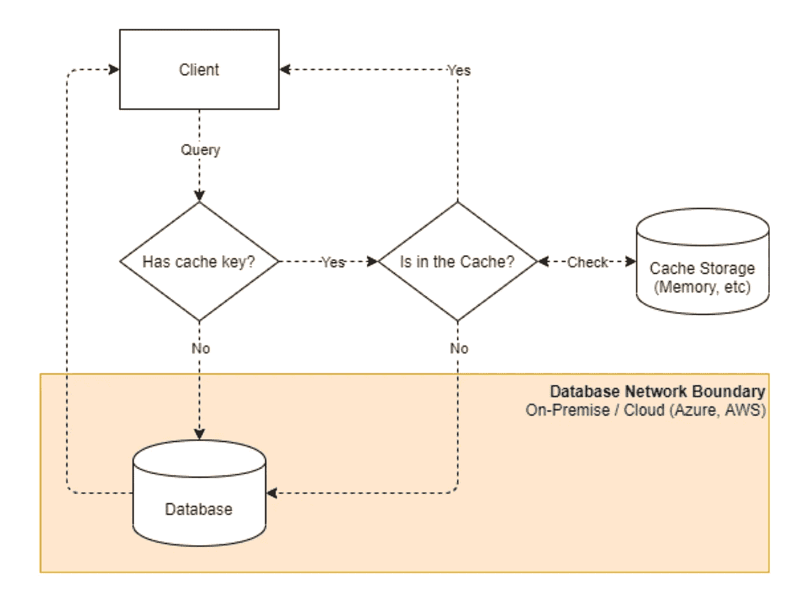
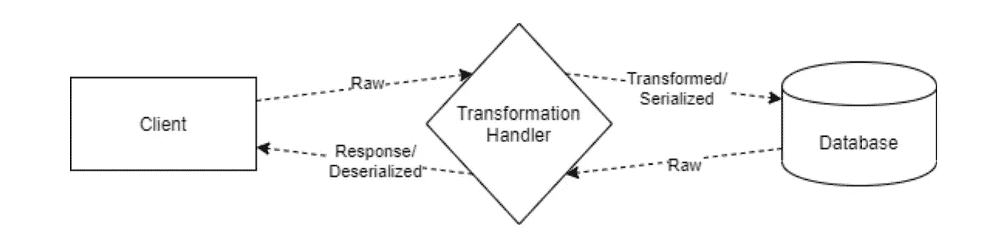

# 为什么选择 RepoDb ORM 而不是 Dapper

> 原文：<https://blog.devgenius.io/why-choose-repodb-orm-over-dapper-da87432c7830?source=collection_archive---------0----------------------->

对于我的软件架构师同事以及所有敢于冒险的开发人员，我很高兴与你们分享使用这个库的好处和价值。

**TL；博士:**这是你可能渴望的微形虫。👀请不要错过一些珠宝！👑

[Dapper](https://stackexchange.github.io/Dapper/) ，它是一种轻便的微形 for。NET，它运行了流行的 StackOverflow 站点很多年。开发它是为了解决 StackOverflow 站点早期的性能问题。

鉴于， [RepoDb](http://repodb.net) 是一种新型混合微形 for。NET 旨在满足微观形式和宏观形式(也称为完整形式)的缺失部分。它还旨在简化 micro-ORM 编码体验，同时保持应用程序的性能和效率。

两者都快速、高效且易于使用。他们还处理不同的使用案例。然而，我们希望这篇博客能够帮助您在为您的企业开发新的解决方案时决定选择 RepoDb 作为您的 ORM 框架。

如果你认为我们对 [RepoDb](http://repodb.net) 的页面有偏见，请允许你检查或评论。

请不要错过本文结尾的结论。👇

> 我是 Mike，RepoDb 的作者，开源贡献者，技术博主。我目前在 Orsted A/S 公司担任海上风能的高级应用架构师，or sted A/S 是一家总部位于丹麦的可再生能源公司，曾被评为世界上最可持续发展的公司。我们正在我们的供应商和我们的组织之间集成数百万和/或数十亿的数据集(以多种方式)。我在这里分享我所做的一切。我努力改进. NET 中的数据访问空间。我个人请求您对这个库的支持。我希望你分享，你博客和使用它。

# 开发经验🙉

**PTP:** 上图取自这个[链接](https://lh3.googleusercontent.com/proxy/AjgzIyDozsAe0RGr4Apd3Jhp8CTy_w93isPL-3sFa_KXjK6x7vptWyyImfno6Q_B9pMDklTNbl6PoBxRq0Qc5R60IMM4jq1EuOilUTzQW9xJ9jP3nYSKCyPOJ81bDKSvE7HnRUD0)，在这个链接中它与这个[页面](http://sdfsystems.com/things-to-discuss-with-your-web-developer-before-you-start/)相关联。

我们都喜欢开发过程中的灵活性和可控性，特别是如果我们对性能和效率感兴趣的话。这是我们选择 Dapper micro-ORM 而不是实体框架的主要原因。

然而，这种微 ORM 要求您在所有与 DB 相关的活动中编写 SQL。

你真的喜欢一直写 SQL 吗？如果是，那么衣冠楚楚对你有好处😀。否则，您最终会在整个存储库或 DAL 中用这些冗余的 SQL 文本污染您的代码。

下面让我们看看查询一个数据的**示例代码。**

**插入一张新唱片怎么样？**

其他操作，如[删除](https://repodb.net/operation/delete)、[合并](https://repodb.net/operation/merge)、[更新](https://repodb.net/operation/update)(更多)也可以帮助您实现灵活性和可控性。还需要注意的是**“repo db 可以执行 Dapper 在 raw-SQL 中可以执行的任何内容”**。

> 使用 RepoDb 时，开发体验与 Dapper 相同，但灵活性、可控性、流畅性和组织性更强。

您可以在“编码体验和比较”部分阅读更多内容。

# 主要特点、性能🚀和效率⚡️

许多人都有这种思想“如果你更喜欢性能，那么就选择整洁的，否则就选择实体框架”。在这个空间中，它似乎是封闭的，因为它总是实体框架或衣冠楚楚。

嗯，是的，它关闭了一些其他蘑菇谁愿意贡献和改善空间的大门。但是明知事实…

RepoDb，它是最快和最有效的 ORM。现在的. NET(无论是“原始 SQL”还是“流畅”执行)。如果你对性能和效率感兴趣，这是足够的理由。官方结果可以在[这里](https://github.com/FransBouma/RawDataAccessBencher/blob/master/Results/20200410_netcore31.txt)找到。

“性能”和“内存效率”是这个库的主要特点。它是在“头脑敏捷”的情况下实现的，在这种情况下，它为我们提供了在整个开发过程中进一步提高数字的基准点。

# 实时的真正“批量操作”支持⚡️

这是这个库之前大多数微形态和全形态都缺少的一个小众特性。有一些业务场景需要这个特性，能够以非常快的方式将数据从客户机带入数据库服务器。是的，我们正在谈论最快的方法来做一个[插入](https://repodb.net/operation/bulkinsert)，[删除](https://repodb.net/operation/bulkdelete)，[合并](https://repodb.net/operation/bulkmerge)和[更新](https://repodb.net/operation/bulkupdate)。

在 Dapper 中，您必须使用 SqlBulkCopy 类编写一个 ADO.NET 方法来实现这一点。

在 RepoDb 中，只需一行代码就可以实现所有事情。您甚至不需要将模型转换成“系统”。DataTable”对象导致更快更有效的处理。

下面是一个通过比较“批量”操作的“批量”和打包的 SQL 语句的示例基准。它将 20 万行 5 列的 48 秒缩短到 1.74 秒。

> 通过将“isReturnIdentity”参数设置为“true”，自动生成的标识值将被设置回模型。

嗯，合并多行怎么样？

在 Dapper 中，您必须使用用户定义的类型(UDT)创建表值参数(TVP ),并创建一个接受它作为参数的定制存储过程。这是可行的，但很繁琐，而且是额外的操作维护。

在 RepoDb 中，您只需调用单个方法。

同样的方法调用也适用于 [*BulkUpdate*](https://repodb.net/operation/bulkupdate) 和 [*BulkDelete*](https://repodb.net/operation/bulkdelete) 。想象一下您在实施过程中节省的精力。

> 通过将“usePhysicalPseudoTempTable”设置为“true ”,允许 RepoDb 在提升为实际表之前创建一个物理临时表。如果您对性能比对线程安全性更感兴趣，那么这个场景非常有用。

# 完全支持原子、批处理和批量操作⚡️

大多数开发人员忽略了在某些业务场景中“何时使用什么”。始终考虑您的当前情况也很重要，无论您是在本地/云、Windows/Linux、低/高规格。

你必须至少考虑以下几点:

*   网络/延迟
*   基础设施
*   列数
*   等等

为了进一步理解，下面是这些操作之间的差异的高层次图片。

上述每个呼叫针对与性能、效率和最终用户情况(如上所述)相关的不同场景。

您和您的团队必须确定在批量保存、更新或删除数据时可以使用的“批量大小”范围(即:30 到 1000)。

*   低于此范围下限的任何行都必须使用“原子”操作。
*   对于基准范围内的所有数字必须使用"批量"操作。
*   对于高于“批量大小”基准上限的数字，必须使用“批量”操作。

**下面的代码是一个“原子”调用的例子。**

**下面的代码是“批处理”调用的示例。**

**以下代码是“批量”调用的示例。**

> “批量”似乎是最快的方法，但是，它并不总是最好的方法。我们建议，如果您处理几千行，只使用“批量”，否则，使用“批量”。

无论如何，RepoDb 支持这种现成的操作。在 Dapper 和/或其他 ORM 的情况下，您必须花时间编写自己的实现并在之后维护它。想象一下您在开发过程中解决现实世界的业务场景时所节省的努力。

# 对第二层缓存的支持🐢→ 🐇

这是一个非常重要的特征，是我(作为一个作者)到目前为止所经历的所有其他 ORM 所缺少的。这在某种意义上是非常重要的，因为我们数据库中的表并不是都在不断变化。事实上，30%的表(可能)是活动的，而另外 70%只是查找表或静态表(等等)。

上图显示了客户端缓存存储和实际数据库之间的请求流。

> 在这种情况下，您可以在到达数据库之前节省网络流量。在现实世界中(经过测试)，通过消除跨网络路由点，它将极大地提高 95-97%的性能。

要利用默认缓存，只需在查询中传递一个“cacheKey”参数值。您还可以通过在“cacheItemExpiration”参数中传递一个整数值来指定分钟保持期。

默认情况下，缓存通过“RepoDb”存储在内存中。MemoryCache”对象。您可以通过创建自己的实现“ICache”接口的类并将其传递给“Cache”参数来覆盖它。

要了解更多关于缓存的信息，请访问我们的官方[文档](https://repodb.net/feature/caching)。

# 属性转换的灵活性👌🏻

您可能会发现自己在某个时间点陷入困境，并且需要在从数据库中提取数据“输入”或“输出”时处理属性转换。

这一特性非常重要，因为并非数据库中的所有数据类型都可以由自动强制。NET 本身(例如:XML，JSON 作为文本，等等)。在这种情况下，您最终会编写转换器或任何想到的技巧。

有了这个功能，就很容易把东西组织起来，放在一个地方。

让我们说，你有一个“[销售]。[客户]“地址”列类型为“NVARCHAR(MAX)”的表。然后，当从数据库中读取数据时，您希望这是一个“地址”模型。在客户端，有一个“Customer”类，它有一个“Address”自定义类型的“Address”属性。

这种情况可以由下面的属性处理程序来处理。

您只需要实现一个实现“IPropertyHandler <tinput toutput="">”接口的类，并将其映射到目标模型(即:Customer)。</tinput>

> 有了这样的实现，任何对操作的调用(即:查询、插入、更新、合并等)将总是触发“CustomerAddressPropertyHandler”类的方法。

上面的场景是“类型到类型”的转换。任何其他情况都可以像下面这样处理。

*   货币领域的处理
*   转换系统的类属性。日期时间字段
*   数据类型转换(即:字符串到 Guid，Guid 到字符串)
*   等等

实际上，属性处理程序可以处理的场景数量是无限的。

# 编码经验和比较🙉

使用这个库的一个好处是“查询表达式”和“流畅性”。

当你使用这个库时，你的体验是 Dapper 和实体框架的结合。

是的，打开连接时像 Dapper 一样简单，执行操作时像 Entity Framework 一样简单。在与数据库交互时，您不需要编写 SQL 和类似“DbContext”的中间对象。

**用户状态:**我需要 Dapper，因为我喜欢 SQL 语句或 SP 执行。

嗯，RepoDb 有以下方法( [ExecuteNonQuery](https://repodb.net/operation/executenonquery) 、 [ExecuteScalar](https://repodb.net/operation/executescalar) 、 [ExecuteQuery](https://repodb.net/operation/executequery) 、 [ExecuteQueryMultiple](https://repodb.net/operation/executequerymultiple) 和 [ExecuteReader](https://repodb.net/operation/executereader) )可以给你和 Dapper 一样的体验。

与 Dapper 相比，通过消除大量基于 SQL 的执行，您将在开发过程中节省大量精力。与实体框架相比，您将最大限度地提高性能，并充分利用动态/混合特性，特别是在切换何时使用什么(流畅执行与原始执行)的上下文时。

# **图书馆质量**💥✔️

这个嘛，Dapper 已经上市快 9 年了，现在被广泛使用。毫无疑问，这个图书馆是高质量的。

另一方面，RepoDb 是一个新的库，比 Dapper 大得多，也丰富得多，并且刚刚开始扩展到。网络社区。为了保证质量，我们编写了几千个单元测试来覆盖为这个库编写的每一个单元。我们还编写了几千个集成测试，以覆盖尽可能多的真实业务场景。

> RepoDb 正在我们组织的生产环境中运行各种关键系统(即:带来最快的数据解决方案、各种主要的 API 等)。

考虑到这一点，RepoDb 是一个高质量的 ORM 库。

# **本表格上的其他件** ♻️

以下是尚未讨论的其他功能。这些功能为您的问题提供了不同的解决方案。

*   [类映射](https://repodb.net/feature/classmapping)对比[隐式映射](https://repodb.net/feature/implicitmapping)
*   [连接人员](https://repodb.net/feature/connectionpersistency)
*   [动力学](https://repodb.net/feature/dynamics)
*   [枚举支持](https://repodb.net/feature/enumeration)
*   [提示](https://repodb.net/feature/hints)
*   [多次查询](https://repodb.net/feature/multiplequery)
*   [知识库](https://repodb.net/feature/repositories)
*   [示踪](https://repodb.net/feature/tracing)
*   [类型映射](https://repodb.net/feature/typemapping)

> 请记住，即使有如此丰富的功能，这个库仍然是微型和最佳的。

# 总体结论👋

我们希望您能以某种方式考虑并重访这个图书馆。从一开始，它就有了很大的进步。

**简约**

Dapper 是轻量级的，但是它会将您拖到更复杂的代码开发阶段。编写原始 SQL 总是乏味的，并且由于它不是编译器友好的，所以很难维护。此外，要获得必要的任务，您需要实现必要的功能。RepoDb 是一个易于使用的 ORM，有足够的功能集供您使用。

**性能**

RepoDb 比 Dapper 快，如果唯一的因素是性能，那么选择这个库就足够了。

**效率**

RepoDb 比 Dapper 更高效(与性能中的说法相同)。它也是. NET 中最有效的 ORM 库。

**经验**

用 RepoDb 开发代码更容易、更快。它有丰富的功能集，可以立即使用(即:第二层缓存，流畅的方法)。作为开发人员，它将帮助您以快速、干净的方式交付更多的代码。

**功能**

在 RepoDb 中，通过在微表单空间中拥有必要的特性，将会对您的开发有很大帮助。

像批量和批处理操作、属性处理程序、二级缓存、表达式树、多查询和提示这样的功能是最常用的功能。主要的痛点是，它在 Dapper 中不存在。

**~感谢您阅读本文。~**