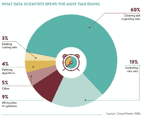
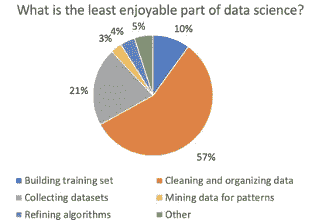
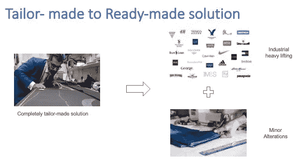

# 为什么数据驱动文化仍然是许多组织的一个深远目标？

> 原文：<https://blog.devgenius.io/why-data-driven-culture-is-still-a-far-reaching-goal-for-many-organizations-ab8a6d5bf0a7?source=collection_archive---------3----------------------->

## 数据驱动文化面临的挑战，以及交付模式的变化如何有助于实现这一目标

创建协作的、数据驱动的文化是许多现代组织最重要的目标之一。然而，数据和数据处理工具的使用仍然仅限于选定的少数技术用户或高层管理人员。

> “一般来说，当人们看到数字时，他们应该更加怀疑。[他们应该更愿意自己摆弄数据](https://www.linkedin.com/pulse/20141118145642-24928192-predictably-inaccurate-big-data-brokers/)。——[*内特·西尔弗*](https://fivethirtyeight.com/contributors/nate-silver/) *，FiveThirtyEight 创始人，主编。*

没有数据的民主化，数据驱动的文化就无法存在。数据民主化当然不意味着对所有组织数据的无限制访问。数据民主化的目标是，能够帮助员工做出有效商业决策的数据应该以一种*可用的格式*、*足够快地*访问，而不需要他们成为*技术数据专家*才能理解这些数据。

## 能否通过确保数据的可访问性来使数据民主化？

以下是数据科学家大部分时间花在哪里的调查结果:

数据科学家花在数据准备上的时间最多

平均而言，数据科学家花费几乎 80%的时间在数据准备上。不过，这是对他们时间的合理利用吗？

数据科学家发现数据准备是他们工作中最不愉快的部分

尽管大部分时间都花在数据准备任务上，但大多数数据科学家发现这些任务是他们工作中最不愉快的部分。这一观察来自技术上最先进的数据用户群体之一。可以理解的是，人们希望从数据中获得洞察力，但不得不在数据准备本身上花费太多时间，从而阻碍了数据驱动文化的传播。

## **集中式数据工程服务有助于数据民主化吗？**

为了解决这一问题，传统上，组织会委托一个集中的数据工程团队来创建企业级的数据仓库或数据湖。然后，分析人员可以接入这个中央数据存储来获得洞察力。然而，这种数据交付模式目前面临压力。让我为你描绘一个场景:

> 假设需要一个额外的指标来完成他们的数据分析。但是，要达到这一指标，需要在数据仓库中处理额外的数据。
> 
> 为了让集中的数据工程团队提供服务，员工需要排队等候，即使是他们能够自己编写的微小变化

集中式数据工程服务有三个主要问题:

1.  定制的设计和交付模式不可扩展
2.  当一个集中的团队必须在数据管道中编写业务逻辑时，业务逻辑的所有权就被稀释了。
3.  由于数据管道应该从源提取数据，并且还需要根据业务规则转换数据，因此这些管道很容易受到源端和目标端发生的变化的影响。源和目标之间的这种紧密耦合大大增加了数据管道的维护成本。

## 数据工程团队如何实现规模化？

有趣的是，定制交付模式的可扩展性解决方案也来自同一个时尚行业— *成衣*。
时装公司生产各种标准尺寸的成衣。但是，如果客户仍然需要少量定制，与从头开始定制解决方案相比，她总能以很少的成本和时间完成。

将任务划分为标准和定制的桶可以创建可伸缩性

基于类似的类比，数据工程团队也可以通过集中管理重技术方面来实现规模化，同时建立技术、流程和人员实践，以支持业务用户在自助服务模型中完成较小的定制。让我们看看哪些组件可以作为托管服务集中交付:

1.  **平台即服务(PAAS/ SAAS)** —创建数据管道和执行分析的基础设施是集中管理的。理想情况下，它还应该包括工具和应用程序。该平台应该是高度可扩展的，最好是基于云的
2.  **数据即服务(DAAS)——**通过创建一个集中式数据仓库产品，集中管理数据采购、数据质量和性能
3.  **数据治理—** 在分散交付模式中，数据治理占据了更加重要的位置，因为每一次治理失误都可能因能够直接操纵数据的用户数量增加而扩大。数据工程团队需要重新关注质量、访问、沿袭、编目等。，然后才能为整个组织开放对数据的访问。

我们计划分散的唯一组件是先前数据管道的 ***业务逻辑*** 组件。特定于领域的业务逻辑组件应该被分散，以处理更接近领域的技术用户，例如数据分析师和数据科学家。

业务逻辑的自助服务可以扩展数据工程团队的数据交付模型

## 摘要

由于以下重大挑战，组织很难传播数据驱动的文化:

1.  对数据的访问是有限的
2.  如果访问是可用的，那么它是通过报告等只读格式。，从而限制了*玩弄数据*的方面，这对于数据民主化至关重要。
3.  获取原始数据并没有使其民主化，因为太多的时间花在数据准备本身的重复和多余的任务上。
4.  由于定制的交付模型，集中式数据工程团队面临着可扩展性挑战。

推广数据驱动文化的一种方式是推广混合数据交付模型。混合交付模型可以通过提供业务逻辑的自助服务来促进数据民主化，同时集中管理繁重的数据准备工作。

现代数据堆栈是混合数据交付模型这一概念背后的驱动力。在接下来的文章中，我们将研究关于 [***的技术细节*** 如何通过利用正确的工具和架构来实现这个](https://medium.com/@meet.aman.gupta/how-can-modern-data-stack-help-in-data-democratization-fed426e764b7)。

请在 Linkedin[上联系我，以便进一步交流。](https://www.linkedin.com/in/meetguptaaman/)

如果你喜欢读这篇文章，别忘了鼓掌👏它跟我来。欢迎反馈！

*多谢！*

[这里的](https://medium.com/@meet.aman.gupta/how-can-modern-data-stack-help-in-data-democratization-fed426e764b7)是这个博客系列的第二部分。

**参考:**

1.  [https://www . LinkedIn . com/pulse/20141118145642-24928192-可预测-不准确-大数据-经纪人/](https://www.linkedin.com/pulse/20141118145642-24928192-predictably-inaccurate-big-data-brokers/)
2.  [https://visit . figure-eight . com/RS/416-ZBE-142/images/crowd flower _ DataScienceReport _ 2016 . pdf](https://visit.figure-eight.com/rs/416-ZBE-142/images/CrowdFlower_DataScienceReport_2016.pdf)
3.  [https://www . researchgate . net/figure/Time-consumption-activities-of-data-science-5 _ fig 1 _ 343441512](https://www.researchgate.net/figure/Time-consuming-activities-of-data-science-5_fig1_343441512)