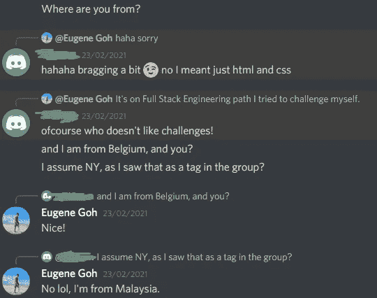

# 为什么我开始自学编码？

> 原文：<https://blog.devgenius.io/why-did-i-start-teaching-myself-to-code-1e1a5a51610c?source=collection_archive---------5----------------------->

## 如果你不先学会如何爬行，你就永远不会学会如何行走。

[Unsplash](https://unsplash.com?utm_source=medium&utm_medium=referral) 上 [AltumCode](https://unsplash.com/@altumcode?utm_source=medium&utm_medium=referral) 的照片

让我们回顾一下 2020 年，看看有多少人因为新冠肺炎而被解雇。甚至我的朋友和亲戚也受到了新冠肺炎疫情的影响，主要是在旅游业。

让我告诉你我的经历，当我刚开始学习如何编码时，我不断地敲打墙壁，我将带你和我一起回到 2020 年 9 月。当我的国家(马来西亚)进入封锁状态，学校由于**移动控制命令**被迫关闭时，我开始学习如何自己编写代码。学校采用远程学习。从字面上看，我在家里太自由了，我总是在想我将来想做什么？人生就是这样吗？想都没想，我就开始自学编码。**我为什么要开始呢？**

# **1)让我为未来做好准备**

Javier Allegue Barros 在 [Unsplash](https://unsplash.com?utm_source=medium&utm_medium=referral) 上拍摄的照片

这是不言自明的。你们中的一些人可能会说我会在大学里学习。

嗯，对我来说，我宁愿在青少年时期自学如何自己编码和创造东西，而不用乞求别人来帮我。除了成就感，相信我学习一项新技能，学习编码也能帮助你感受到生活的目标感。

编码是一项超级棒的技能，可以在我未来的简历中加入，因为我现在还在上高中。我总是告诉自己要考虑长远，而不是短期。

# 2)我的学校不教编码

阿诺·弗朗西斯卡在 [Unsplash](https://unsplash.com?utm_source=medium&utm_medium=referral) 上拍摄的照片

是啊！你没听错，说实话我学校不教编码。不要误解我，有些学校确实教编码，但不是我的。没有任何编码背景的我决定在 [**Codecademy**](http://www.codecademy.com) 上试用 [**代码基础**](https://www.codecademy.com/learn/paths/code-foundations) 课程。

结果是 [**代码基础**](https://www.codecademy.com/learn/paths/code-foundations) 课程非常有趣，我接触了很多东西，从编程入门、玩 HTML & CSS，到你在编程领域能做什么。

对我来说最好的部分是，与我在学校学到的知识相比，在我的国家封锁期间，我可以通过自学获得过多的知识。

当然，我也使用不同的资源，不仅仅是 [**Codecademy**](http://www.codecademy.com) ，我还使用[**FreeCodeCamp**](https://www.freecodecamp.org/)&[**YouTube**](http://www.youtube.com)。

# 3)编码教会我思考

[Jason Leung](https://unsplash.com/@ninjason?utm_source=medium&utm_medium=referral) 在 [Unsplash](https://unsplash.com?utm_source=medium&utm_medium=referral) 上的照片

> “这个国家的每个人都应该学会给计算机编程，因为它教你如何思考”
> 
> —史蒂夫·乔布斯

我完全同意 ***乔布斯的名言*** ，编码给我巨大的压力。

编码教会我如何批判性地、算法地、以正确的方式思考。我能够教自己冷静下来，有耐心，把问题分成更小的部分，我经历过，当我独自做项目时，有时我会被困在用 JavaScript 实现一些逻辑上。我刚出道的时候很纠结。

通过将问题分解成块，我能够使用约束来定义问题(我必须弄清楚什么将进入我的代码，什么将从我的代码中出来)，我必须精确，我必须完全理解问题的所有组成部分及其解决方案，以便解决问题。

这种定义和分解解决问题的方法非常适用于许多领域的问题，尤其是在科学和数学领域。

给你一个建议，如果你不能解决你的问题，试着去谷歌一下。

# 4)网络&交朋友

我的一个比利时朋友

我可能会被困在家里，但是外面有一群欣欣向荣的**编码社区**我可以加入。

我很确定我们中的许多人在禁闭期间自学编码。

话虽如此，我们中的许多人肯定会加入一个在线社区，相处并交朋友。

对我来说，我可以结交来自世界各地的朋友，包括来自英国、比利时等地的朋友。一旦你进入编码社区，你可能会惊讶地发现有多少人和你一样在学习编码。

所以，一定要和你的朋友分享你的编程目标或者你目前正在做的事情，以便和他们保持联系，将来他/她也可能成为你的商业伙伴。没人知道…

切记一起学习新技能，因为 ***一教两学*** 。

# 把东西包起来

总之，如果你想构建你长期以来一直想要的东西，或者你只是想交朋友和增强你的思维能力，编码可能是你的正确选择。

不管怎样，当你投入到编码中时，你应该摆脱在编码过程中遇到问题时的放弃感，对于一个特定的问题，总会有一个解决方案。所以如果你想开始编码，我会说-> **就开始吧！**

现在没有比自学编程更好的时机了。**就这么做！**

在 [**LinkedIn**](https://www.linkedin.com/in/eugene-goh-5236241a9/) 和 [**Twitter**](https://twitter.com/EugeneGohHere) **上随时联系我。**