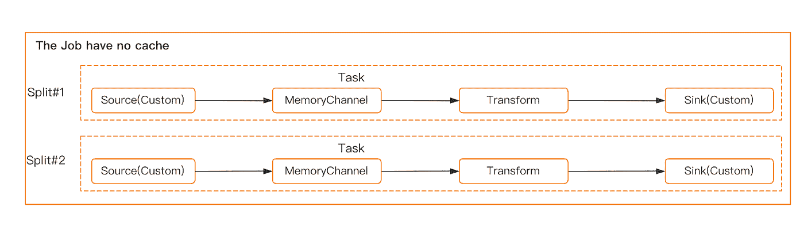

# 我们为什么要自主研发海底隧道发动机，想解决什么问题？

> 原文：<https://blog.devgenius.io/why-did-we-self-developed-the-seatunnel-engine-and-what-problems-do-we-want-to-solve-6f06c9261e3e?source=collection_archive---------13----------------------->

***由李宗文执笔，***

> SeaTunnel 自行开发了我们自己的发动机。我们为什么需要海底隧道发动机，我们想解决什么问题？这些都是我在这篇文章中要回答的问题。

# 更好的资源利用率

实时数据同步是一个关键的使用场景。有时我们需要实时同步整个数据库。但是一些流行数据同步引擎对每个表执行一个作业。这种做法的优点是一个作业失败不会影响另一个作业，但是当大多数表只有少量数据时，这可能会造成资源浪费。

我们希望海底隧道发动机可以解决这个问题。我们计划支持更灵活的资源共享策略。当由同一用户提交时，它将允许一些作业共享资源。用户甚至可以指定在哪些作业之间共享资源。如果对此有什么看法，欢迎在邮件列表或 GitHub 问题中讨论。

# 较少的数据库连接器

使用 CDC 进行整个数据库同步过程中的另一个常见问题是，每个表都需要一个数据库连接器。当数据库中有很多表时，这会给 DB 服务器带来很大压力。

为什么不把数据库连接器设计成作业之间的共享资源呢？以便用户可以配置他们的数据库连接器池。当作业使用连接器池时，SeaTunnel 引擎将在源/接收器连接器的节点上初始化连接器池。然后，我们将连接器池推入源/接收器连接器。通过更好地利用资源的特性，我们可以将数据库连接器的数量减少到一个可接受的范围。

减少 CDC 源连接器使用的数据库连接器的另一种方法是在 CDC 源连接器中支持多表读取。然后该流将在 SeaTunnel 引擎中按照表名进行拆分。

它以这种方式减少了 CDC 源连接器使用的数据库连接器，但如果同步目标是数据库，则似乎无法减少接收器使用的数据库连接器。因此，共享数据库连接器池将是一个好的解决方案。

# 源和接收器之间的数据缓存

Flume 是一个优秀的数据同步项目。Flume Channel 可以在 Sink 失败无法写入数据时缓存数据。这在某些情况下很有用。例如，一些用户保存数据库日志的时间有限。CDC 源连接器必须确保它可以读取数据库日志，即使接收器不能写入数据。

一个可行的解决方案是开始两份工作。一个作业使用 CDC 源连接器读取数据库日志，然后使用 Kafka 接收器连接器将数据写入 Kafka。另一个作业使用 Kafka 源连接器从 Kafka 读取数据，然后使用目标接收器连接器将数据写入目标。这种解决方案需要用户对基础技术有深刻的理解，两份工作会增加运维的难度。因为每个工作都需要一个 JobMaster，所以它将需要更多的资源。

在理想情况下，用户只知道他们将从源读取数据并将数据写入接收器，同时，如果接收器在此过程中失败，数据可以被缓存。同步引擎需要将缓存操作自动添加到执行计划中，并确保即使接收器失败，源也可以工作。在这个过程中，引擎需要确保写入缓存和从缓存中读取的数据是事务性的，这就保证了数据的一致性。

执行计划是这样的:

# 图式进化

模式演变是一个特性，它允许用户轻松地更改表的当前模式，以适应随时间变化的数据。最常见的是，在执行追加或覆盖操作时，使用它来自动调整模式以包含一个或多个新列。

这个特性在实时数据仓库场景中是必需的。目前，Flink 和 Spark 引擎不支持该功能。

# 更好的容错能力

目前，大多数实时处理引擎会在其中一个任务失败时使作业失败。主要原因是下游算子依赖于上游算子的计算结果。然而，在数据同步的场景中，数据只是从源读取，然后写入接收器。它不需要保存中间结果状态。因此，一项任务的失败不会影响其他任务的结果。

新引擎应该提供更复杂的容错管理。它应该支持单个任务的失败而不影响其他任务的执行，并提供一个界面，用户可以在该界面上手动重试失败的任务，而不是重试整个作业。

# 速度控制

在批处理作业管理中，我们需要支持速度控制，这使用户能够选择他们想要的同步速度，以防止过度影响源或目标数据库。

1.  整体建筑设计

我认为我们可以向弗林克建筑设计公司学习。

2.1 流任务

> 注意:
> 
> CacheSink:内部接收器，将数据写入缓存。
> 
> CacheSource:内部源，从缓存中读取数据。
> 
> 源(自定义):源连接器在海底隧道连接器模块中定义。
> 
> Sink(自定义):Sink 连接器是在 SeaTunnel 连接器模块中定义的。
> 
> 转换(自定义):转换连接器在 SeaTunnel 连接器模块中定义。
> 
> 任务:任务一般包括一个源+转换+接收操作。任务之间没有数据依赖或上下游关系。所以一个任务的失败不会影响其他任务的结果是否正确。

可以设置任务重试失败的次数。一般情况下，建议批量运行 3 次左右，可以有更多的实时场景。每个作业都支持在任务失败时设置作业是否失败的策略。一般来说，默认任务在离线场景下失败，默认任务在实时场景下失败。

> 注意:
> 
> 工作:每个工作都和 Flink 里的工作差不多。如果任何任务失败，调度器负责失败任务的容错。因为任务之间没有数据依赖，其他任务正常运行。事务和状态的持久性也是任务粒度，而不是作业粒度。

2.2 批处理任务

BatchTask 现在不支持缓存。

> 注意:
> 
> MemoryChannel:类似于 DataX 的通道，source 向通道写入数据，Sink 从通道取数据，可以支持离线场景下的限速。经过测试，在拆分次数相同的情况下，与无内存通道设计相比，内存通道将带来至少两倍的性能提升。

2.3 检查点设计

2.4 任务状态设计

而且目前随着 sea tunnel 2 . 0 . 3 beta 版本的发布，一个全新的引擎设计就在这里！

[**链接:重大发布！SeaTunnel 2.3.0-beta 支持自主创新的 SeaTunnel 引擎和更多连接器！**](https://medium.com/@seatunnel/major-release-c5ad939d21c8)

经历了这么多轮讨论和迭代，新的 SeaTunnel 引擎并没有完全遵循原始设计，而是针对整体平衡和关键功能的实现进行了优化。

无论如何，SeaTunnel 引擎正在发展，并将成为你所知道的第一个也是一个伟大的独立开发的大数据同步引擎！

# 关于海底隧道

SeaTunnel(原 Waterdrop)是一个简单易用、超高性能的分布式数据集成平台，支持海量数据的实时同步，可以稳定高效地同步每天数千亿的数据。

**我们为什么需要海底隧道？**

SeaTunnel 竭尽所能解决你在同步海量数据时可能遇到的问题。

*   数据丢失和重复
*   任务构建和延迟
*   低吞吐量
*   从应用到生产周期长
*   缺乏应用程序状态监控

**海底隧道使用场景**

*   海量数据同步
*   海量数据集成
*   大量数据的 ETL
*   海量数据聚合
*   多源数据处理

**海底隧道的特点**

*   丰富的组件
*   高可扩展性
*   使用方便
*   成熟稳重

**如何快速上手 SeaTunnel？**

想快速体验海底隧道？SeaTunnel 2.1.0 只需 10 秒钟即可启动并运行。

[https://seatunnel.apache.org/docs/2.1.0/developement/setup](https://seatunnel.apache.org/docs/2.1.0/developement/setup)

**我能做些什么？**

我们邀请所有对本地开源全球化感兴趣的合作伙伴加入 SeaTunnel 贡献者大家庭，共同促进开源！

提交问题:

【https://github.com/apache/incubator-seatunnel/issues 

将代码贡献给:

[https://github.com/apache/incubator-seatunnel/pulls](https://github.com/apache/incubator-seatunnel/pulls)

订阅社区发展邮件列表:

dev-subscribe@seatunnel.apache.org

开发邮件列表:

dev@seatunnel.apache.org

加入时差:

[https://join . slack . com/t/Apache seatunnel/shared _ invite/ZT-1 HSO 5 N2 TV-mkfkwxonc 70 heqgxtvi 34 w](https://join.slack.com/t/apacheseatunnel/shared_invite/zt-1hso5n2tv-mkFKWxonc70HeqGxTVi34w)

关注 Twitter:

[https://twitter.com/ASFSeaTunnel](https://twitter.com/ASFSeaTunnel)

来加入我们吧！