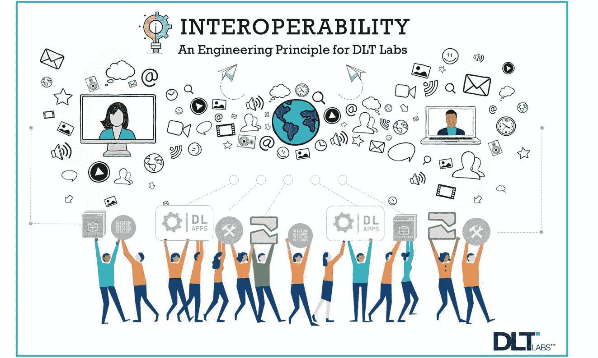

# 为什么 DLT 实验室关注互操作性

> 原文：<https://blog.devgenius.io/why-dlt-labs-focuses-on-interoperability-4f95889d6288?source=collection_archive---------26----------------------->

我们依靠可靠的连接速度来实现更好、更便捷的通信。各种计算机、软件和应用程序需要连接起来，以实现自动和实时的数据共享。这叫做互操作性。

在基于软件的平台和产品环境中，我们经常会遇到关于互操作性及其重要性的问题。并非所有基于软件的平台都关注互操作性，因此这是我们在创建 DL 平台时关注的问题。但是首先，让我们更详细地了解一下什么是互操作性。

> 与任何其他平台不同，DL 平台的架构是*异步*。

# 什么是互操作性？

互操作性是应用程序为了可靠的数据共享而相互连接和通信的能力。

这与硬件制造商、服务器的物理位置以及用于存储信息的数据库类型无关。对于一个成功的基于软件的平台来说，*互操作性*是一个受到关注和重视的工程原则，这一点至关重要。

这导致优化的数据共享、高效的通信和最大化的市场占有率。

# DL 平台如何利用互操作性？

DL 平台的设计将互操作性作为其主要关注领域之一。我们解决互操作性问题的能力使我们能够在不中断企业流程的情况下获得更广泛的市场份额。

> DL 平台使用一些不同的技术来支持它的框架；其中最大的一个是基于区块链的架构。区块链已经存在好几年了，但是很少有基于企业的应用程序使用这项技术。

经常引起我们注意的问题是分布式网络中各方之间交换和确保数据可信的效率。与其他任何平台不同，DL 平台的架构是*异步*。

在异步架构中，一个系统不等待另一个系统的回复，而是在回复中使用消息队列进行轮询。

创建了一个*压缩 URL* 用于表示各方之间传输的数据，从而实现了单一的真实来源和数据的统一视图。如果不留下数字足迹，数据就无法更新。

# DL 平台如何处理网络延迟？

**Kafka** 和 **Zookeeper** 消息队列用于管理任意两个系统之间的通信。这种异步架构的设计方式有助于平台处理任何类型的网络延迟。

这是 VISA 和 MasterCard 等公司使用的通用架构，这意味着我们的平台可以无缝地与这些支付网络通信。

# 互操作性的 3 大优势

1.  **增加沟通** —当作为计算机化网络一部分的系统数量没有限制时，有效沟通自然会增加。对于拥有全球业务的企业来说尤其如此。
2.  **提高流程效率** —当正确的数据可用时，无论原始数据源是什么，都可以以一致和及时的方式提供，利益相关者可以迅速做出业务决策。
3.  **降低成本** —优化业务流程、及时做出决策，以及将分散的数据整合成有意义的输出，所有这些都会减少收入流失，并整体降低运营成本。

随着人们不断地连接和通信，网络系统在全世界每天都在使用。无论是拥有全球业务的公司，还是试图为员工举办会议、让家人了解当天的活动，或者熬夜观看体育比赛，网络系统都使这一切成为可能。

有了 DL 平台，企业不仅能享受到这些好处，还能从增加沟通、提高流程效率、降低成本中获益。

UI/UX 环境中的等待时间是好事还是坏事？在这里找到答案:

 [## 等待时间如何影响用户期望？

### 首先，我想说我不是 UI/UX 专家。但是我知道等待时间并不总是一件坏事。

medium.com 的 DLT 实验室](https://medium.com/@dltlabs/how-do-wait-times-affect-user-expectations-411eefb9193d) 

*作者— Shailen Parbhoo，* *DLT 实验室*

**关于作者:** *Shailen* 在 DLT 实验室领导产品管理。他在银行和航空航天等多个行业担任产品经理/业务分析师，拥有丰富的咨询经验，并参与过 Apple Pay 和飞机健康管理等备受瞩目的项目。在他的职业生涯中，重点一直放在如何将客户的需求与技术的交付联系起来。

