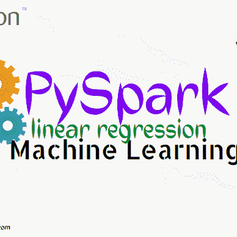
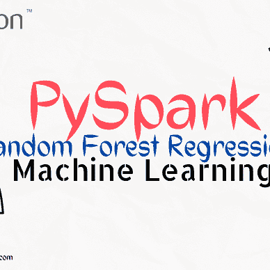

# 为什么数据工程师喜欢 BigQuery

> 原文：<https://blog.devgenius.io/why-do-data-engineers-loves-bigquery-14584d3608b8?source=collection_archive---------5----------------------->

BigQuery 是 Google Cloud 提供的现代数据仓库。这是非常容易设置，因为它是无服务器的。它用于分析目的。

## **加载和导出数据**

您的数据可以快速加载到 BigQuery 中。

BigQuery 处理完您的数据后，您可以将其导出以进行更深入的分析。

## **查询和查看数据**

您可以使用 BigQuery 进行交互式查询。

此外，您可以使用您的数据来运行批处理查询和构建虚拟表。

## **管理数据**

使用 BigQuery，您可以列出任务、分配、数据集和表。您可以修改数据集，并且可以找到关于每个数据集的更多信息。

BigQuery 允许您管理和删除您输入的任何数据。您可以使用 BigQuery 快速轻松地分析您的数据。

BigQuery 使您能够与您的团队交流见解。
你可以透露:

*   数据集
*   问题
*   电子表格
*   报告

# 最佳 BigQuery 特性:

## 1.无服务器洞察

当您使用 BigQuery 时，您的所有数据都在云上存储和处理。其无服务器架构使您能够自动扩展您的分析。

由于这一特性，您可以专注于您希望的最重要的见解。

## 2.实时分析

实时分析也是 BigQuery 机器学习的一个特点。该工具中提供了高速流插入 API。它有助于为实时数据的分析奠定坚实的基础。

您可以输入最新的公司数据，并使用实时分析立即进行检查。因为它使您能够在收集数据时理解数据，所以该功能对您的公司非常有帮助。

## 3.数据传输服务

您可以使用数据传输服务从外部源自动传输数据。您可以使用 BigQuery 数据传输服务来计划和全面管理来自许多来源的数据收集。

这些平台包括:

*   谷歌营销平台
*   谷歌广告
*   油管（国外视频网站）
*   Teradata
*   亚马逊 S3

## 4.自动高可用性

由于自动高可用性，您可以获得透明和自动的存储。您可以拥有多个可用性极佳的存储位置。

此功能不需要额外的成本或设置。

## 5.自动备份和轻松恢复

您的业务依赖于您的数据。一边努力消化，一边又不想失去。BigQuery 自动复制和存储您的数据，确保其安全性。

BigQuery 保存了七天的更改历史。您可以比较不同时间点的数据，并使用此工具恢复以前的数据。这是监控数据和识别变化的绝佳工具。

# BigQuery 的优势

## 1.It 设置快速

当您忙于经营业务时，您不希望花费数小时尝试建立一个数据工具来汇总您的所有信息。

BigQuery 最显著的优点是设置简单快捷。数据仓库可以在几秒钟内建立起来。一旦建立了数据仓库，就可以开始查询数据。

在几秒钟内，BigQuery 可以处理数十亿行数据。

它处理所有的实时数据，并在数据进入工具后立即进行处理。BigQuery 是数据管理的理想选择，因为它速度快。

## 2.它很容易使用

BigQuery 最显著的优点之一是易于使用。构建自己的数据中心不仅成本高昂，而且耗时且难以扩展。这让你感到沮丧，甚至会浪费你试图理解数据的时间。BigQuery 简化了这个过程。

你把你的数据输入工具，只为你使用的东西付费。

这是一种帮助您处理和理解数据的有效方式，无需构建自己的数据中心。

## 3.它是负担得起的

BigQuery 的定价是根据您的需求量身定制的。您只需为您使用的资源付费。谷歌只根据你使用工具的多少向你的公司收费，不管是存储还是计算资源。

当您查看 BigQuery 定价时，您会注意到存储和流插入是分开收费的。

**对于存储，成本为:**

*   每月每 GB 0.02 美元
*   长期存储每月每 Gb 0.01 美元

**对于流式插入，成本为:**

*   每 200 MB 0.01 美元

## 4.您的数据受到保护

您的数据对您的公司很有价值。BigQuery 保护您的数据并确保其安全性。

尽管您应该始终有一个灾难恢复计划，但该过程减轻了在数据受损或丢失的情况下有一个灾难恢复计划的负担。

## 5.它可以无缝扩展

缩放是数据输入的主要问题之一。许多企业都很难理解如何通过正确地调整数据来让数据变得有意义。
BigQuery 将为您处理所有的缩放工作。

BigQuery 将数据存储和数据计算分开。这种方法使弹性伸缩成为可能，允许您以更高的性能比率进行伸缩。
它能够完美地进行实时分析，并适当地扩展您的数据，以便您能够理解。

感谢你阅读我的博客。希望你喜欢。

> 想要更多的数据工程博客，请关注我，为这个博客鼓掌。

想学阿帕奇 Spark。

[Deepanshu tyagi](https://brilliantprogrammer.medium.com/?source=post_page-----14584d3608b8--------------------------------)

## 阿帕奇派斯帕克

[View list](https://brilliantprogrammer.medium.com/list/apache-pyspark-8181c687929e?source=post_page-----14584d3608b8--------------------------------)8 stories