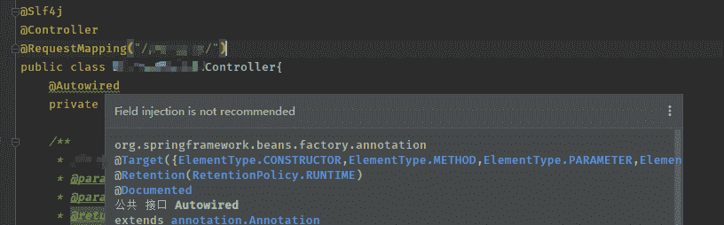

# 为什么 Spring 和 IDEA 不推荐@Autowired 标注？

> 原文：<https://blog.devgenius.io/why-do-spring-and-idea-not-recommend-autowired-annotation-7273691a3079?source=collection_archive---------0----------------------->

D 你有没有意识到，当你用@Autowired 注解在 IDEA 中开发的时候，有这个警告？



> 不推荐现场注射。

但是 **@Resource** 注释不会产生这个警告。

请记住，Spring 使用了几种方法来注入依赖关系:

## 1.构造函数注入

```
private final InventoryMapper inventoryMapper;

public InventoryController(InventoryMapper inventoryMapper) {
    this.inventoryMapper = inventoryMapper;
}
```

## 2.定型剂注射

```
private InventoryMapper inventoryMapper;

public void setInventoryMapper(InventoryMapper inventoryMapper) {
    this.inventoryMapper = inventoryMapper;
}
```

## 3.注释注入

```
@Autowired
private InventoryMapper inventoryMapper;
```

# @自动连线 vs @资源

事实上，两者都利用注释进行依赖注入，但是有一些不同的细节:

*   *依赖关系标识* : @Autowired 默认按类型注入 beans，而@Resource 默认按名称使用，如果不是，则按类型使用。
*   目标 : @Autowired 可以用于构造函数、方法、参数和字段，而@Resource 只能应用于方法和字段。
*   *提供者* : @Autowired 由 Spring 提供，而@Resource 由 JSR-250 提供。

回到我们上面提到的问题:

## 为什么 IDEA 会警告@Autowired 而不是@Resource？

这可能是因为@Autowired 是由 Spring 提供的，它将它绑定到特定的 Spring IoC。如果使用另一个 IoC 框架，则不支持字段注入。

相比之下，@Resource 是由 JSR-250 提供的，是 Java 标准。我们使用的 IoC 容器应该与 Java 标准兼容，这样依赖关系仍然可以正常工作。

我希望这篇文章对你有所帮助。

我是后端软件工程师。如果你渴望了解技术，请关注我的频道，了解我在日常工作和生活中获得的灵感。

> **接通:**
> [我的 LinkedIn](https://www.linkedin.com/in/daini-wang-5127b2182)
> 
> **阅读更多:**

[](https://medium.com/geekculture/10-best-software-engineering-practices-for-java-f438906c0211) [## Java 的 10 个最佳软件工程实践

### 1.编写有意义的 Java-doc/注释

medium.com](https://medium.com/geekculture/10-best-software-engineering-practices-for-java-f438906c0211) [](/my-favorite-5-intellij-plugins-that-can-boost-your-productivity-b30ac73389ce) [## 我最喜欢的 5 个 IntelliJ 插件可以提高你的工作效率

### IntelliJ 已经成为 2022 年 Java 开发中使用最多的 IDE。

blog.devgenius.io](/my-favorite-5-intellij-plugins-that-can-boost-your-productivity-b30ac73389ce) [](/10-java-shortcuts-in-intellij-idea-5ee3a8caa02d) [## IntelliJ IDEA 中的 10 个 Java 快捷方式

### 我上一篇关于我最喜欢的 5 个 IntelliJ 插件的文章得到了很好的反馈。

blog.devgenius.io](/10-java-shortcuts-in-intellij-idea-5ee3a8caa02d)