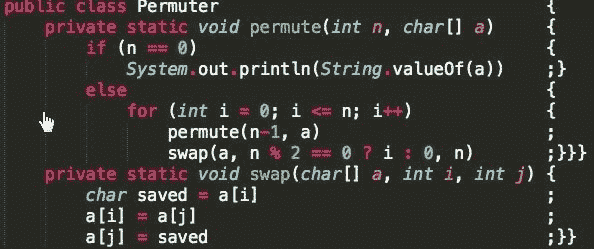
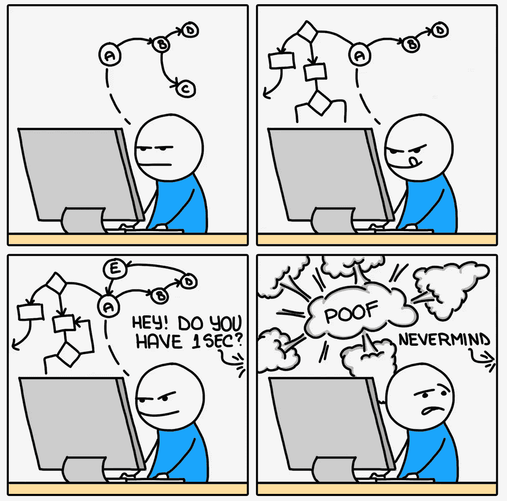
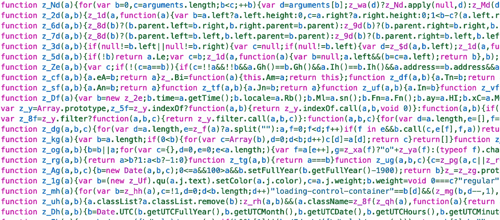

# 为什么我们会掉棉绒？

> 原文：<https://blog.devgenius.io/why-do-we-lint-97e6f134953f?source=collection_archive---------15----------------------->

## 为了真正理解可读性，我们必须暂时离开比较科学，进入心理学领域

经典/r/节目幽默转贴。

编码风格是一个热门话题。开发人员到处都在争论制表符和空格、同一行上的大括号、行长度限制等等。人们发明了自动过磅器来寻找违反风格的地方，并像编译器一样破坏构建。但是*为什么呢？*为什么代码风格应该打破一个构建？今天我们来看看可读性的首要原则，这样我们就能知道这些规则从何而来。

# 认知负荷

为了真正理解可读性，我们必须暂时离开比较科学，进入心理学领域。每个人脑子里一次只能容纳这么多，称为他们的[工作记忆](https://en.wikipedia.org/wiki/Working_memory)。[认知负荷](https://en.wikipedia.org/wiki/Cognitive_load)指的是某样东西在一个人的工作记忆中占据的空间。你可以把它想象成一个缓存:一旦它满了，就必须清除一些东西来添加新的东西。

然而，认知负荷的规则远没有数据结构那么简单。想想电话号码:哪一个更容易记忆？

用不同的方式分解信息会影响记忆

如果你像我一样，你会把开头和结尾的数字记为“信息太多”。中间的那些就好理解多了。这是因为每个数字都有不同的认知负荷量。

# 缺陷和效率

来自[https://www.monkeyuser.com/](https://www.monkeyuser.com/)的漫画

现在我们对人类记忆有了更多的了解，我们可以把它应用到软件开发中。每个特性都有其缺陷和边缘情况，所以开发人员一次能记住的越多，他们就越有可能在部署前发现缺陷。

到了审查代码的时候，问题会更加突出。如果我把所有的工作内存空间都花在阅读代码上，我就不可能找到边缘情况。想象一下，如果让你审查简化的 Javascript，会发生什么！

这里有窃听器吗？祝你好运。

有了这个联系，我们终于有了代码可读性的神奇规则:**最小化代码的认知负荷。**

# 风格原则

以下是关于认知负荷的三条简单的经验法则:

1.  小的、自包含的块是低负载的。由三部分组成的电话号码比一个长号码更容易记忆。
2.  熟能生巧。随着时间的推移，大脑在存储重复结构方面变得更好，减少了它们的负荷。
3.  假设可以节省大量时间。依赖一个假设意味着几乎完全跳过工作记忆。

这些规则转化为编写优秀代码的基本原则:

1.  使用函数将逻辑分成易于阅读的部分。读者只需要阅读你的函数名，而不是所有的东西。
2.  在缩进和括号中保持一致的风格，这样其他人就可以忽略空格而专注于正在运行的代码。
3.  使用层来设计您的代码库，这样其他人就可以对您的功能结构做出假设，而不必进行调查。

我们越遵循这些规则，我们的认知负荷就会越低，我们产生的错误就会越少。如果我们不遵循它们，我们将花费越来越多的时间试图找出已经写好的代码，减慢我们自己的速度并引入错误。

# 好的和坏的风格规则

最后，凭借我们所有的新理解和原则，我们可以开发一个有用的风格指南。然而，要小心:有可能走得太远。

好的风格规则直接影响理解代码功能的能力。开发人员依靠缩进来推断功能，因此这包括大括号和缩进规则。这些规则通过调用上述原则简化了理解代码的过程。

一个**坏风格规则**是为了一致性而要求一致性。一些例子是关于连续空行计数或尾随空白的规则。这些规则会在根本没有任何代码的行上导致错误，实际上*给代码库增加了*认知负荷，却没有给人类提供任何(字面上的)可见的好处。

在这种情况下，重要的是要记住，你不必为每件事都指定一个规则。一致性是有用的，但不应该在不考虑其目的的情况下应用它。一次添加一个 lint 规则，思考每个规则:这如何帮助其他人阅读代码？