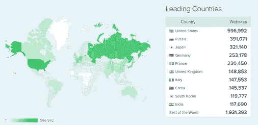
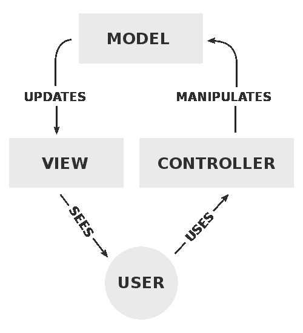

# 为什么世界领先的公司仍然雇佣 PHP 开发人员？

> 原文：<https://blog.devgenius.io/why-do-world-leading-corporations-still-hire-php-developers-97f4b3da812d?source=collection_archive---------2----------------------->

自 1994 年创建以来，PHP(超文本预处理器)编程语言一直是最需要和最流行的编程语言之一。那么，PHP 在国际 ICLT 业界长盛不衰的秘诀是什么呢？PHP 为什么不死？为什么世界领先的网站都是用 PHP 编程语言开发的，为什么从那时起他们就把它包括在他们的主要技术栈中？为什么越来越多的企业雇佣专门的 PHP 程序员和 Laravel 开发人员？PHP 开发在未来几年还会如此受欢迎吗？

关于这种编程语言的传说已经流传了几十年，人们仍然渴望得到答案。让我们从头开始。

**PHP 的历史**

PHP 编程语言是由拉斯马斯·勒德尔夫在 1994 年秋天构思的。最初，他们使用其非发布版本来跟踪勒多夫的在线简历浏览者。最终，PHP 的第一个版本在一年后，即 1995 年初，可供公众使用。当时，它被称为人事主页工具。它有一个简单的包裹引擎，可以理解有限数量的宏和实用程序，这些在当时的主页中广泛使用，例如，留言簿、计数器和其他类似的东西。

在 1995 年中期，人事主页工具的第二个版本以 PHP/FI 版本 2 的名称发布。它与表单解释器以及 mSQL 支持一起工作。FI 来自另一个解释 HTML 表单数据的包。

PHP 的新版本以惊人的速度发展。人们似乎很喜欢它，并开始为它贡献代码。这推动了它的进一步成功，到 1997 年，Zeev Suraski 和 Andi Gutmans 从头开始重写了解析器，形成了 PHP 第 3 版的基础，这开创了一些不可思议的事情。

**PHP Now**

今天，PHP 是一种后端通用脚本语言，我们用它来开发动态的交互式网站和 web 应用程序。企业使用 PHP 开发来管理数据库、会话跟踪、构建完整的电子商务网站、ERP 软件解决方案等等。

PHP 是首批嵌入 HTML 的服务器端语言之一。它简化了向网页添加新功能的过程，而无需调用外部文件来获取数据。

PHP 还兼容许多[流行的数据库](https://www.coderiders.am/blog/babken-d-of-coderiders-shares-his-story-as-sql-developer)，如 MySQL、PostgreSQL、Oracle 和微软 SQL Server。

**PHP 的主要功能包括:**

● 创建易于更新的动态页面内容，

●在服务器上创建、打开、读取、写入和终止文件，

●表格数据收集的机会，

●发送和接收 cookies，

●控制用户访问，

●加密敏感的用户数据。

由于这些难以置信的机会，许多来自不同行业的公司雇佣了专门的 PHP 程序员。

根据 [W3Techs](https://www.similartech.com/technologies/php) 的数据，所有网站中有 78.9%的网站使用 PHP 和一种已知的服务器端编程语言。因此，事实证明，大约 10 个网站中有 8 个以这样或那样的方式使用 PHP。换句话说，PHP 在互联网上是如此的受欢迎，即使它现在死了，所有那些用 PHP 开发的大网站的支持将确保它长期的工作和影响。

[SimilarTech 统计数据](https://www.similartech.com/technologies/php)区分了以下 PHP 非常流行的国家。

美国、俄罗斯、日本、德国和法国位列前五，接下来是意大利、中国、韩国和印度。

作为一家提供合格 PHP 开发人员的软件外包公司，我们 [CodeRiders](https://www.coderiders.am/) 经常收到关于 PHP 开发效率的问题。

一切都很简单。PHP 的有效性取决于它的正确使用。如果您将这种编程语言用于其主要目的——编写网站和应用程序，它将发挥最大的作用。

**程序员关于 PHP 开发**

*“如果你曾经对 PHP 有过不好的体验，首先，问问你自己“我用这种语言构建了什么？".另一方面，如果您需要多个 web 和移动应用程序或自定义软件解决方案，则使用 Python 更合适，Python 的使用领域更广。Python 在大数据分析、机器学习、AI 等方面也很有用。你可能会在这里问我一个问题，“那么当有另一种技术用于多种目的时，我为什么要首先使用 PHP 呢？“嗯，是关于舒适的。PHP 不是一种类型化语言；在使用 PHP 时，你会遇到更少的障碍。此外，它对用户和开发者来说都更快。最近，PHP 8 JIT 编译器的发布极大地提高了速度。*

***Albert Ispiryan，***[***code riders***](https://www.coderiders.am/)高级后端软件开发人员

PHP 框架

PHP 框架有多种类型。最流行的 PHP 框架有:

● Laravel，

● Symfony，

● Zend，

● Yii，

● CodeIgniter。

因此，许多需要新的 PHP 软件解决方案的企业主遇到选择合适的 PHP 框架的艰难决定是很自然的。所有这些框架都是开源的，不需要任何许可费用。这些 PHP 框架中的一些属于全栈 web 框架类别，而另一些是微框架。它们中的大多数都遵循模型视图控制器(MVC)设计模式，这种模式将数据操作与其表示分离开来。

MVC 过程很简单。模型将业务逻辑和应用程序数据存储到视图中(表示层)。用户与视图交互，并可以通过控制器输入指令。控制器向模型发出这些命令，循环继续。简而言之，模型关乎数据，视图关乎外观，控制器关乎行为。

**Laravel:最流行和需求最大的 PHP 框架**

laravel(2011 年推出)已经成为最受欢迎的 PHP 框架，因为它可以安全地处理复杂的应用程序，并促进快速的应用程序开发。它有一个富有表现力和优雅的语法。它简化并加速了 web 项目的类似任务，如认证、路由、会话、指导。它有干净的架构，是作曲家友好的。

Laravel 的这些优势促使企业主或公司领导为他们的复杂项目雇佣 Laravel 开发人员。在 CodeRiders，我们依靠这些优势，努力提供最合格的专门 Laravel 程序员。

我们一些成功的 Laravel 项目包括:

***产品:房地产应用(加盟商和加盟商在线平台)***

技术堆栈:Laravel 5.8 用于后端，Vue.js 用于前端

国家:丹麦

***产品:房东和房客的在线平台***

技术堆栈:Laravel 5.8 用于后端，Vue.js 用于前端

国家:南非共和国

***产品:为一家营销公司开发基于 PHP 的 web 应用***

技术堆栈:Vue.js 2.6 用于前端，Laravel 5.8 用于后端

国家:中国

在对我们的高级软件开发人员 Albert Ispiryan 的采访中查看这些项目的完整描述，并查看我们的投资组合部分的客户评论。

要了解更多关于其他 PHP 框架的信息，比如 Symphony、Zend、CodeIgniter、Yii，我建议查看我们关于定义编码的顶级编程语言的文章。

PHP 的主要优势

**只要有网站，PHP 就是病毒**

一些编程语言严格地与特定的软件解决方案相关联。例如，当我们谈论机器学习(ML)或人工智能(AI)时，我们就停在 Python 上。当你想建立一个可扩展的快速网站时，同样的事情也会发生，你只需选择 PHP 开发。

**PHP 开发成本低**

PHP 从 1994 年就出现了，它创造了自己的身份。由于它是一种开源的服务器端编程语言，你可以在 PHP 开发过程中略微降低开发成本。

然而，PHP 开发价格也因国家而异。例如，在加拿大，根据 Talent.com 的调查，一个普通 PHP 开发人员的年薪在 8 万到 10 万美元之间。在澳大利亚，PHP 网站开发人员的年薪在 9 万美元到 11 万美元之间。我们在欧洲国家和美国有类似的数字，而在亚美尼亚，你可以以每小时 30-50 美元的价格雇佣具有相同技能的专门的 PHP 程序员。查看更多关于 [PHP 网站开发者费率](https://www.coderiders.am/blog/is-armenia-a-top-software-outsourcing-country)的细节。

**PHP 安全**

PHP 和其他服务器端语言一样安全。代码的脆弱性或不安全性取决于编写代码的人，而不是语言或工具。

**PHP 有一个很大的社区**

由于其悠久的历史和受欢迎程度，PHP 已经发展了一个强大的社区。PHP 开发人员的数量非常多。我们收到的几乎 50%的询问都是关于无处不在的 PHP。

**用 PHP 开发的著名网站/使用 PHP**

**脸书**

世界上广泛使用的社交媒体平台脸书(Meta)是用 PHP 开发的顶级网站之一。它最初的编程语言是 PHP，由它的创始人马克·扎克伯格和达斯汀·莫斯科维茨于 2004 年编写。自成立以来，脸书一直依赖 PHP 的优势之一，即在几秒钟内生成动态内容。因此，脸书上的大部分应用程序代码都使用 PHP。

在脸书，PHP 的使用在其漫长的历史和发展中一直没有改变。[脸书 28.95 亿](https://www.statista.com/statistics/264810/number-of-monthly-active-facebook-users-worldwide/)月活跃用户和[13 亿](https://datareportal.com/essential-facebook-messenger-stats)月活跃用户的脸书信使鼓励和激励各种现代公司使用 PHP 作为他们的主要应用程序代码。

总的来说，脸书平台是一个 API 的组合，使应用程序更加社会化。这个库包含开源的 PHP SDK，可以从 PHP 应用程序访问你的脸书帐户。

脸书商业软件开发工具包也使用 PHP。这是一个工具包，将专注于业务的 API 捆绑到一个 SDK 中，包括业务管理器、营销、页面和 Instagram Graph API。脸书商业软件开发工具包允许管理页面和帐户的活动，营销活动，以促进您的业务，如广告创建和传播，添加产品，见解，权限控制，等等。PHP 编程语言支持这一切。

2010 年，脸书也为 PHP 引入了 hip hop(HP HPC)。这个编译器将源代码翻译成另一种语言的源代码。

**维基百科**

MediaWiki 是 2002 年为支持维基百科而开发的免费开源软件。最初，创建 MediaWiki 的目的是运行维基百科。它使用 PHP 运行在 MySQL 数据库上。MediaWiki 仍然被几乎所有其他的 Wikimedia 平台使用，例如 Wiktionary、Wikimedia Commons 和 Wikidata。

MediaWiki 最初是用 PHP 编程语言编写的，它将所有文本内容存储到一个数据库中。该平台是世界上最大的网站之一，具有高度的可扩展性和国际化(提供 300 多种语言)，证明了 PHP 编程语言对于开发人员来说“简单易用”的有效性，以及使用其他语言和数据库的简易性和便利性。

其他重要的编程语言包括用于 MediaWiki 许多基本组件的 JavaScript，如 VisualEditor、Persoid 和所有小工具。Python 语言广泛用于开发像 Pywikibot 这样的工具，而 Ruby 是浏览器测试引擎(Cucumber)的基础语言，在 Puppet 部署系统中也很流行。

与脸书相比，在 2014 年，他们转向 HHVM，加快了页面数据的加载时间。

**Tumblr**

Tumblr 是世界上最著名的微博和社交网站之一，由戴维·卡普于 2007 年创立。它的前任和首任 CTO 是 Marco Arment，他用 PHP 编写了 Tumblr、Instapaper 和 Second Crack。根据 Arment 的说法，完全有可能写出好的 PHP 代码。他说:

“Tumblr、Instapaper 和我们的一些老咨询客户使用我们在过去四年中编写的一个很好的仅支持 PHP-5 的 MVC 框架，这使我们处于一个很好的位置:我们的优势是知道所有代码做什么，以及在哪里修复错误或添加功能，但我们也有这个成熟的、经过验证的框架来完成繁重的工作并强制实施良好的代码结构。”

2016 年，Tumblr 过渡到 PHP7，为实现创建了新的语言特性，包括标量类型提示和返回类型声明。Tumblr 社区目前每月有超过 5.55 亿的访客，并产生了超过 3.25 亿个博客。

**懈怠**

最受欢迎和最受欢迎的工作场所通信工具之一，消息、工具和文件的单一位置——Slack 最初是用 JavaScript、electronic、C++和 Hack 编写的。对于服务器端的应用逻辑，Slack 用的是 PHP，有点不常见。然而，价值 200 多亿美元的病毒性 CMS 系统证实了 PHP 比其他竞争环境为构建、更改和操作一个成功的项目提供了更好的支持。

或许，这些以及其他许多类似的 PHP 优势促使 Slack 使用这种编程语言。Slack 目前拥有超过 1000 万的日活跃用户，他们平均每天在该平台上花费 9 个小时。在这种程度上，付费版本也很受欢迎。它有 300 多万用户。根据 Slack 的用户统计，超过 43%的财富 100 强企业使用 Slack 的付费版本。

目前，Slack 积极雇佣 PHP 开发人员和上面列举的网站。

**世界上最流行、最受欢迎、最广泛使用的免费开源内容管理系统 WordPress 是用 PHP 编写的，并配有 MySQL 和 MariaDB 数据库。WordPress 仍然使用 PHP 与数据库交互并获取数据。**

**PHP 帮助从数据库中获取必要的组件，并将它们输出为静态 HTML。它允许数百万没有编程技能的日常用户创建和使用模板，拖放网站 UI 组件等。**

**WordPress 的核心文件使用 PHP。它包括了一些函数、钩子、类和方法，程序员和普通用户都可以用这些工具来扩展 WordPress 的功能。**

**继续阅读 CodeRiders 博客上的文章。单击下面的链接。**

** [## 为什么世界领先的公司仍然雇佣 PHP 开发人员？

### PHP(超文本预处理器)编程语言已经成为最需要和最流行的编程语言之一…

www.coderiders.am](https://www.coderiders.am/blog/why-do-world-leading-corporations-still-hire-php-developers)**