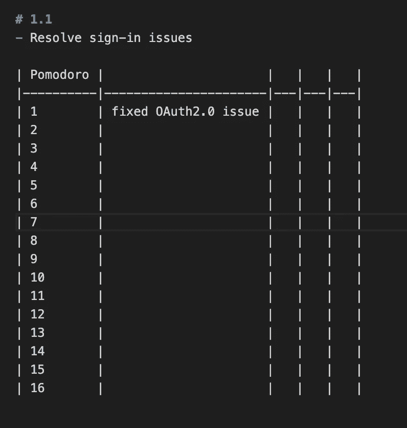

# 你为什么需要一本发展期刊？

> 原文：<https://blog.devgenius.io/why-do-you-need-a-development-journal-e06b5854368d?source=collection_archive---------1----------------------->

## 记录想法和工作有助于你的事业。这就是为什么你需要开始写日记。

索尼娅·兰福德在 [Unsplash](https://unsplash.com?utm_source=medium&utm_medium=referral) 上拍摄的照片

写日记有很多好处。当你分时段工作时，你会提高你的注意力。你将审视你过去的行为，看看你能改进或根除什么。

有关杂志福利的更多信息，请参考下面的文章:

 [## 本杰明·富兰克林:日记如何帮助你过上更好的生活

### 专注的艺术、责任的力量和自我反省的价值

medium.com](https://medium.com/personal-growth/benjamin-franklin-how-a-journal-can-help-you-lead-a-better-life-7c8ce70a4622) 

我会继续解释为什么你需要一本发展日志。

让我们进入一个日志能有所帮助的情况。你在打电话。一张票你似乎很熟悉。从这里有两个选择。

> 1.你没有日记，所以你需要穿过吉拉去找它。
> 
> 2.你已经跟踪了你的工作，并且可以在你的日志中找到你所有的问题。

如果你想选择第二个选项，请继续阅读本文。我来奠定我的期刊基础。记住这一点，让我们继续实际的技巧。

# 游戏化

 [## 游戏化

### 游戏化是游戏设计元素和游戏原则在非游戏环境中的应用。也可以是…

en.wikipedia.org](https://en.wikipedia.org/wiki/Gamification#Points) 

我喜欢游戏的一点是游戏点数。人们喜欢名字后面有一个更大的数字。想想钱的数字。

> 我们如何将日志游戏化？

我们可以通过使用[番茄工作法](https://francescocirillo.com/pages/pomodoro-technique)来使日志游戏化。使用这种技术，您需要在一段时间后注销。时间段设置为 25 分钟。

回想起来，这个日志就变成了**游戏化**。你投入的时间越多，你就越想工作。

在实际日志之前写下一天的大任务。之后，你可以把你的时间表，在那里你记录你的番茄。

我的日记布局

我今天画了 16 个番茄。在这两者之间，我有几段休息时间。当你一整天都在屏幕前时，这是至关重要的。

你会看到写日记的好处。你可以从你自己的日记中导出你的想法，并有一个明确的时间表。

# 思想

假设你正在开发一个简单的计算器。你必须把两个数相加。票证的范围没有说明号码类型。

你把这种怀疑写在日记里。打电话给业务分析师后，你澄清了这一点。你把它写在你的日记里。

这会给你的灵魂带来平静，因为你已经把它记在日记里了。票证范围可能会改变，但您现在知道了这些信息。票也可以保持不变，但是你在日记里写得很好。

思想不一定要放在时间表上。你可以在文档中自由书写它们。

# 工作跟踪

在开发过程中，工作跟踪是必不可少的。伐木在任何地方都有帮助。我们甚至记录一个程序做了什么，看看它有什么问题。

假设你有一张被重新打开的票。即使你有吉拉的机票，你也需要额外的信息。查看 Git 提交有时没有帮助，因为 rebase 或 merge 已经就位。

当你在这种情况下，依靠你的日记。你已经追踪了那张票周围的小块时间。在日志中，你会看到那个标签上的瓶颈。

工作跟踪有助于分而治之的技巧。你可以把一天的任务分成几个容易处理的部分。

将大代码分解成易于管理的部分会有所帮助。将你的任务分成小块会有很大帮助。

# 工作反思

你总是需要拍拍自己的背。回头看看日志，看看到目前为止你已经完成了什么。

> 鼓舞士气会帮助你度过忧郁的日子。

跟踪工作带来可衡量的结果。没有统计数据你就无法提高，你不知道你的痛点是什么。

> “如果你不能衡量它，你就不能改善它。”—彼得·德鲁克

感谢阅读！

 [## 没人告诉你的简单体面的个人日记

### 为什么你应该有一个稳定的个人发展日志

medium.com](https://medium.com/dev-genius/what-no-one-tells-you-about-simple-decent-personal-journal-4a9de184696a)