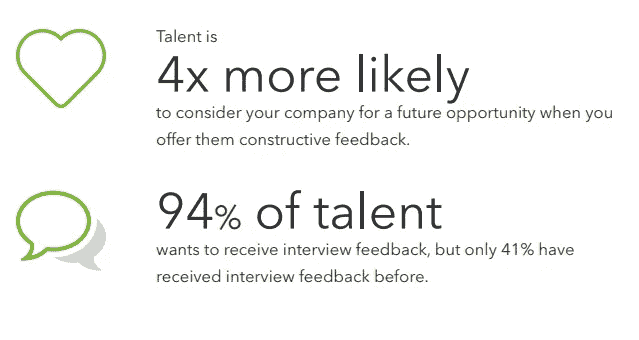
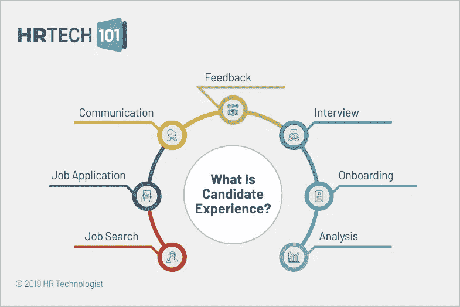

# 为什么公司不给应聘者反馈？

> 原文：<https://blog.devgenius.io/why-dont-companies-give-candidates-feedback-9b97bb7a9ae1?source=collection_archive---------5----------------------->

[https://nederlia . com/getting-actionable-candidate-feedback-and-use-it/](https://nederlia.com/getting-actionable-candidate-feedback-and-using-it/)

不给反馈会损害你的品牌。说真的。我知道提供反馈是一个极具争议的话题。像亚马逊、脸书和谷歌这样的公司制定了不提供反馈的政策。超级沮丧。他们都鼓励你“明年再试。”如果你不知道如何改进，你怎么能再次尝试呢？

甚至在《先声夺人》上，亚当·莱文、布莱克·谢尔顿、格温·史蒂芬妮、法瑞尔·威廉姆斯和其他人总是立即给参赛者提供反馈。你猜怎么着，人家回来再试！

大多数公司没有像亚马逊、网飞和其他公司一样的品牌。所以，这有点像拿苹果和橘子做比较。他们有大量的品牌代表和法律部门，比你刚刚起步的创业公司损失更大。

**向你拒绝的候选人提供反馈如何成为一种优势？**

回答被拒绝的受访者的询问有多种积极的原因。首先，也是最重要的，它可以在候选人和你的公司之间建立好感。

今天的申请人有一个扩音器来表达他们对你如何对待他们的反应。在他们努力在面试中表现出色后，让他们蒙在鼓里，你可能不得不在社交媒体上与对你公司的批评作斗争。反而帮他们一把，获得一个有关系的大使。这意味着它们可以成为你品牌的活广告牌。他们不喜欢被拒绝，但他们仍然尊重你和团队。

建立积极的联系也能增加你未来招聘的渠道。所以考虑只给排名第二、第三或第四的受访者反馈。除此之外，你多半会给出负面评论，这可能会反过来困扰你。如果这是第一次打电话，你完全可以说，“我们已经和更强的申请人取得了进展，这不是针对你个人。”

[https://www . business 2 community . com/human-resources/provisioning-interview-feedback-can-help-companies-recruiting-02042065](https://www.business2community.com/human-resources/providing-interview-feedback-can-help-companys-recruitment-02042065)

美国是苏快乐的。所以，很多公司都避免使用它。

大品牌确实尽量避免给出官方反馈，因为 whiplash。任何人最不想要的就是因为歧视而被起诉，这是基于电话游戏的古老游戏。

曲解是 2021 年的野兽。告诉候选人他们被拒绝的原因可能会导致潘多拉魔盒的冒险。即使你有最积极的意图，措辞也是非常重要的。如果你说得不好，你可能会说漏嘴，成为偏见或歧视。例如，如果你告诉某人你在“寻找更有活力的人”，这可能会被理解为“你只雇佣更年轻的人。”或者，你告诉某人“对于这个职位来说，你的资历太高了”，他们可能还是会有同样的感觉。

所以，大公司可以接受人们的不满，因为这比诉讼的反弹要好。

在我看来，就如何提供不越界的建设性反馈进行培训会更好。我乐观地认为，通过多元化和包容性培训，这种沟通方式将开始成为人们的第二天性，人们开始意识到他们所说的可能与其含义不同。我们每天都在努力提高。

你要给出反馈。但是，怎么做呢？

如果您想让候选人知道他们是如何做到的，请记住以下几点:

1.  **避免写评论:**口头交流很重要。口头交流伴随着情绪、声音的变化和令人鼓舞的热情。一封描述你被拒绝的原因的电子邮件让人感觉超级冷漠、刺耳，如果写错了…好吧…我们只能说它打开了一个蠕虫罐，我们都不会去钓鱼。
2.  **具体而不笼统:**不要说，“你在我们的项目中做得很好，但还不够好”，而是说“我们很喜欢你在我们的讨论中引导问题的方式以及你的热情，但是我们真的希望有人开始进入 edge 案例，讨论 TDD 实践和约束。您提供了即时的正确答案，但没有达到我们对公司高级工程师的期望。”
3.  避免意见或感觉:情感联系可能是一个陷阱，误导你做出正确的决定。对你的决定保持客观比简单地说你出于任何原因“喜欢”或“不喜欢”他们要好得多。很明显，如果他们通过了最初的筛选，至少会有一些积极的信号。
4.  仅评论候选人可以改变的方面:行为和技能可以改变。然而，像被采访者的外貌、口音和声音是无法改变的。涉及个人因素的反馈是绝对不行的。如果你要对某个行为提供反馈，可能是这样的:“对于高级工程师，我们希望他们引导面试，提出澄清性问题，而不是假设他们的答案是正确的。我们是一个协作团队，希望确保大家步调一致。”
5.  从积极的方面开始:如果你立即开始消极，你的任何积极的言论都将变得无关紧要。他们会很生气的。当面试官得到反馈时，他们真的想要建设性的见解。他们想知道如何在下一次面试中做得更好，或者如果他们再次面试你的公司，他们可以做些什么来留下更好的印象。
6.  **请不要过度分享:**要真实，但要切题。你必须在这里使用你的街头智慧，并有一个体面的情商。你不应该透露专有或犯罪信息。

**你如何拒绝候选人很能说明你的生意。**

只有一小部分申请人会要求详细的反馈。然而，你采访的每个人都应该得到一个真实的、感激的回复。他们花了很多时间和你面谈，就像你和他们一样多。时间是我们一生中唯一无法挽回的东西。

至少，试着给所有被拒绝的受访者发一封措辞温和的短信。重影考生是最糟糕的！让他们知道你有多欣赏他们的努力。如果你真的想保留他们的简历以备将来的机会，让他们知道。

对于你希望保留在管道中的少数人，及时打电话。保持您的反馈简明扼要。你今天的拒绝，可能会成为你未来的摇滚明星！过去这种事在我身上发生过很多次。

[https://www . toolbox . com/HR/recruiting-on boarding/articles/what-is-candidate-experience-definition-components-technology/](https://www.toolbox.com/hr/recruitment-onboarding/articles/what-is-candidate-experience-definition-components-technology/)