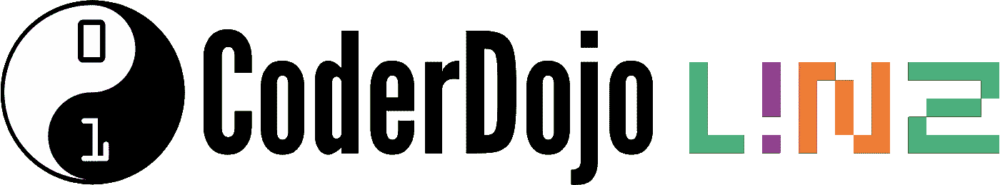

# 为什么每个开发人员都应该创建一个 CoderDojo

> 原文：<https://blog.devgenius.io/why-every-developer-should-start-a-coderdojo-c0c5c2726856?source=collection_archive---------14----------------------->

CoderDojo 林茨标志

在我的日常工作中，我基于微软 Azure 构建云解决方案。私下里，我是家乡林茨当地 CoderDojo 的主席和导师。 [CoderDojos](https://coderdojo.com) 是志愿者驱动的免费电脑俱乐部，面向 7 至 17 岁的孩子。这是一项全球性的运动，在全球 110 个国家拥有超过 2200 个俱乐部([找到一个离你最近的](https://zen.coderdojo.com/find))。

五年前，我在比利时的一次会议上发言时接触到了 CoderDojo。我和我的妻子一起去过那里，她也是程序员。我们立即被这个想法迷住了，当我们回家时，我们在奥地利建立了第一个正规的 CoderDojo。五年后，我们每年举办超过 35 场活动，在这些活动中，我们统计有超过 1500 名儿童到访。在当前的《新冠肺炎时报》中，我们转向了虚拟代码。这非常有效。

在这篇帖子中，我想告诉你为什么我认为每个开发人员都应该开始或参加像 CoderDojo 这样的编程俱乐部。

我可以先告诉你一些关于技术工人短缺，关于我们行业缺乏多样性，关于为什么免费编程课程很重要，因为我们的社会应该为每个人提供平等的机会。我认为理解编程语言在现代社会越来越重要，尽早学习这些技能更好也更容易。所有这些事情都是千真万确的，我对此深信不疑。不过，今天我的重点是为什么作为开发者的 ***you*** 要开始参加 CoderDojo 这样的编程俱乐部。你的奶酪在哪里？为什么你要花额外的时间在电脑前为孩子们准备练习呢？

首先，让我告诉你，它很有趣！根据最新的[栈溢出开发者](https://insights.stackoverflow.com/survey/2020#developer-profile-coding-as-a-hobby)研究，超过 78%的开发者将编程视为一种爱好。我相信你们很多人也是如此。为什么不与热衷于学习现代技术的年轻程序员一起执行这个爱好呢？你可以制作有趣的项目，与热情的孩子们分享你对编码世界的着迷 ***和*** 帮助他们发展重要的生活技能。相信我，这样做是非常值得的。

接下来，当你和孩子们一起工作时，你会学到很多东西。不，他们不会教你最新的 C#语言特性，如果你告诉他们 Azure Security Center 的改进，他们中只有少数人会眼前一亮。你的学习将会不同。它们将是技术中最难的事情之一:以一种即使是孩子也能理解的方式描述复杂的事物，并让孩子想学得更多。教算法不应该是枯燥的，应该是有趣的。用 Scratch 和孩子们一起做游戏。通过在《我的世界》使用[雷石东](https://education.minecraft.net/blog/learn-about-redstone/)建造令人兴奋的东西来教大一点的孩子基本逻辑。向年龄较大的孩子展示如何创建一个关于他们关心的主题的网站。能够让那些还不是专家的人理解软件开发概念，这是你在工作中绝对需要的技能，CoderDojo 是一个学习和实践的好地方。

在 CoderDojo 的帮助不仅仅是和孩子们一起工作。你会遇到很多志同道合的人，赢得新朋友。当你向公司寻求硬件捐赠或资金支持时，你会发现来自儿童编程俱乐部的帮助打开了许多大门。作为 CoderDojo 志愿者，您的工作将拓宽您的人际网络，并使您在个人和专业方面得到发展。

我让你兴奋了吗？你想知道更多吗？我希望如此。作为 CoderDojo 导师，你旅程的第一站可能是 CoderDojo 网站。寻找你附近现有的俱乐部。如果你找到一个，与组织者取得联系，并向他们提供你的帮助。如果你有具体的问题，请联系我或[coder Dojo 基金会](https://coderdojo.com/contact/)。他们超级友好，乐于助人。在你的区域找不到 CoderDojo？太棒了，这是你创业的好机会。CoderDojo 有很多资料可以帮助你入门(我们的资料是德语的，可以在我们的网站上[找到)。你可以参加一个在线活动或者去一个现有的 CoderDojo 为你自己的俱乐部获取灵感。然后，不要犹豫，开始吧！找一个地点，请朋友帮忙，邀请当地社区的孩子，然后开始吧！](https://linz.coderdojo.net/infos/uebungsbeispiele.html)

非常感谢您的阅读。我希望我能激励你，我期待着听到你作为 CoderDojo 冠军的开始。

再见…