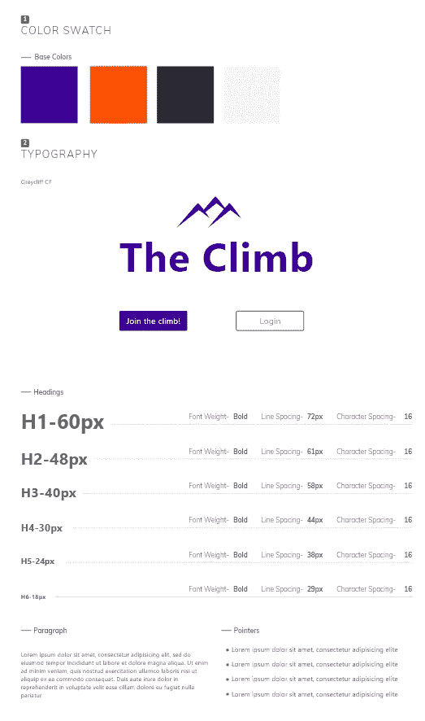
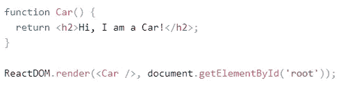

# 为什么每个人都应该学习编码，(从 UX 设计师的角度)。

> 原文：<https://blog.devgenius.io/why-everyone-should-learn-coding-from-a-ux-designers-perspective-655fd0e18543?source=collection_archive---------4----------------------->

[图像链接](https://www.pexels.com/photo/black-background-with-text-overlay-screengrab-270404/)

在与来自不同背景的许多人一起参与了无数项目后，我惊讶地发现，完全的信息技术素养在工作场所并不常见。来自一个项目经理和一个 UX 设计师，他曾在网站咨询、黑客马拉松，甚至设计竞赛中工作过，大量可以自动化的琐碎工作总是让我感到惊讶。根据我的观察，人们通常会本能地倾向于用蛮力来解决问题。在普通工作场所常见的一种方法是在 Excel 工作表中进行简单计算。有了 Excel 甚至编程的基本知识，人们可以简单地自动化这个过程，几个小时的复制粘贴可以变成几秒钟。

# **UX 设计并编码？有什么联系？**

首先，什么是 UX 设计？

UX 设计或用户体验设计就是通过特定的界面帮助用户实现他们的目标，并简化他们的整个体验。通常与平面设计相混淆，UX 设计需要理解界面的用户，界面的信息结构，设计界面，并创建界面的工作原型。所有这些最终导致了网站或应用程序的创建和部署，不仅看起来不错，而且给用户带来了直观的体验。

那么，UX 和编码之间有什么联系呢？

UX 的整体源于设计师创造直观项目时遵循的一些法则。尽管其中一些法则可能看起来微不足道，但 UX 设计师需要理解识别设计法则和有效实施之间的错综复杂。

可以说，最重要的设计原则之一是一致性。网站的颜色、按钮位置、字体，甚至大小都是决定公司成功的重要因素。以一家红黄相间的快餐店为例。第一个浮现在你脑海中的公司很可能是麦当劳，因为它的标志性地位与其品牌的一致性密切相关。

经典的麦当劳配色方案光彩照人

# **设计库与反应简介。**

为了达到这种一致性，设计者利用库来管理放置在网站上的设计元素。

我最近在一个项目中使用的一个库的例子

我们可以简单地拖放按钮、分隔线、链接以及我们之前创建的库中的各种其他元素。这不仅节省了我们的时间，也是确保网站一致性的万无一失的方法。

UX 设计师的线框最终被移交给网站开发人员，他们审查设计库以创建 React 组件。

[React](https://reactjs.org) 是一个 JavaScript 框架，开发者通过它可以使用模块化组件快速创建网站。React 的美妙之处在于，它与线框图时库的使用有着相似的实现风格。React 元素被创建并可以在模块化方法中重用，以将相似的元素从一个页面转移到下一个页面。React 组件的常见例子是常见的网站元素，如页眉和页脚，它们在大多数网站上都是一致的。

开发人员的角色是创建单独的 react 组件，首先使用 UX 设计器提供的库，然后使用这些组件创建站点。

页面上创建并呈现了一个名为“Car”的组件

这种方法的优点是无穷无尽的。使用组件而不是复制粘贴代码块不仅可以减少创建项目所花费的时间，还可以缩短站点的加载时间。在上面的例子中，组件“Car”可以被重用和多次渲染以供将来使用。

现在问题来了，UX 设计师真的需要 React 的知识来创建这些线框库吗？

当然不是！然而，这只是让我更容易了解库的两者之间的许多相似之处之一。UX 对编码知识的要求也不止于此。UX 设计师需要了解前端开发，以创建可行的线框和功能。我遇到过许多在部署阶段失败的项目，原因是设计师不了解他们的开发人员的能力，仅仅是因为他们缺乏编码意识。

# **我又不是想进 UX，为什么要编码？**

如前所述，自动化基本任务和编码之间有许多相似之处。我相信，不管你想从事什么办公室相关的职业，学习 Excel 至少是有用的。它简化了你的工作流程，让事情变得非常简单。如果你想更进一步，你可以学习与数据管理相关的语言，一个坚实的起点是 Python。甚至不直接参与编码的人也发现 Python 在任务自动化、数据可视化和数据分析方面有价值的用途。

这里有一些我在过去发现有用的资源。

[Jon](https://www.youtube.com/channel/UCSxX7Vgyu9iThxPE1jSDFdw) ，一个专门用于 Excel 的 YouTuber，提供了关于 Excel 快捷方式的全面见解。他的视频大约 10 分钟长，非常容易消化和应用。

Sololearn 是我过去曾多次使用的一个地方，用来获取编码语言的介绍。这是一个免费的资源，还提供练习来帮助你更深入地理解所讨论的语言。

*更多内容尽在*[*blog . dev genius . io*](http://blog.devgenius.io)*。*