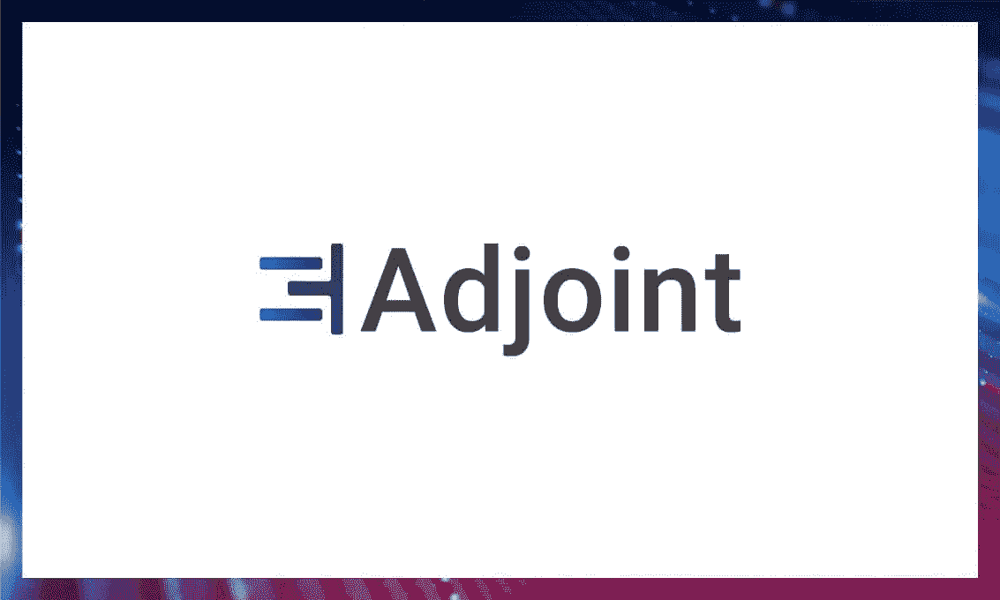
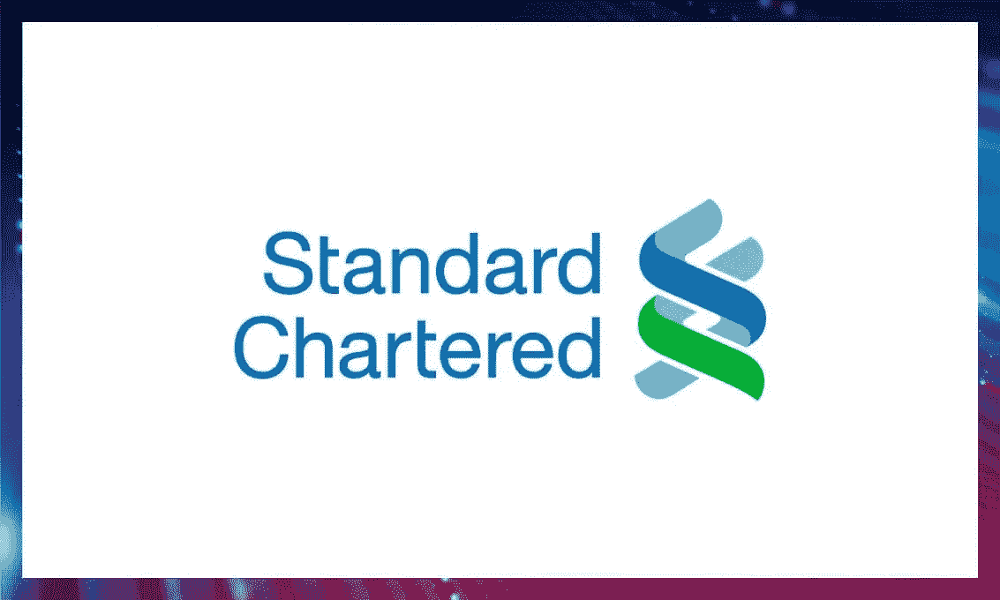
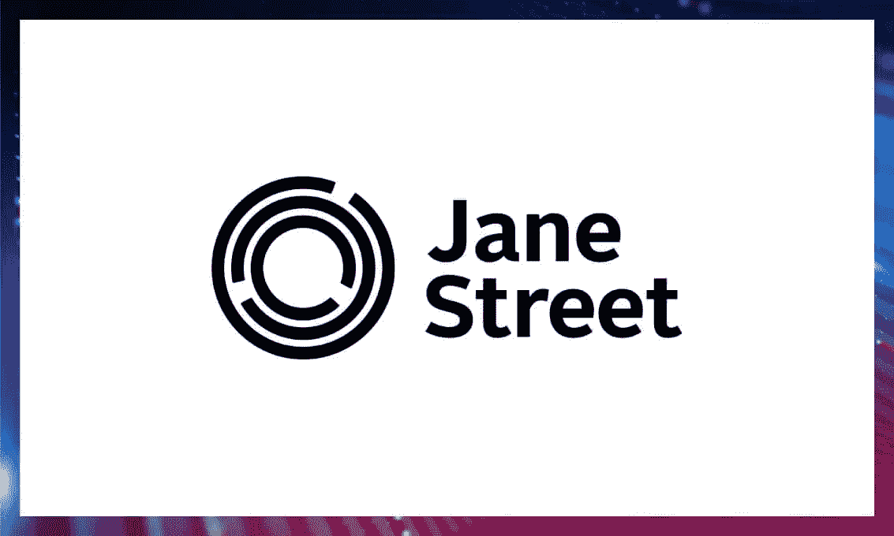

# 为什么金融技术公司使用哈斯克尔

> 原文：<https://blog.devgenius.io/why-fintech-companies-use-haskell-5ae2c85831b3?source=collection_archive---------4----------------------->

## fintech 产品的函数式编程的好处

[粘土堤](https://unsplash.com/@claybanks?utm_source=unsplash&utm_medium=referral&utm_content=creditCopyText)在[地下](https://unsplash.com/?utm_source=unsplash&utm_medium=referral&utm_content=creditCopyText)拍摄的照片

Fintech 是当今最大和增长最快的信息技术市场之一。

这是一个新兴行业，利用技术在提供金融服务方面与传统金融方法竞争。移动银行、投资服务和密码货币都是让公众更容易获得金融服务的解决方案。

我们在 fintech 中看到的一个重要趋势是函数式编程语言的使用。在这篇博客文章中，我们将深入探究 fintech 目前的状况，以及函数式编程是如何改进现代 fintech 产品的。最后，我们将列出一些在交易、银行或金融技术基础设施中使用 FP 的公司。

# 函数式编程语言的好处

银行、贸易公司和 fintech 项目使用像 Haskell 这样的函数式编程语言，因为它具有命令式编程所不具备的特性。大多数大公司提到三个主要原因:

1.  强类型有助于防止代码中的错误，这些错误可能会导致以后的问题。例如，巴克莱将强类型列为选择哈斯克尔作为其衍生算法的原因之一；
2.  代码更易读、更易维护，因此更容易发现错误并降低被利用的风险。
3.  函数式编程能更好地处理并发性，因此这些语言擅长于涉及并行动作的复杂任务。

让我们看看 fintech 目前最受欢迎的领域，以及函数式编程如何在它们的特定用例中有所帮助。

# fintech 的现状

“fintech”一词包括大量采用不同方法从事一系列技术和项目的公司。

如今，成千上万的初创公司正在研究独特的技术，其中一些包括带有人工智能和遥测技术的 KYC/身份证、支付和贷款协议等。这个领域是一个由大量细节组成的难题。

此外，所有这些小拼图都试图实时地相互操作。为了达到这种服务速度，需要采用能够提供更快、更并发服务的技术。一些功能性编程技术(例如，支持类似参与者的模型的技术)非常适合于使这个多样化的生态系统更加有效。

概括地说，以下是我们在 fintech 市场上看到的一些全球趋势，以及有助于它们崛起的 FP 技术。

# 人工智能、大数据、物联网

上面提到的技术是最需要的。它们用于开发和实施聊天机器人、虚拟顾问和虚拟咨询、语音识别、流程自动化、预测分析(包括信用评分和欺诈监控)。使用这些技术的目的是个性化、交易安全、提高时间管理效率和客户行为分析。

FP 可以给这些领域带来成功。Scala 已经因其卓越的并发性和 [Apache Spark](https://spark.apache.org/) 而被广泛用于大数据，而[神经](https://www.nerves-project.org/)、灵丹妙药框架[看起来非常有希望用于物联网](https://www.cognizantsoftvision.com/blog/year-of-elixir/)。

# 交易处理和基础设施

根据 2019 年[全球支付报告](https://image-src.bcg.com/Images/BCG-Global-Payments-2019-Tapping-into-Pockets-of-Growth-September-2019-rev_tcm9-231986.pdf)，信用卡交易数量每年以 13.6%的 CAGR 增长。其中一个原因是生物特征分析和非接触式支付的集成。

函数式编程语言允许构建更可靠、容错且错误更少的稳定基础设施。尤其是，Elixir 非常适合于需要处理来自众多用户的大量小交互的情况。

# 信贷和保险技术

如今，信贷和保险不仅由传统银行发行，也由较小的私人公司和创业公司发行。有大量的项目提供 P2P 贷款，这个领域的技术发展非常快。

如果你是一家信贷或保险领域的初创公司，你需要快速行动。一个构建良好的 FP 团队将能够快速迭代并更好地扩展你的产品，因为范式允许更好的生产力和更快的大规模变化。

阅读[我们对再保险领域初创公司 Riskbook 的采访](https://serokell.io/blog/haskell-in-industry-riskbook)，了解 Haskell 为快速变化的领域带来的更多好处。

# 区块链和密码

企业使用区块链技术作为一种快速安全的交易方式，监控资金，进行快速的国际支付，存储和共享报告。许多银行在 Ripple 或 HyperLedger 伙伴关系下联合起来，在它们之间交换信息。区块链也可以用来存储生物特征数据。

函数式编程(尤其是 Haskell)非常适合处理区块链，因为它具有不变性、类型安全性以及很好地管理分布式计算的能力。Haskell 还使人们能够构建优秀的特定领域语言，例如[智能契约语言](https://serokell.io/blog/lorentz-implementing-smart-contract-edsl-in-haskell)。

# 使用函数式编程的公司

# 金融科技

## 克拉纳

欧洲支付初创公司 [Klarna](https://www.klarna.com/) 使用多种函数式编程语言，如 Scala、Erlang、Clojure 和 Haskell。他们服务的核心在 Erlang 中。

## 数字资产

Digital Asset 是一家帮助公司设计和运行下一代商业应用的金融科技公司，主要借助于用 Scala 编写的智能合约语言 [DAML](https://daml.com/) 。他们的 GitHub 上有多种语言，包括 Haskell 和 Scala。

## 伴随矩阵

[伴随](https://www.adjoint.io/)为跨国公司数字化现金和结算流程。目前，他们的主要产品是共轭国债，这是一个企业国债的实时支付和结算平台。

# 银行和贸易

## 主要经营银行）

Barclays 有一个用 Haskell 编写的嵌入式领域特定函数语言(FPF ),用于指定奇异的股票衍生品。我们已经在我们的 [Haskell 成功故事](https://serokell.io/blog/top-software-written-in-haskell)中对此进行了更详细的介绍。

## 渣打银行

[渣打银行](https://www.sc.com/)使用他们自己严格的 Haskell 方言 Mu，并拥有一个庞大的代码库，包括大约 50 万行 Haskell 代码和 450 万行 Mu 代码。

## 廷科夫银行

[Tinkoff](https://www.tinkoff.ru/eng/)tink off 旅行社后端使用 Haskell，tink off 银行后端使用 Scala。

## 简街

Jane Street 将 OCaml 用于几乎所有后端，从低延迟交易和市场风险系统到管理和监控基础设施的工具、工作流工具和数据分析。

要了解更多关于这一选择的原因，你可以观看他们技术方面的详细演讲:[为什么选择 OCaml](https://www.youtube.com/watch?v=v1CmGbOGb2I&feature=emb_title) 。

## 摩根斯坦利

摩根士丹利使用 Scala，是大规模 Scala 项目的所在地。更多关于摩根士丹利 Scala 的信息，可以查看[这个短片](https://vimeo.com/147697498)。

# 还有更多

此外，许多其他金融公司已经使用或正在使用 Haskell 或其他函数式编程语言:

*   JP 摩根
*   BNB·帕里巴斯
*   美国美林银行
*   德意志银行
*   ABN·AMRO
*   瑞士瑞信银行环球公司
*   奥尔斯顿贸易公司

随着大量重量级银行和创业公司进行函数式编程，这似乎是一种不会消失的趋势。此外，金融科技每分钟都变得越来越复杂和分散，银行意识到，面对 COVID 危机，它们不够数字化。函数式编程似乎有解决相关问题的工具。无论你是一家金融科技初创公司还是一家银行，或许是时候开始考虑转向一种更经得起未来考验的技术了。