# 为什么 for 循环是徒劳的！！！！

> 原文：<https://blog.devgenius.io/why-for-loop-is-a-shit-bc8b04801afb?source=collection_archive---------3----------------------->

从新手到专家，所有程序员都知道循环，尤其是“for”循环和“while”循环。但是“for loops with range”比数组(iterable)迭代和 while 循环有很多缺点。我不会谈论“do while”循环，因为我们将在 PYTHON 中看到这些。其他语言的人在 python 中搜索“do while”循环，有些人甚至像我一样创建了自己的语法😂😂😂。所以，伙计们要清楚 PYTHON 没有“do while”循环。所以不要问我为什么不使用“do while”循环。只是为了好玩。

我们将讨论我所经历的一些问题，并给出 while 循环问题的解决方案。

## 为什么？

1.  动态范围问题
2.  动态数组追加问题
3.  动态数组元素移除“索引超出界限错误”
4.  无法移动到首选值
5.  静态增量序列

## 1.动态范围问题

> 一旦做了就不能撤销

我们可能会遇到必须动态更新循环范围的情况。但是当我们使用“带范围的 for 循环”时，我们不能改变循环内部的范围(一旦它被初始化)。

## 问题

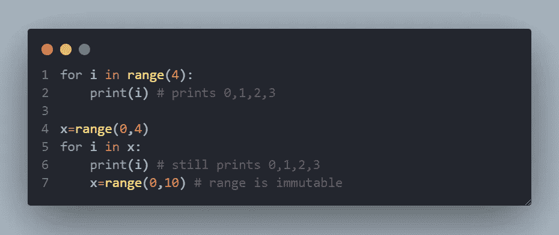

## 解决办法

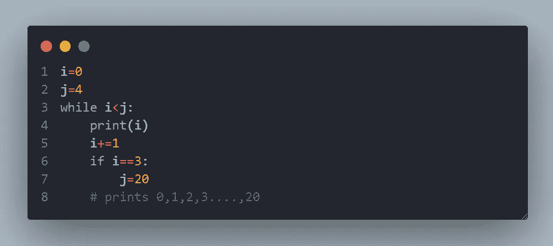

## 2.动态数组追加问题

当你在一个数组上迭代时，如果你在数组中添加一个元素，那么添加的元素将不会在“for with range”循环中迭代。但是我们可以通过直接遍历数组或者使用“while”循环来访问元素。

## 问题

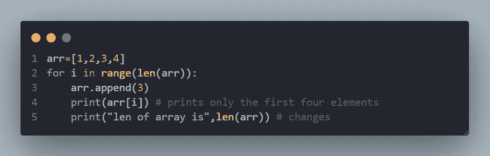

## 解决办法

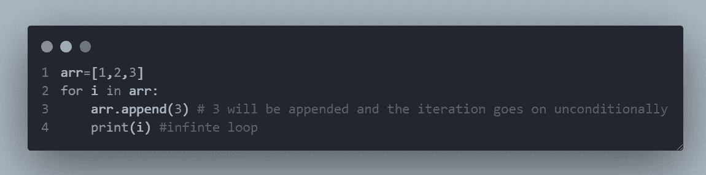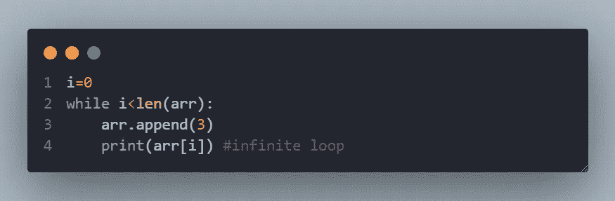

## 3.动态数组元素移除问题

当你想删除一个元素时，在循环运行时“带范围的 for 循环”肯定会进入“索引越界”的错误状态。这是因为该范围在开始时已经被初始化，当我们改变数组长度时，该范围保持不变，因此出现错误。

## 问题

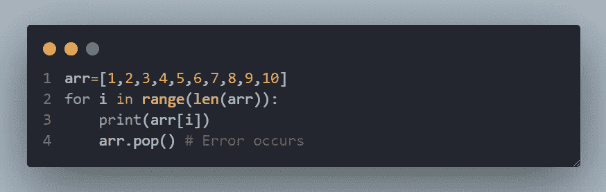

## 解决办法

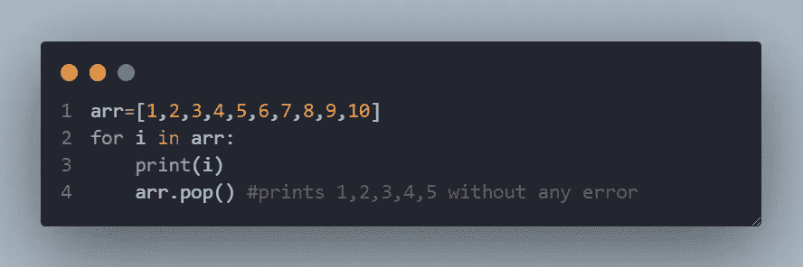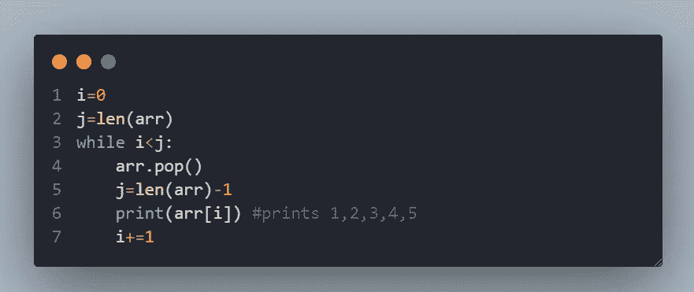

4.无法移动到首选值

当你迭代的时候，你不能在 for 循环中移动到你想要的位置。但是在 while 循环中，你可以很容易地做到这一点。

## 问题

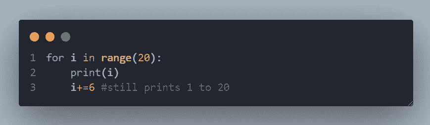

## 解决办法

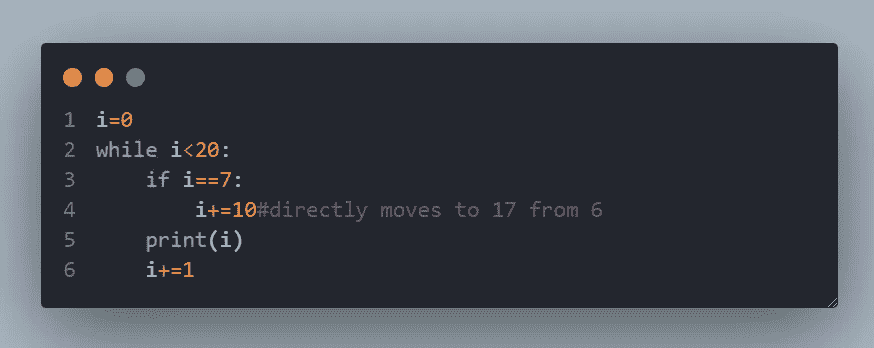

## 5.静态增量序列

增量序列可以在开始时初始化，但是当你试图对不同的迭代使用不同的增量值时，这在 for 循环中是不可能的。

## 问题

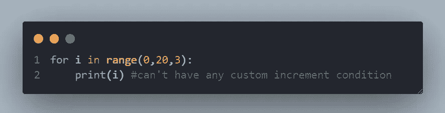

## 解决办法

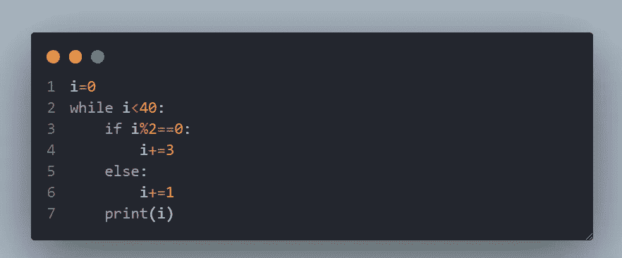