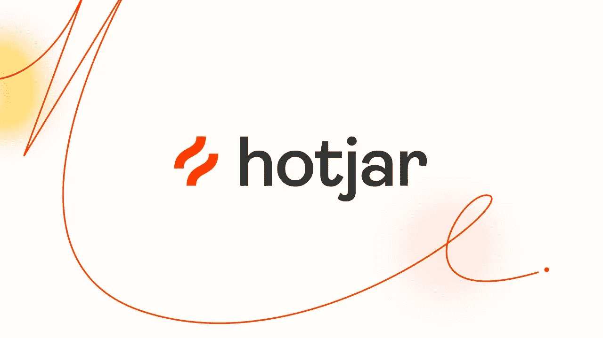
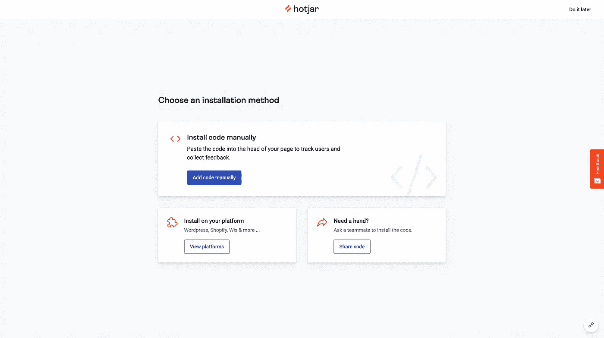
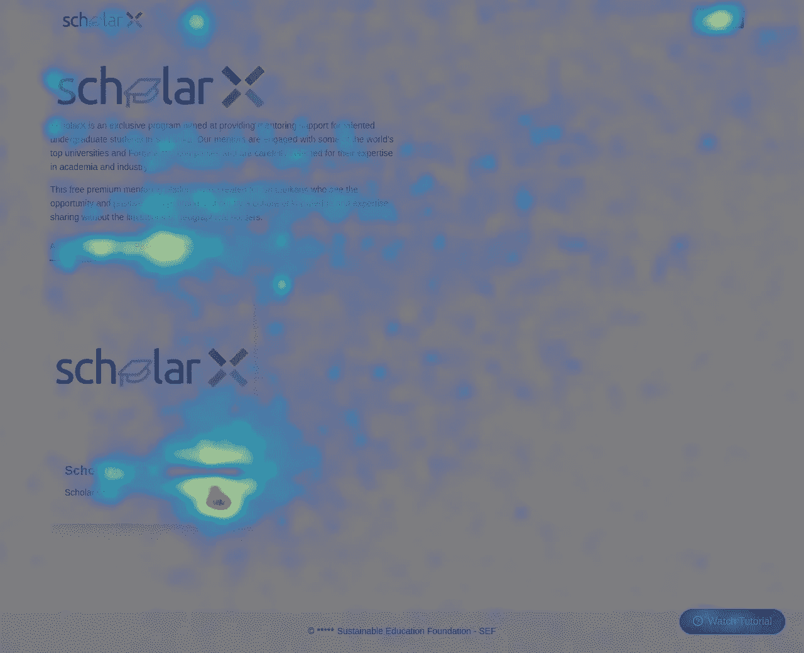
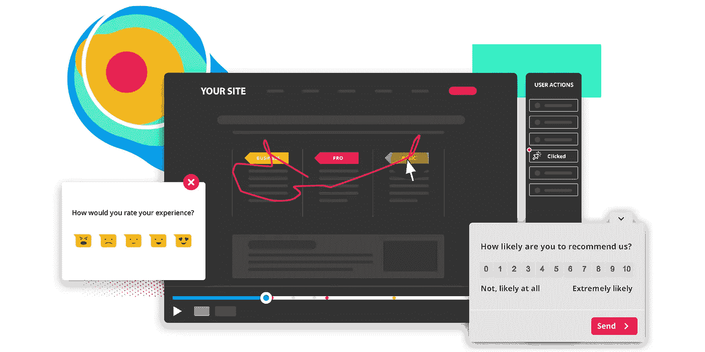

# 为什么 Hotjar 是最好的行为分析工具？

> 原文：<https://blog.devgenius.io/why-hotjar-is-the-best-behaviour-analytic-tool-out-there-e50d2b610205?source=collection_archive---------8----------------------->

了解用户在你的网站上的行为，他们需要什么，他们的感受对你的网站来说非常重要。在 [SEF](https://sefglobal.org/) ，我们对 [ScholarX 2022](http://sef-scholarx.herokuapp.com/) 有同样的要求。那是当[博士**Akshika Wijesundara**](https://medium.com/@akshikawijesundara?source=user_profile----------------------------------------)**建议 Hotjar。在本文中，我们来讨论 HotJar 提供了什么，以及为什么它是最好的。所以让我们开始吧。**

## **Hotjar 是什么？**

> **Hotjar 是一个产品体验洞察工具，它为您提供行为分析和反馈数据，通过热图、会话记录、调查和反馈插件等工具帮助您理解和理解您的客户**

**Hotjar 对产品经理、产品设计师、研究人员以及最后但并非最不重要的开发人员非常有用。**

## **安装**

**设置 Hotjar 非常简单。你可以创建一个免费的试用账户来测试它。在我的例子中，我将它与 react 创建的单页面应用程序集成在一起。**

**创建帐户后，您可以添加新网站。它会给你一个代码片段，你需要粘贴在头部标签下。**

****

**仅此而已。是啊，就这么简单。**

**如果你像我一样把这个整合到一个 [SPA](https://en.wikipedia.org/wiki/Single-page_application) 中，你需要从设置中设置[这个选项](https://help.hotjar.com/hc/en-us/articles/115011805428-Hotjar-on-Single-Page-Apps)。**

## **它是如何工作的**

**为了了解用户如何真正体验你的网站，hotjar 使用了四种主要方法。我们来看看那些方法是什么，以及它们的好处。**

1.  **热图
    热图直观地展示了用户在你的网站上点击、移动和滚动的位置。您可以比较不同的视图，如桌面、移动和平板电脑。**

****

**热图样本**

**2.录音是用户在你的网站上滚动、移动、掉头和疯狂点击的回放。这确实有助于您轻松识别站点中的问题和缺陷。**

****

**3.反馈
通过反馈了解用户对你网站的真实想法。**

**4.调查
通过现场和外部调查将客户的声音带到您的决策中。**

**如果你不能理解一切是如何工作的，不要担心。Hotjar 有一些很棒的[指南](https://www.hotjar.com/guides/)让你更容易理解。**

**对我来说，热图和记录是 hotjar 提供的最好的功能。它帮助我们从用户的角度看问题。到目前为止，您已经知道 Hotjar 提供了哪些东西。如果你正在寻找一个分析工具，你可以考虑这个。**

**就这样，我们来到了本文的结尾。你可以通过[文档](https://www.hotjar.com/guides/)获得更多信息。别忘了看看我的其他文章。下次再见了。在那之前保持安全！✌️**

# **参考资料:**

**[1].热罐。[2022]文档[在线]。可在 https://www.hotjar.com/[获得](https://www.hotjar.com/)【2022 年 3 月 31 日获得】**