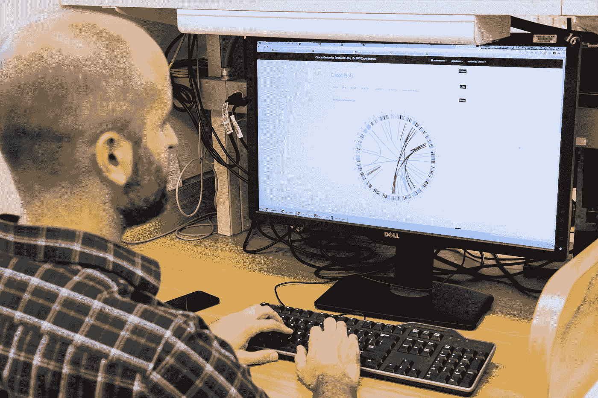
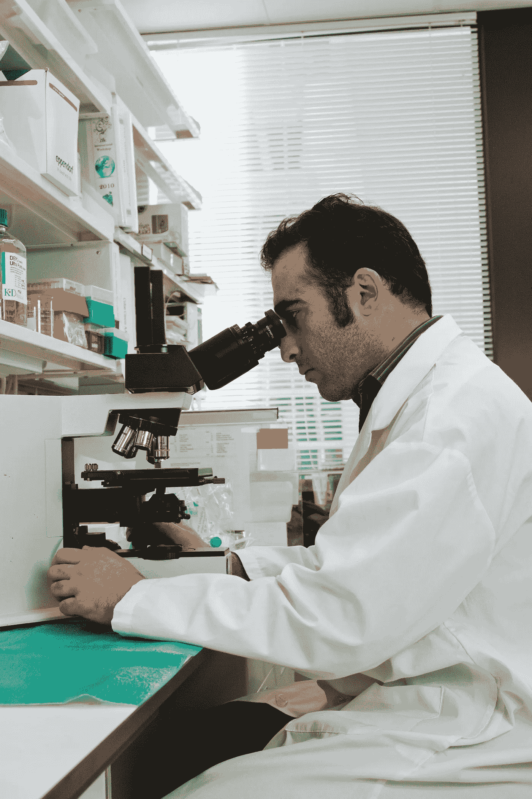

# 为什么我对生物信息学感兴趣

> 原文：<https://blog.devgenius.io/why-i-became-interested-in-bioinformatics-caaef996a38d?source=collection_archive---------0----------------------->

## 生物信息学是二十一世纪的革命。我变得如此惊讶，并希望在生物信息学领域建立我的职业生涯。

[国家癌症研究所](https://unsplash.com/@nci?utm_source=unsplash&utm_medium=referral&utm_content=creditCopyText)在 [Unsplash](https://unsplash.com/s/photos/biotechnology?utm_source=unsplash&utm_medium=referral&utm_content=creditCopyText) 上拍摄的照片

B 生物信息学是孟加拉语的**“生化科学”**。在英语中，它被称为一种交叉领域。就是生物医学里面跟生物学相关的东西多了很多。这些科目首先是计算机科学，其次是数学算法和统计学。我们在生物信息学中所说的生物学，基本上就是灵感的科学，英文叫分子生物学。我们的问题是，灵感科学和计算机科学之间有什么关系。

我对了解和传播生物信息学的兴趣有很多原因。我本人在大学生活中学习过基础生物科学。但是我一直对电脑感兴趣。我过去平均每天至少花五个小时坐在电脑前，现在在我的职业生涯中，这个时间增加了很多。问题是，一个生物科学的学生浪费时间坐在电脑前有多合理？

一开始，我看不到任何争论。我喜欢每天在电脑上学习新的东西，这就是我能说的。在生物和遗传学课上，先生给了我们一些关于生物信息学的信息。在书中，我们了解了计算机编程与灵感科学的直接关系。但这件事非常棘手。

与此同时，我开始作为一名高中 ICT(信息和通信技术)教师在一个私人项目中讲课。虽然我已经阅读了许多关于 ICT 的文章和书籍，但高中的 ICT 书籍对我来说是新的。所以，这本书得倒过来看。在书的某个地方，我看到了一段关于生物信息学的描述，先生在我们班里讲过一点。我很惊讶地想到今天的大学生在高中学习生物信息学，尽管我是大学生，但我对那个学科几乎没有任何概念。所以生物信息学的常识都要焊接。

[国家癌症研究所](https://unsplash.com/@nci?utm_source=unsplash&utm_medium=referral&utm_content=creditCopyText)在 [Unsplash](https://unsplash.com/s/photos/biotechnology?utm_source=unsplash&utm_medium=referral&utm_content=creditCopyText) 上拍摄的照片

在他们的一生中，科学家们为了人类的福利进行了各种各样的研究活动。这些用不懈的劳动换来的有价值的研究工作不断地让科学书籍的书页变得更重。世界上许多地方的研究人员无意中在已有的研究工作中浪费了宝贵的时间。如果世界上一个地方的研究成果能够推动另一个地方的研究，就有可能很快带来革命性的发现。

但是我们需要的是一个能够将世界不同地区的研究相互联系起来的 T4 工具。生物信息学提供了这个工具。由于科学家和研究人员不懈的工作和研究，生物信息学提供了不断创造的有价值的信息，这种相互联系使得快速开展研究成为可能。

将信息技术应用于分析大量数据的灵感科学可以称为生物信息学。信息技术的这种应用基本上涉及各种生物数据分析。这个生物数据的范围很大程度上局限于**[**DNA**](https://en.wikipedia.org/wiki/DNA)**[**基因**](https://en.wikipedia.org/wiki/Gene)**[**氨基酸**](https://en.wikipedia.org/wiki/Amino_acid)**[**蛋白质**](https://en.wikipedia.org/wiki/Protein)**[**核酸**](https://en.wikipedia.org/wiki/Nucleic_acid) **。************

****正如我上面所说的，我认为生物信息学的基本概念还不够清楚。由于生物信息学的应用在农业、渔业和兽医学中最为普遍，因此可以通过这些例子来说明问题。****

****假设一种病毒以流行病的形式在农产品、鱼或牛中传播。需要开发一种针对这种病毒的肽疫苗 。数百种肽可能对抗这种病毒。但是这些肽中只有三四种可以作为疫苗。现在要找到这三四种肽，就得在实验室里测试上百种肽。所以这需要数百万美元，艰苦的工作和很长的时间。这就是为什么研究人员想到发明一种工具来创建一个基于互联网的干燥实验室，来自世界各地的研究人员可以在这里进行研究。这是可能的。****

****研究人员开发了软件，在信息技术的帮助下分析各种生物数据，对这些数据进行三维建模和模拟分析。****

****在这种工具的帮助下，可以在干燥的实验室中，在没有任何一种试剂的帮助下，通过坐在世界不同地方的研究人员的帮助，在短时间内从数百种肽中找到十种可能的肽。****

****因此，不用在一个有一百多个肽的重量实验室中工作，只用其中的十个肽就可以减少十倍的工作时间，节省人力和金钱，这就是生物信息学的方法。****

********

****[国立癌症研究所](https://unsplash.com/@nci?utm_source=unsplash&utm_medium=referral&utm_content=creditCopyText)在 [Unsplash](https://unsplash.com/s/photos/biotechnology?utm_source=unsplash&utm_medium=referral&utm_content=creditCopyText) 上拍摄的照片****

****我们都知道杂交这个词。杂交是一个过程，它通过在二十一世纪这一可怕的环境过程中继续增加农产品的生产，使人口众多的世界一直处于饥饿状态。在杂交过程中，控制多个基因的基因从那些具有多重性状的基因到那些被带入特定品系的基因。生物信息学使得这项极其复杂的任务变得更加容易。****

****因此，现在研究人员转向生物信息学，寻找一种以更低的成本生产更多的蛋白质，同时减少对环境的破坏的方法。可以肯定地说，生物信息学将引领世界农业生产。****

********

****Artem Beliaikin 在 [Unsplash](https://unsplash.com/s/photos/agriculture-research?utm_source=unsplash&utm_medium=referral&utm_content=creditCopyText) 上拍摄的照片****

****20 世纪 50 年代初，[弗雷德里克·桑格](https://en.wikipedia.org/wiki/Frederick_Sanger)提供了胰岛素序列的见解。就在那时，世界第一次意识到蛋白质序列，并感到在灵感科学中需要计算机。大概第一个通过生物信息学比较蛋白质多个序列的是美国女化学家[玛格丽特·奥克利·戴霍夫](https://en.wikipedia.org/wiki/Margaret_Oakley_Dayhoff)博士。[大卫·李普曼](https://en.wikipedia.org/wiki/David_J._Lipman)，[国家生物技术信息中心(NCBI)](https://www.ncbi.nlm.nih.gov/) 主任，将她誉为“**生物信息学之父”**。****

****Dayhoff 博士在数据库的数据表开头列出任何蛋白质的序列，后来通过提供序列比对和灵感进化的思想，成为生物信息学的光度。****

********

****[玛格丽特·奥克利·戴霍夫](https://en.wikipedia.org/wiki/Margaret_Oakley_Dayhoff)在[cfmedicine.nlm.nih.gov](https://cfmedicine.nlm.nih.gov/gallery/photo_76_7.html)的照片****

****如今，许多复杂的过程都是通过生物信息学完成的。如[序列比对](https://en.wikipedia.org/wiki/Sequence_alignment) **，** [寻找所需基因](https://www.ncbi.nlm.nih.gov/books/NBK26837/) **，** [基因组组装](https://www.sciencedirect.com/topics/agricultural-and-biological-sciences/genome-assembly)，[药物设计](https://en.wikipedia.org/wiki/Drug_design)，[蛋白质比对](https://www.ebi.ac.uk/Tools/msa/clustalw2/)，关于[蛋白质结构的先入之见](https://en.wikipedia.org/wiki/Protein_structure)等。****

****正在执行这些复杂的生物信息学任务的[开源软件](https://opensource.com/resources/what-open-source)是 [Bio Conductor](https://www.bioconductor.org/) 、 [Bio-Perl](https://bioperl.org/) 、 [Bio-Python](https://biopython.org/) 、 [Bio-Java](https://biojava.org/) 、 [Bio-JavaScript](https://en.wikipedia.org/wiki/BioJS) 等。****

****你可能会惊讶地发现，开发这些软件的人既是生物学家又是程序员。看到今天的世界和我们现在所处的位置是令人惊奇的！****

*****感谢您的阅读。*****