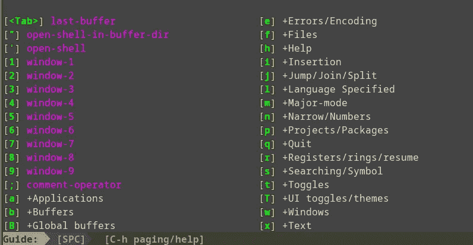

# 为什么我决定去 Vim？

> 原文：<https://blog.devgenius.io/why-i-decided-to-vim-ca87ddc9fbd6?source=collection_archive---------14----------------------->

文件。这是唯一的原因。

Vim 创造了一个爱恨交加的关系。秘诀在于教你的老师。能够教 Vim 的老师充满热情，富有想象力，相信 Vim 让 linux 用户的生活变得更好，并真诚地认为迁移到 Vim 将是我们对自己最大的帮助。

奥卡姆剃刀:教师的激情、广泛的使用和想象力意味着这些教师经历了更多的失败，设法变得有耐心并学会了 Vim。他们可以巩固对 Vim 命令的理解，并提出最常用的**命令**。Vim 中的大部分工作都是使用下面的 15 个命令完成的。

**这与数据工程有什么关系？**

文件。我们在数据工程中所做的每一件事都会处理某种类型的文件。他们大多在 Linux 上。突然，你会发现在 10 个不同的文件夹中的文件，分布在 5 个不同的云服务和 8 个不同的 docker 图像。使用 GUI 会像 50 美元的服务器一样让你陷入困境。我对自己说，是时候向德里克学习维姆了。

DT，一个 youtuber 托管 DistroWatch 频道。有人会发现他在这里说话。

[https://www.youtube.com/c/distrotube](https://www.youtube.com/c/distrotube)

这些命令不能代替 DT 的视频。请观看他的视频，以便更好地理解。这是一种直观的备忘单。现在来谈谈这东西的实质。让我们直接进入命令

```
Modes:
i ==> Insert
v ==> Visual
Esc ==> Normal 

Moves only possible in Normal Mode
j ==> down / junk
k ==> up/ kick
l ==> right / lane change
h ==> left / head left 

These commands can be augmented by typing the number before the invoking them

10j ==> will take cursor 10 lines down
9l ==> will move the cursor 9 characters right
```

我们都想从多个位置复制|粘贴代码。默认情况下，Vim 没有自己的剪贴板。我艰难地学会了这一点，并搜索了 stack-exchange，发现了以下内容

```
In the Normal mode 
type ":echo has('clipboard')"
if the reply is 1 then there is clipboard
else No clipboard
```

**如何启用剪贴板？**

安装 gvim。图形化 Vim 带来了剪贴板，常规命令行 Vim 将继承它。然后使用更多的命令 foo，如下所示

```
"+p ==> paste the content from your clipboard
"+u ==> yank the content from Vim to clipboard

at the bottom you will see vim telling how many lines where yanked / pasted
```

现在是你们期待的杀手锏。在你正在处理的文件中像忍者一样移动。

```
e ==> moves / ejects the cursor to the end of the word 
w ==> whacks the cursor to beginning of the word
b ==> moves / bashes the cursor backwards

same like the above commands the numbers can be prepended to these letters, and 
that much number of moves will be seen on the cursor

f'a character' ==> forward to cursor on "that character"
t'a character' ==> track the cursor before " that character"
```

**好，告诉我们如何撤销/重做？**

开始了。在我搞砸了 Space vim 的 init.toml 文件后，我不得不紧张地查看 Derek 的视频。我想重做一些东西，有 DT 解释如下

```
u ==> undo
ctrl + r ==> redo
```

**现在进行查找和替换**

```
#find and replace
move into Normal mode
:%s/currentWord/newWord

#Just find
/word ==> will locate the word instances. Can move to each word with "n"
?word ==> will locate the word instances. Can move to each word with "n" backwards
```

**注意助记符**

例如，我附加了与 vim 命令具有相同开头字母的单词

```
l ==> right / "lane change" to right
h ==> left / "head" left 
```

这是有目的的。我注意到视频中的德里克不断用语言描述他试图用光标做什么。然后他调用了命令。这就是我写这篇文章的原因，同时还有助记法。当你用 Vim 训练时，使用这些单词将帮助你更快地回忆起命令字母。

**然后就是缓冲区+窗口:**

这是安装了 Space Vim 的 Vim 特有的。Vi '编辑器没有这个功能。在正常模式下**点击空格键**会打开一个抽屉，如下图所示。它是在 Vim 周围移动的指南。安装空间 Vim 提供这个抽屉。



空格键抽屉

这个抽屉有许多子命令，可以对在 vim 编辑器中打开的文件做各种事情。这里我们需要集中精力做两件事

```
[w] +Windows
[b] +Buffers
```

一旦你进入 Vim，当多个文件在相同的实例中打开时，你会感到惊讶，它们像 Chrome/FireFox 标签一样排列。为了在那里移动，上面的抽屉和里面的命令就派上用场了。

**题外话:**我已经为掌握 Vim 奋斗了这么多年。出乎意料的是，我看到了 DT 的视频，我能够使用 Vim 完成工作。正如我反复强调的，老师的教学方式更重要。在任何编程语言/Linux/Unix 的情况下都是如此。寻找适合你学习方式的老师。