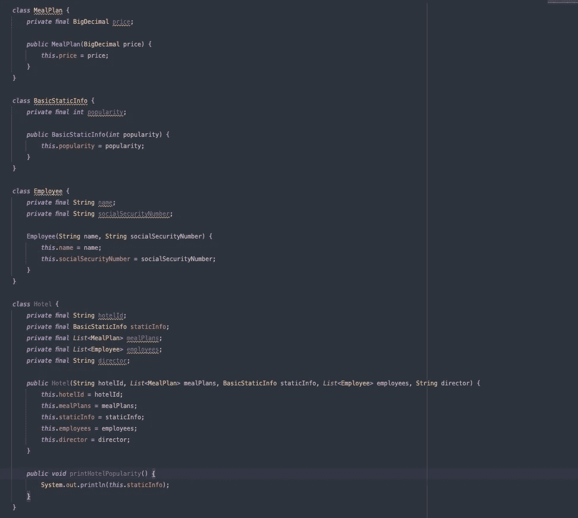
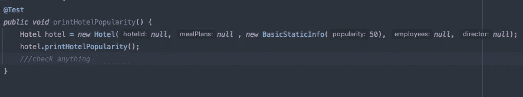
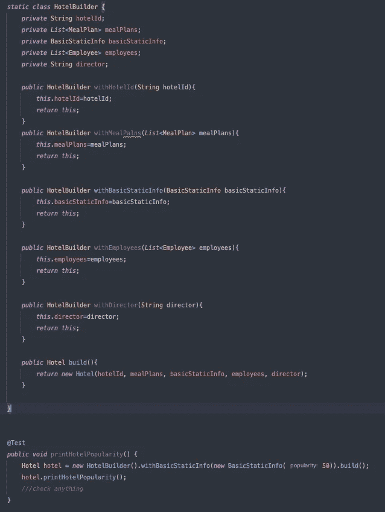

# 为什么我不喜欢构建器模式

> 原文：<https://blog.devgenius.io/why-i-dont-like-the-builder-pattern-e05423698a9a?source=collection_archive---------0----------------------->

builder 模式是开发人员广泛使用的 GOF 创造模式之一。但这是解决了一个问题还是创造了更多？

我第一次读到构建器模式时，我认为它很亲切。我是用 Java 开发的，那时候 JavaBeans 就像是你想创建的任何类的一种标准。所以用一个空的构造函数和十个必须用它们的“setters”来设置的字段来创建类是非常乏味的。有了构建器，我们可以流畅地用一行或几行代码写出同样的内容。

构建器模式被设计用来创建带有可选和必需参数的对象，其中一些参数，而不是大量的参数。它不是用来隐藏糟糕的设计的。这就是为什么当我看到一个构建器时，一些警告浮现在我的脑海中，我试图调查我们为什么要写一个构建器。

# 问题是

让我们想象一下，我们要做一个酒店的模型。我们正在为一家大型连锁酒店工作，他们希望有一个软件，不仅可以销售酒店，还可以向主要主管报告，并了解每个特定酒店的相关员工。因此，在各种迭代之后，增加更多的功能到我们的代码库，我们已经设计了我们的领域，就像这样。

假设我们需要为我们在类 Hotel 中的 printHotelPopularity 方法创建一个测试。

为了创建酒店类，我们只需要基本的 StaticInfo。其余的字段对我们的测试方法没有用。我在字段中使用 null，只是因为我想强调这些字段根本没有被 printHotelPopularity 使用。为了解决这个问题，让我们创建一个构建器。

Builder 已经解决了空值的问题，现在我们不需要在创建酒店时设置空值或任何虚拟值，因为这些都隐藏在 builder 中。但是问题仍然存在，因为我们没有改变我们的设计，我们只是改变了我们建造酒店的方式。如果你使用 Lombok，这就更糟了，构建器的创建要简单得多，根本没有代码，只有一个注释。

我们这样做是为了避免代码中有异味，但是我们没有解决问题的真正原因:

*   我们仍然使用空值作为 Hotel 类的字段值。
*   为什么 printHotelPopularity 方法在 Hotel 类内部，是真正需要使用整个酒店来打印其受欢迎程度。
*   为什么酒店将静态信息、用餐计划、员工和主管都放在一个类中。

在这种情况下，构建器隐藏了真正的问题“耦合”。这种设计的效果是酒店类的无处不在。每个方法都使用那个类，而那个类有这么多字段，只是因为它与许多逻辑相结合，需要酒店内部的一些字段。
当人们从数据库开始设计并将那个类复制到它的域中时，或者当表示数据库中的表的同一个类被用来绘制视图时，我经常看到这种情况。

## 界面分离原理

这是我们看到这些信号时应该应用的。找到酒店类的每个字段的用法，并试图将它们从大酒店神类中分离出来。这里有一个如何做这件事的例子。
界面分离原理认为，拥有许多微小的界面比拥有一个通用的界面要好。
这是重点，有很多可能性，我们可以创建不同的类来管理与酒店相关的不同行为。你会觉得这违背了 DRY 原则(不要重复自己)但其实不是，DRY 并不是要把所有东西都耦合到一个类上。

每一项知识都必须在系统中有一个单一的、明确的、权威的表示

知识并不只有一种，我们也不应该试图只创造一种。

那么为什么不把酒店类分成几个类呢，每个类对应一种不同的行为。我们可以开始向大酒店类添加一个或多个接口，只需关注特定行为所需的东西。
一旦完成，我们就可以在我们的域和我们的基础设施之间创建一个接口(就像你检索酒店类一样)。在该接口中，我们可以创建一个方法，在代码需要时返回旧的酒店类。有了这个接口，我们可以添加更多的方法来直接获得不同的接口，而不是每个行为的酒店。从这一点开始你的域名是免费的，不再需要酒店类。
现在问题出在基础设施，接口的实现上。我们需要在这一层(更接近于基础设施)解决这个问题，例如创建实现接口的新类，并将酒店转换为新类(如果酒店是我们用来持久化的)。
如果我们使用数据库，并且我们想要继续重构，我们可以创建新的表(用新类所需的信息建模)，将数据移动到这些表中。不再需要酒店了。

## 零设计显微技术

我不认为设计已经完成，或者我们必须在每次迭代中创造出最好的一个。我只是认为我们必须随着时间的推移而改进，所以我真的更喜欢展示问题，而不是隐藏它们。使用空值通常是一种不好的做法，但是我发现在我的测试中使用像虚拟对象一样的空值帮助我识别新的接口/新的域对象。所以这就像是另一种气味，引发了一些设计上的改变，对我来说，它基本上和有很多参数的构造函数处于同一水平。
当你在测试中将一个 POJO 设置为 null 时，你是说这个属性没有被测试的代码使用，所以它的值是不相关的。基本上你是在标记真正的接口，那些没有空值的东西。在我的测试通过之后，我可以重构非空对象之后的代码，并创建新的接口/对象。

我第一次在 JB Rainsberger 的 Code 博客上了解到这种设计技术，这篇文章是 [here](https://blog.thecodewhisperer.com/permalink/null-design-tool) 。

通常，重构是答案，我们应该更喜欢解决根本原因，而不是隐藏气味。因此，如果我们不打算重构酒店类，我认为最好不要隐藏问题，所以使用空值和构造函数而不是构建器。