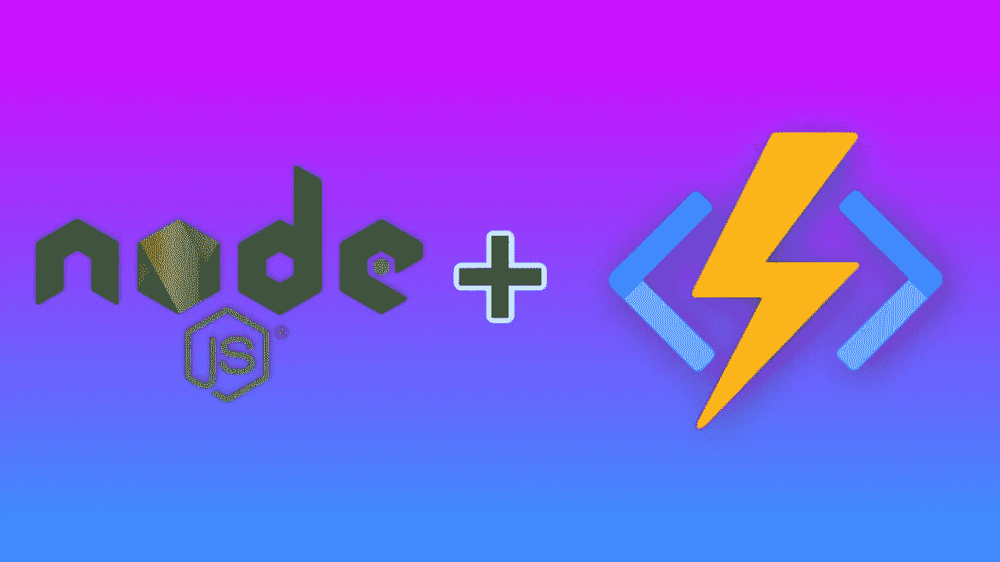
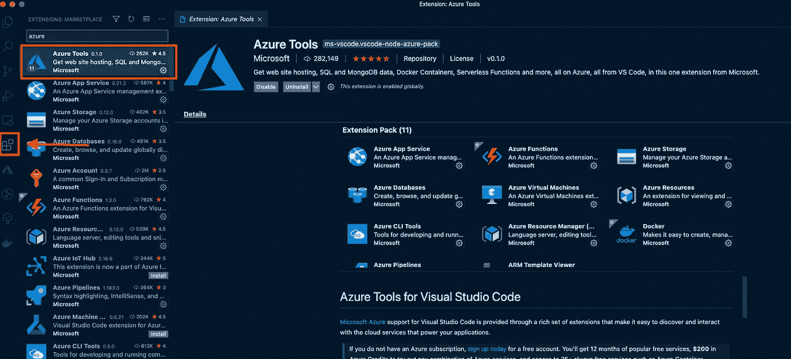
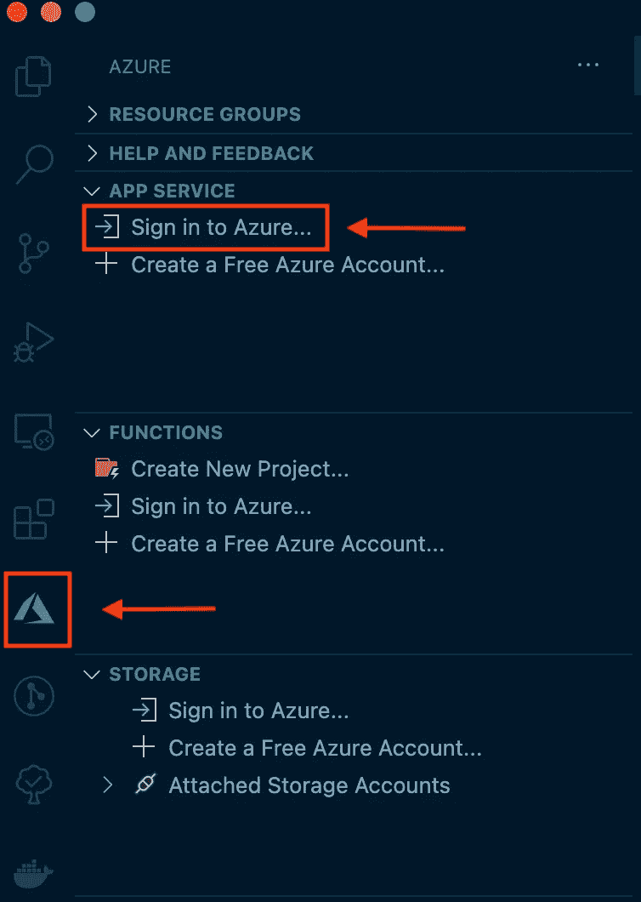
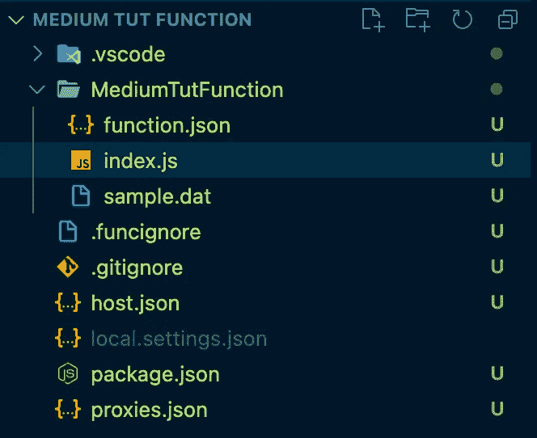
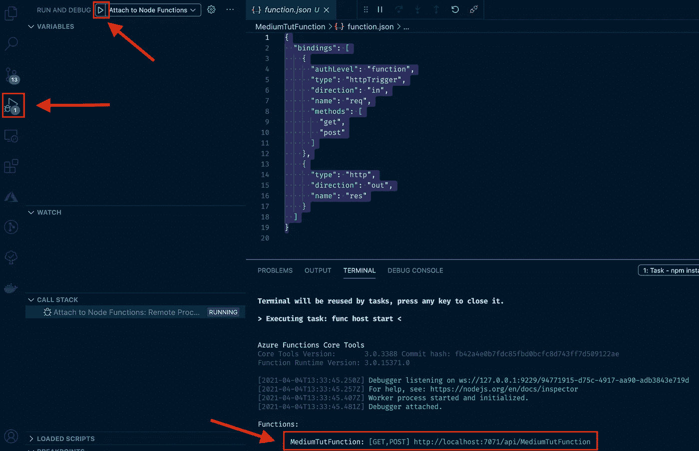
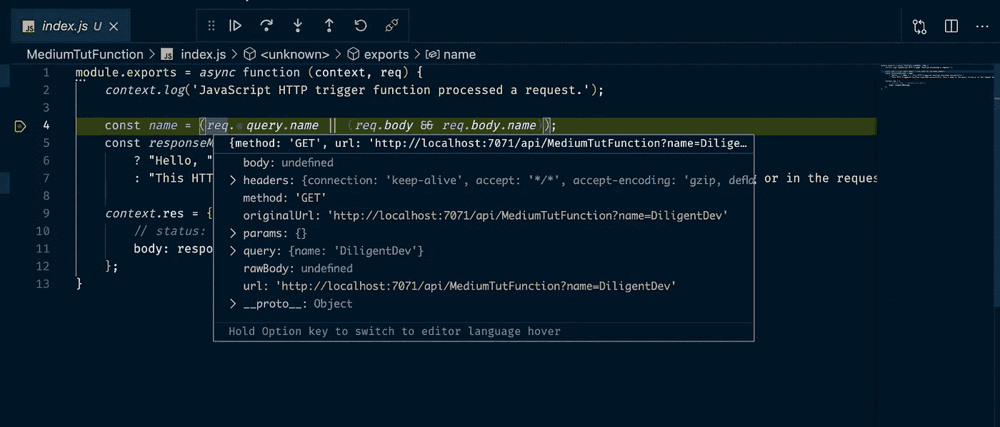

# 为什么我喜欢 Node.js 的 Azure 无服务器功能

> 原文：<https://blog.devgenius.io/why-i-love-azure-serverless-functions-for-node-js-d03c5767eb62?source=collection_archive---------6----------------------->



NodeJs + Azure 函数

在我职业软件开发生涯的前五年，我主要是一名. NET 开发人员。如果你已经编程了。NET，你知道首选的 IDE 是 [Visual Studio](https://visualstudio.microsoft.com/) (VS)。VS 给了你很多工具，让开发变得更加容易。

VS (IMO)最好的部分之一是它的调试工具。它允许您设置断点、观察器等等。这对初级开发人员非常有帮助，因为它允许您查看可以访问的不同属性和方法，当然，比使用打印/控制台日志语句更容易找到代码中的错误。

这就是为什么当我转而关注 JavaScript 时，我在调试代码时遇到了如此大的困难。我被 VS 工具套件宠坏了，以至于它很快就变得令人沮丧。为 AWS Lambdas 之类的无服务器功能设置本地环境是多么复杂，这可能会使问题复杂化。

# 蔚蓝的

在我的职业生涯中，我使用过所有主要的云提供商(AWS、GCP 和 Azure)。在这三者中，Azure 是最容易使用的。他们的门户是直观和干净的。他们提供与 GCP 和 AWS 几乎相同的服务。最棒的是，它们为我的新宠 IDE[Visual Studio 代码](https://code.visualstudio.com/)提供了奇妙的工具(如下所示)。

# 创建 Azure 无服务器功能

## Azure 帐户

如果您还没有帐户，请前往 https://azure.microsoft.com 的，创建一个帐户，然后登录门户网站测试您的证书。从这里开始，我们将不再使用 Azure，而是使用 VS 代码来创建一切。

## Azure Tools Visual Studio 代码扩展

接下来，下载 [VS 代码](https://code.visualstudio.com/)如果你还没有的话。下载完成后，点击左侧菜单中的扩展选项卡，搜索 [Azure Tools](https://marketplace.visualstudio.com/items?itemName=ms-vscode.vscode-node-azure-pack) 并安装。



安装 Azure 扩展

安装完扩展后，你会在左侧菜单中看到一个 Azure 图标。点击它，然后点击“登录 Azure”。这将提示您登录 Azure 帐户。



Azure 扩展登录

现在我们已经登录了，我们可以直接从 VS 代码创建一个 Azure 函数。为此，请确保您在 azure 扩展菜单上，找到“功能”选项卡，然后单击“创建新项目”图标。如果您不在目录(文件夹)中，它会提示您创建一个目录。一旦进入您想要的目录，它将引导您创建新的函数。

## 我将选择以下内容:

1.  选择一种语言: **JavaScript**
2.  为你的第一个函数选择一个模板: **HTTP 触发器**(还有很多其他的。可以在这里了解一下:[https://docs . Microsoft . com/en-us/azure/azure-functions/functions-overview](https://docs.microsoft.com/en-us/azure/azure-functions/functions-reference))
3.  提供一个名称:**媒体功能**
4.  授权:**函数**(要了解更多关于 Auth 的信息，请访问:**[https://docs . Microsoft . com/en-us/azure/azure-functions/security-concepts](https://docs.microsoft.com/en-us/azure/azure-functions/security-concepts))**

**选择之后，您可以选择在当前窗口中打开该功能。Azure 会在你的函数目录下创建几个文件。两个最重要的文件是 function.json 和 index.js，前者保存所有的函数设置，后者保存代码。**

****

**项目结构**

## **操作码**

**在基本项目模板中，您将看到一些示例代码。它期望您向主体或查询字符串传递一个名称参数，并且它将返回一个响应，主体将名称和一些文本一起传递回来。该状态默认为 200，但可以被覆盖。**

```
module*.*exports = *async* function (context, req) {
 *context.log*(
  'JavaScript HTTP trigger function processed a  request.'
 ); const *name* =(*req.query.name* ||(*req.body* && *req.body.name*)); const *responseMessage* =name
  ? "Hello, " + name + ". This HTTP triggered function executed 
  successfully." : 
  "This HTTP triggered function executed successfully. Pass a name
  in the query string or in the request body for a personalized 
  response."; *context.*res = {
  // *status: 200, /* Defaults to 200 */* body: responseMessage
 };
}
```

## **函数. json**

**在 function.json 中，我们可以找到函数的设置:**

```
{
 "bindings": [
  {
   "authLevel": "function",
   "type": "httpTrigger",
   "direction": "in",
   "name": "req",
   "methods": [
    "get",
    "post"
   ]
  },
  {
   "type": "http",
   "direction": "out",
   "name": "res"
  }
 ]
}
```

**这显示了我们在功能设置中选择的所有选项。我们将 auth level 作为一个函数，将 type 作为 httpTrigger，一些方向设置，以及我们允许的 HTTP 方法(GET 和 POST)。要了解如何编辑此文件的更多信息，请访问:[https://docs . Microsoft . com/en-us/azure/azure-functions/functions-reference](https://docs.microsoft.com/en-us/azure/azure-functions/functions-reference)**

# **最精彩的部分…**

## **局部功能调试**

**使用 Azure 函数最奇妙的部分是本地调试功能。要在本地启动它，请单击左侧菜单中的调试图标，这将在左上角显示一个绿色的播放按钮。一旦你点击它，它将启动你的功能，并给你一个端点。**

****

**在本地启动 Azure 功能**

## **设置和命中断点**

**现在回到 index.js 文件，在第 4 行设置一个断点，在这里检查名字。然后打开 Postman(或类似的),用查询字符串或请求正文中的名称调用端点。**

**这将在本地调用该函数并命中断点。从那里，您可以将鼠标悬停在不同的变量上，查看它们的值和方法。在我看来，毫无疑问这使得开发变得更加容易。**

****

# **更多…**

**很难在一篇文章中展示更多。因此，要想获得更深入的教程，请务必查看我下面关于这个主题的视频。在这篇文章中，我们将涵盖本文中包含的所有内容，以及如何返回不同的状态代码，如何在一个项目中创建多个功能，以及如何在 Azure 上部署它们。**

# **视频教程**