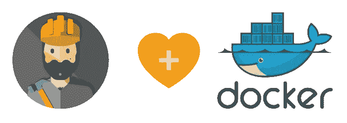
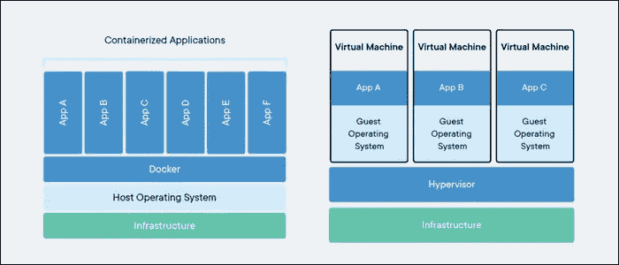

# 我为什么喜欢 Docker

> 原文：<https://blog.devgenius.io/why-i-love-docker-e72b2f3ab7dd?source=collection_archive---------14----------------------->

[https://www.praecipio.com/hubfs/dld-1.png](https://www.praecipio.com/hubfs/dld-1.png)

# **我的背景故事**

多年来，在我开始作为后端开发人员专业工作之前，我一直在努力理解如何使用 Linux，我不明白为什么许多人特别是开发人员如此喜欢使用 Linux。我的意思是，安装一个东西，不管是游戏，程序，还是其他什么，都是一件痛苦的事情。主要是因为我要一个一个安装所有的依赖项，还要配置。

我当时非常喜欢 windows，因为安装任何东西都很容易，而且 windows 有一个用户友好的 GUI(可能是因为我从第一次使用计算机时就开始使用它了)。我第一次出于严肃的目的使用 Linux 是在我上大学的时候，用 Debian 做树莓派。这是因为我的机器人实验室使用 Raspberry PI 来运行它的一个机器人，为了开发它，我必须学习它。为机器人软件安装工具和依赖项是一场噩梦。我只是一个接一个地阅读教程，并遵循它，并不真正知道我在做什么。我所知道的是我心中有想法，我需要以某种方式实现它。

快进到我职业生涯的第二年，在辞去第一份工作后，我在一家科技公司找到了一份工作。这是一家新的软件公司，我的朋友邀请我作为他们的第一个后端开发人员加入。我答应了，我成了唯一的后端程序员，负责维护后端程序的服务器。我没有做开发操作的经验，但是我有使用 Linux 操作机器人的经验，那么会有什么问题呢？

我的公司当时使用 GCP(谷歌云平台，也没有任何经验)来运行我们所有的网络应用和后端。所以我只是做我在机器人实验室学到的东西，然后艰难地安装东西。我尽可能按照每一个教程安装 Redis、Postgres、Node Js 和开发后端所需的所有依赖项。当你在一台机器上处理大量的依赖项时，这真的很累人，很多事情都会出错。一个错误的配置不仅会影响你的程序，还会影响依赖它的整个系统。所以每次做改动，我都需要**非常** **小心**。

这种情况一直持续到相当一段时间…

照片由 [Tim Gouw](https://unsplash.com/@punttim?utm_source=medium&utm_medium=referral) 在 [Unsplas](https://unsplash.com?utm_source=medium&utm_medium=referral) h 上拍摄

# 然后我遇到了 Docker…

最后，我的老板和经理意识到，我无法独自处理服务器，因为我没有处理生产和开发服务器的经验，我还是一名程序员，这意味着我花了大部分时间编写代码，而不是寻找开发运营最佳实践，我以前的工作只是一名初级后端程序员。几个月后，他们最终决定雇佣一名真正的开发人员。对我来说这是一种解脱，因为我不必编码和管理服务器。

当开发运营人员开始工作时，他很快构建了服务器，使其易于管理(比我管理时好得多)。起初我并不真的关心他在做什么，我只是松了口气，因为我的一些负担已经解除了。但是当我把我的程序部署到服务器上时，我意识到他用这个叫做 Docker 的东西来构建我的 API。我经常听说它，但我不知道它是什么，它是如何使用的，我只知道网站和大多数人说它是一个容器。因此，我开始查看 docker 的文档，并询问开发人员它是什么以及它是如何工作的，我所知道的是，当部署到服务器时，它使生活变得容易得多。它可以自动重启程序，部署程序不会停止当前程序的运行，最棒的是，构建程序所需的一切都在其中。yml 文件。

左 docker，右虚拟机|[https://www . cloudsavvyit . com/thumb cache/0/0/4651 EFA 0 ab 96 e 9 b 521 a 6 eded F9 c 58 e 8/p/uploads/2019/06/bc4f 8762 . png](https://www.cloudsavvyit.com/thumbcache/0/0/4651efa0ab96e9b521a6ededff9c58e8/p/uploads/2019/06/bc4f8762.png)

起初我真的不明白，但后来我有一个个人项目，并试图在该项目中实现 Docker。安装和配置 Postgres，PG admin，Redis，Logging 和 Image bucket 是小菜一碟。它只是立即运行(如果配置中没有出现错误)。我对一个容器所做的任何更改都不会影响到除该容器之外的任何东西。这是天堂，我后悔没有早点知道。对于包含操作系统的东西来说，它也是超级轻量级的。创建我的个人项目真的很容易，其中一个好处是它可以封装连接。因此，如果我不需要任何到容器的外部连接和良好的安全性，我就不需要浪费服务器上的任何端口。管理文件也很容易。您可以使文件临时或永久链接到服务器，这取决于您如何配置配置文件。

# 结论

我可能对 docker 的宣传有点晚了，但至少我有机会了解 Docker，并向其他像我一样挣扎的开发人员传播这个消息。关于 Docker，我还有很多需要学习的地方，还没有真正发现它的所有优点。但我希望对 docker 有更深入的了解，并在我做的任何项目中优化它。是的，我在使用 Docker 时有起有落，但我仍然对 Docker 很满意。

对于还没有使用 Docker 的人来说，这是一件值得尝试和探索的事情。我保证你不会后悔学习 Docker 的基础知识，也不会后悔在你的项目中实现它。它真的是我的救命稻草，如果没有它，我可能仍然会在尝试部署任何东西时感到沮丧。我希望你早点学会它。

干杯！:)

威尔·斯图尔特在 [Unsplash](https://unsplash.com?utm_source=medium&utm_medium=referral) 上拍摄的照片