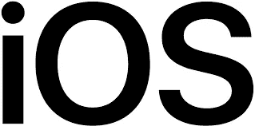

# 我为什么喜欢 iOS

> 原文：<https://blog.devgenius.io/why-i-love-ios-a99377c7a0?source=collection_archive---------7----------------------->

使用这个系统时，我从未失望过。

从我高中一年级开始，苹果的 iOS 从未让我失望过，我把 MacBook Air 当作工作电脑使用。以下是我为什么喜欢使用苹果产品的细节。

## 1-从网上下载东西很容易

但这取决于互联网网站。总的来说，为你的苹果电脑下载一些东西是相当容易的。尤其是有了苹果的 App Store 安全便捷的下载。一旦它们被下载，就很容易设置整个程序。然后，它一完成你就可以开始了。因此，在你的苹果电脑上下载和设置是一件容易的事情。

## 2-它比大多数操作系统安全得多

苹果以拥有高安全性系统而闻名，他们至今仍保持着这一声誉。许多人使用这个功能来确保他们在大多数情况下是安全的。我和这些人没什么不同，我喜欢这种方便我们工作的方式。所以，如果你定期采取一定的安全防范措施，你真的不必担心你的苹果电脑。

## 3-与大多数操作系统相比，它很容易使用

作为一个长期的 iOS 用户，我能理解为什么苹果用户往往会狂热地选择苹果产品。这不仅仅是营销和客户忠诚度，因为用户喜欢简单易用，而大多数技术公司在很长一段时间内都无法满足这些需求。但是，ubuntu 是苹果 iOS 的竞争对手，因为许多用户对 Ubuntu 操作系统提供的相同水平的便捷使用感到满意。

## 4-做多件事通常很容易

除了游戏，你可以做任何事情。不过要看你的存储和硬盘水平。除此之外，你还可以轻松存放大部分所需物品。但是如果你是一名软件开发人员，你需要一台大容量的电脑。但是苹果公司用他们最近的笔记本电脑和他们自己的电脑覆盖了你。自从我在 2018 年拥有了我的第一台 Macbook，我使用它的时间超过了两年，这是我最开心的事情。但是我讨厌几年后我可能不得不改变它。如果可能的话，我可以告诉你，我很可能会用 MacBook Pro 来改变，包括软件开发的最高存储。

*你觉得苹果的产品怎么样？当你使用它们时，你感觉如何？如果你用过，请在下面的评论区分享你的经验。*