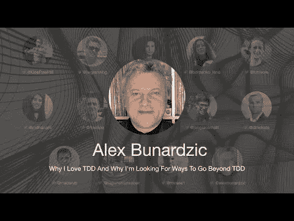

# 我为什么喜欢 TDD 以及我为什么在寻找超越 TDD 的方法——Alex Bunardzic

> 原文：<https://blog.devgenius.io/why-i-love-tdd-and-why-im-looking-for-ways-to-go-beyond-tdd-alex-bunardzic-4564e33b76d5?source=collection_archive---------3----------------------->

第一次国际测试驱动开发发生在 7 月 10 日。

在这个系列中，我将包括每一次谈话，还有我的笔记和进一步的阅读。

希望有很多读者会观看并重新观看这些讲座，因为它们值得几篇评论。

让我们继续…

# 个人简历

Alex 是一名软件工程老手，拥有超过 30 年的实际操作专业经验。Alex 是极限编程和 TDD 的坚定倡导者，目前正在通过指导 DevOps 团队进行 TDD 实践来领导他们。

> TL；DR:我们需要超快的反馈。TCR 做得很好

# 讨论

# 我的个人笔记

*   我们花一半的时间弹吉他，另一半时间调音
*   在我们做出改变并看到其影响之前，我们等待的时间越长，我们就越是陷入黑暗
*   我们需要缩短反馈回路
*   我们应该像在谷歌文档上合作一样，将每一个击键都部署到产品中
*   从头开始创建一个 [TCR](https://medium.com/@kentbeck_7670/test-commit-revert-870bbd756864) 系统，自动化脚本根据测试结果提交或恢复。
*   我们从一个稳态到另一个稳态
*   我们被对称性所驱使
*   像往常一样，我们开始假装，直到我们开始做它
*   首要指令是系统始终启动并运行
*   一旦我们编写了许多测试，我们就可以运行突变测试
*   意外的复杂性是我们系统的痛苦

# *音箱链接*

*   推特 [alexbunardzic](https://twitter.com/alexbunardzic)
*   LinkedIn [@alexbunardzic](https://www.linkedin.com/in/alexbunardzic/)
*   中等 [Alex Bunardzic](https://medium.com/u/16ec868611bd?source=post_page-----4564e33b76d5--------------------------------)

请在以下时间关注贸发大会:

 [## TDD 会议

### 与朋友、家人和全世界分享您的视频

www.youtube.com](https://www.youtube.com/channel/UCKn-DadPoyYssfAOMk1LSew)  [## JavaScript 不可用。

### 编辑描述

twitter.com](https://twitter.com/tddconf)