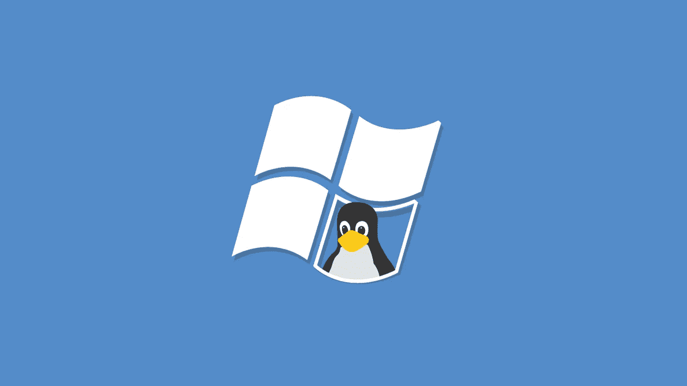
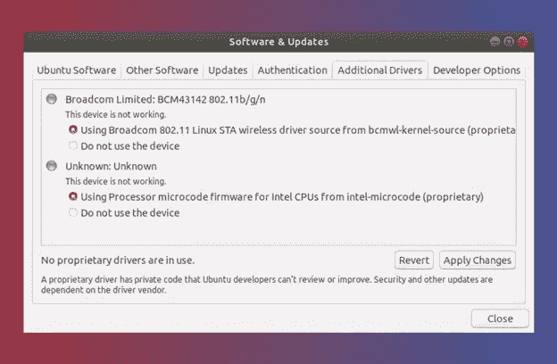
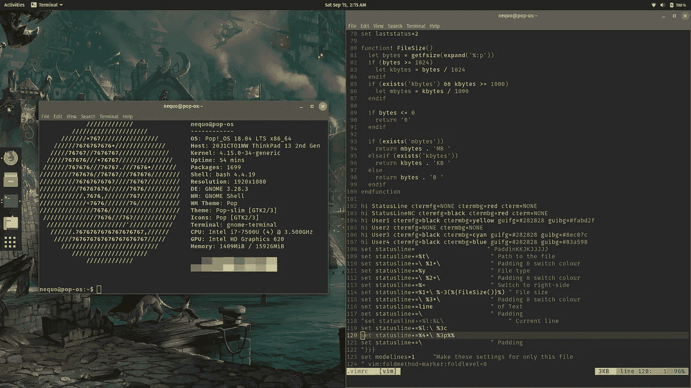
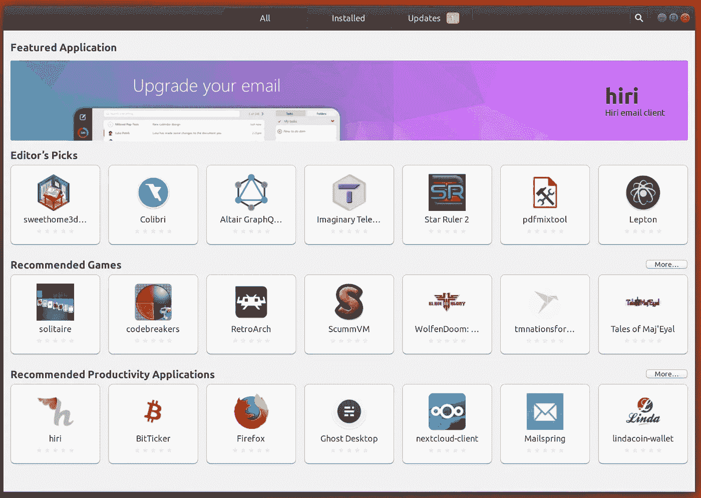

# 为什么我在使用 Linux 一周后又换回了 Windows

> 原文：<https://blog.devgenius.io/why-i-switched-back-to-windows-after-using-linux-for-a-week-7b5382bbbf73?source=collection_archive---------3----------------------->

## 至少现在是这样

贷项:开发至

作为一名技术爱好者，我和开源企鹅有过不少接触。以前每当我尝试 Linux，它从来没有作为日常驱动程序或长时间。但是，在阅读了大量关于 Windows 替代系统如何最终好到足以被普通用户视为操作系统的文章和视频之后。我决定试一试，发现 Linux 实际上变好了，但还不够好。抓紧你的座位，试着增加你的注意力，因为我在大声抱怨让我放弃 Linux 并切换回好的旧 Windows 的一切。

## **司机支持仍是个问题**

功劳:是 FOSS

在做了一些研究后，我认为 PopOS，Ubuntu 的一个分支，将是我的 AMD 笔记本电脑作为日常驱动操作系统的最佳选择。我以为这么多年过去了，Linux 应该能像 Windows 10 一样原生支持几乎所有的驱动程序；不幸的是，我错了。仅仅 2 分钟后，我发现我的笔记本电脑没有互联网连接。罪魁祸首？找不到 Wi-Fi 适配器的驱动程序。我只花了 5 分钟就找到了解决方案，但具有讽刺意味的是，它要求我的笔记本电脑有互联网连接来解决这个问题。谷歌搜索了 10 分钟后，我找到了一个离线方法，可惜没有用。近 30 分钟后，经过一番头脑风暴，我终于用最初的解决方案，通过连接到网上，解决了我的笔记本电脑的 Wi-Fi 驱动程序问题。这是唯一可能的，因为我的智能手机支持反向共享。这仅仅是我在 Linux 上修复和优化驱动程序的开始。

> *LINUX 仍然缺乏对那些不广泛可用或全新的组件的驱动支持；特别是在笔记本电脑上*

当我还在 Linux 冒险的时候，我一直注意到我的笔记本电脑异常发热，显然这又是由于驱动程序的问题。如今，许多笔记本电脑都配有一个集成的专用图形处理单元，或简称为 GPU。Windows 有一个专用的系统功能和驱动程序支持，可以根据系统的需要使用两个或一个 GPU。这与 Linux 不同，因为大多数发行版都不支持这种混合 GPU 特性，需要您手动安装程序来根据需要交换 GPU。即使在 Linux 上实现了这种混合 GPU 特性之后，缺乏优化往往会导致 GPU 的空闲温度更高，甚至平均电池时间更短。具有讽刺意味的是，拥有 nVidia GPUs 只是给安装 Linux 增加了更多的麻烦，并限制了人们对发行版的选择。因为他们中的很多人在安装 nVidia 驱动程序时会给你带来噩梦。

在台式机上运行开放源码和更加可定制的 Linux 可能会让你少一些驱动程序支持的麻烦，但是如果你在笔记本电脑上运行它，并且它碰巧是全新的或由 AMD 驱动的；你肯定会发现一些或大部分组件缺少驱动支持。

## **压力下节流**

鸣谢:Reddit

大多数人会继续说 Linux 反应更快，速度更快；显然，他们没有错。与 Window 10 相比，Linux 桌面环境肯定会给你更快的感觉。此外，桌面环境之间的定制和更多选项带来的额外好处令人欣喜。除了桌面环境，Linux 传统上带有较少的内置软件和在后台运行的进程。因此感觉更快。然而，这种更快更好的操作系统往往会在压力下窒息，因为它使用虚拟 ram 的方式，或者在 Linux 中更普遍的说法是交换空间。多年来，Windows 一直在改进的一点是它如何处理虚拟内存，尽管现在大多数人都有 8g 甚至更多的内存；但是有时我们会遇到系统使用了将近 99%内存的情况。而这种情况最常见的例子就是，*咳咳*，用 Chrome。

> *当使用超过 90%的系统资源时，LINUX 往往会死机*

在试图创建一个系统使用 99%内存的情况时，Windows 不断地将大量程序数据移动到虚拟内存，并不断地为我释放物理内存。这导致系统有点慢，一些程序需要更长时间才能打开。然而，这不是 Linux 的情况。只有当系统达到特定的内存消耗百分比时，它才会将少量数据从物理内存移动到虚拟内存。当 Linux 实际移动数据以释放物理内存时，您会注意到在一切恢复正常和可用之前有 3-4 秒的可怕冻结。当 Linux 将数据从虚拟内存移回物理内存时，也会注意到同样的情况。这有时会令人烦恼。最大的障碍是当系统使用超过 90%的系统资源时，它倾向于冻结多次；而 Windows 运行良好，只是在执行某些任务时出现了一点延迟。

## **凌乱软件安装方法及支持**

信用:生命线

Linux 与 Windows 的区别在于软件的安装方式。在 Windows 中，安装任何软件都非常简单，只需下载安装文件，打开它，继续按下一步，直到完成按钮出现。瞧。软件已安装。而在 Linux 上，使用终端是更常见的方法；尽管许多人喜欢用 Eddy 来安装 Debian 软件包。但是，在 Linux 中安装软件的故事并没有就此结束。通常，在实际运行您想要的程序之前，您必须安装必备的库和其他软件组件。这里是麻烦开始的地方；我试着安装了一个叫 Anbox 的软件。它是一个开源的 android 模拟器；我在 PopOS 软件中心找到的 Debian 软件包。显然，安装后根本就没有启动。所以，我去了他们的网站，那里有关于如何让一个盒子工作的所有说明。按照这些指示，我不得不在运行 Anbox 之前通过终端下载 3 个以上的东西。做了所有这些，还是不行，为什么？因为它没有针对 PopOS 进行很好的优化，而如果它是 Arch Linux，它会立即运行。也就是说，如果某个软件可以在特定的 Linux 发行版上流畅运行，那么另一个发行版可能就不行了。

> *在 LINUX 上运行一些软件可能会很漫长和耗时*

软件安装和支持这些问题，以及同样软件的更麻烦和更慢的 snap pack 版本，使得 Linux 在许多情况下不是用户友好的操作系统。然而，如果你是那种喜欢在多个论坛中寻找运行一个软件的解决方案的人，那么我有什么资格去评判呢？在所有使 Linux 对我来说不再是日常驱动的事情中，无法离线安装大多数重要的软件，如硬件驱动程序或系统组件，是最烦人的部分。

## **Linux 并不适合所有人**

与几年前的 Linux 相比，它已经有了很大的进步。理论上，在许多基准测试中，Linux 都领先于 Windows 即使在现实生活中，它也表现得很好。然而，对于一个想要流畅无故障体验的普通用户来说，Windows 是唯一应该考虑的操作系统。