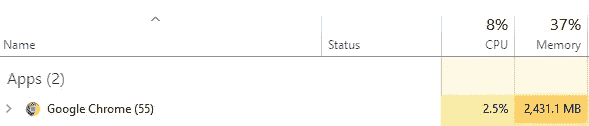
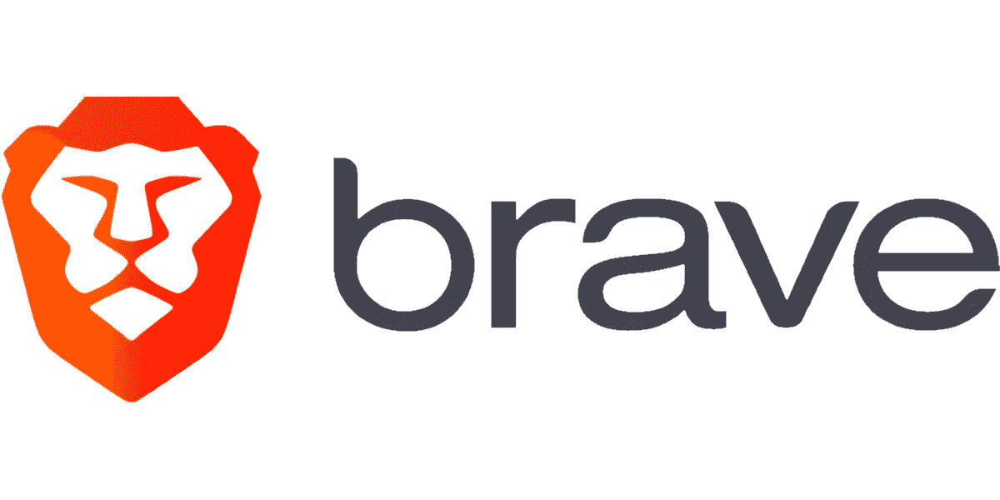
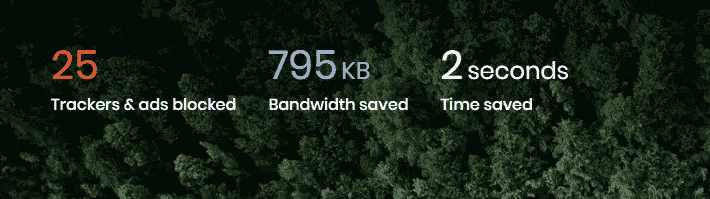
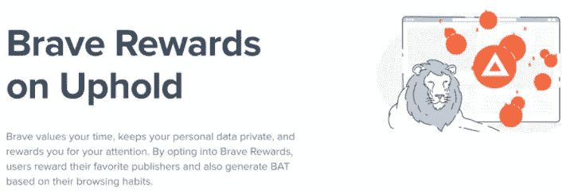

# 为什么我使用勇敢的浏览器

> 原文：<https://blog.devgenius.io/why-i-use-the-brave-browser-f23946dde120?source=collection_archive---------8----------------------->

我使用互联网和互联网浏览器的故事开始于很久以前，如果我没记错的话，大约有 10 年了。当我第一次得到我的电脑时，我打开了浏览器，那是 Internet Explorer，我清楚地记得我在搜索什么。那时我还是个孩子，我生命中最重要的部分是《龙珠》的下一集。我搜索了一下，看到了很多我非常喜欢的照片。那时生活很简单，所以网络浏览器。

# 我一直使用到现在的互联网浏览器的历史。

几乎和我认识的每个人一样，我们都开始在 Internet Explorer 浏览器上搜索网页。当时它工作得很好，直到我长大了，对计算机和技术有了更多的了解。在 IE 之后，我已经尝试了很多不同的浏览器，其中最让我难忘的是 Mozilla Firefox。它很快，很可靠，而且没有消耗掉我电脑上所有的内存。我记得我用了几年，生活很好，我从来没有遇到任何真正的问题。

照片由 [Richy Great](https://unsplash.com/@richygreat?utm_source=medium&utm_medium=referral) 在 [Unsplash](https://unsplash.com?utm_source=medium&utm_medium=referral) 上拍摄

在过去的四到五年里，我一直只使用谷歌浏览器，我非常喜欢这个浏览器。它已经发展了很多，并解决了我过去遇到的每一个问题。速度是一个重要因素，我觉得 Chrome 在这方面是市场上最好的。关于吃公羊的问题，我认为它已经做了很好的修复工作。现在它不会消耗太多的内存，为了证明这一点，我在下面放了一张图片，显示它在打开 30 多个标签时不会超过 3 Gb。不要介意我打开了大量的标签，我在写这篇文章之前做了一些工作和研究，所以这就是我有这么多标签的原因。

# 为什么我转投勇敢？

几个月前，由于对区块链和加密货币越来越感兴趣，我发现了勇敢浏览器。Brave 是一款基于 Chromium 的免费浏览器，拥有基于 BAT token 的奖励政策。(基本的注意力令牌)它还有内置的钱包，可以放你的密码，这对我来说是一个巨大的奖励。

这款浏览器内置广告拦截器，还能拦截恶意软件和追踪器。此外，在任何时候你都可以激活 Brave 的保护盾，只需访问导航栏右侧带有其标志的图标。当我们继续使用 Brave browser 时，它会阻止广告、恶意软件或追踪器，并在首页显示它能够阻止的数量。

# 勇敢的奖励。

Brave it 已经将对用户的奖励整合到了蝙蝠令牌的形式中。您可以通过两种方式获得代币:

*   第一种选择是从访问我们网站的勇敢用户那里获得小额捐款(如果我们有网站的话)。但为此，我们必须在 Brave 中注册为发布者。
*   第二种方式是看广告(对此我们给予许可)，广告以通知的形式到达我们的电脑(此外，由于我们看到的广告类型是在我们的电脑上本地确定的，根据我们的浏览历史，它不一定是外部跟进，以了解什么可以显示给我们)。

我们挣的球棒被转移到一个钱包里。对于这一点，我们必须在这个平台上注册和识别自己，然后链接到 Brave。