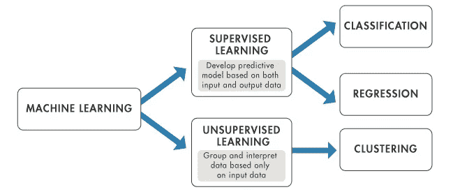
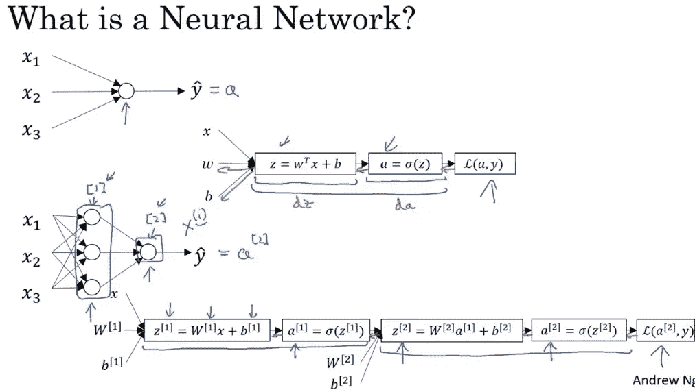
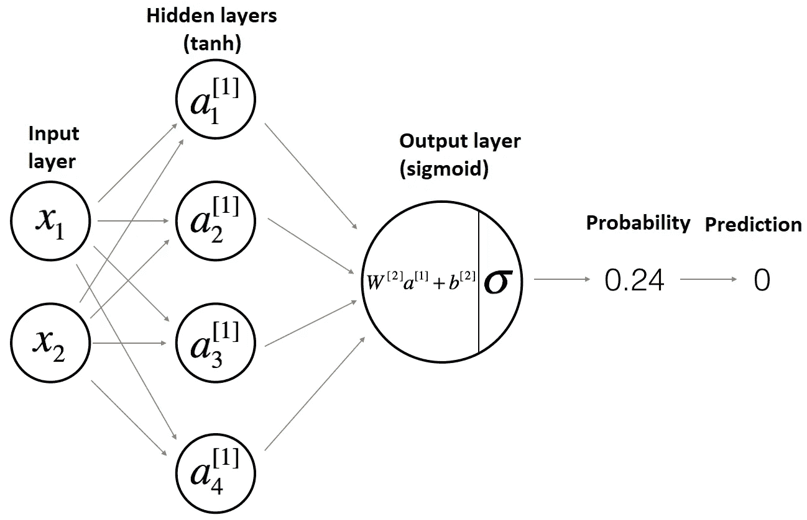
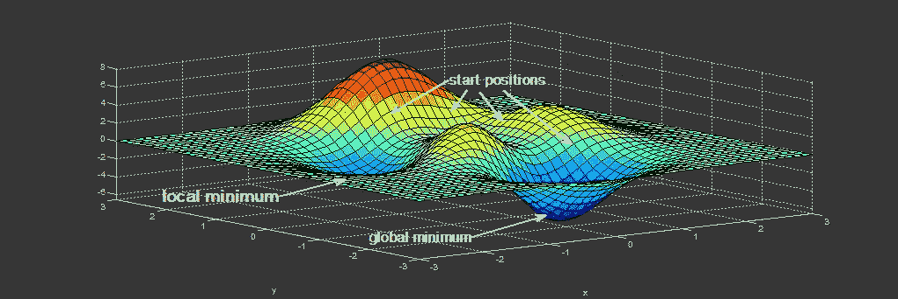

# 隐层神经网络为什么要随机初始化权重(numpy.random.randn())？

> 原文：<https://blog.devgenius.io/why-initialize-weights-randomly-numpy-random-randn-in-hidden-layered-neural-networks-5187263f2ed1?source=collection_archive---------8----------------------->

**有线性回归为什么还要 Logistic 回归？**

来源:www。Mathworks.com

基本上，分类是预测离散类别标签的任务，而回归是预测连续数量的任务。回归问题涉及到数量的预测。

**线性回归**:建立输入与输出之间的线性关系。它适用于连续变量。使用最小平方估计方法。

**逻辑回归:**这里不需要线性关系，因为在方法中使用了 Logit 函数，所以称之为逻辑回归。它可以输出 0 到 1 之间的预测值，它对分类变量有效。s 曲线(sigmoid)输出介于 0 和 1 之间。使用 s 曲线是因为逻辑回归问题的输出是事件发生的概率。这里使用最大似然估计。

来源:谷歌

**为什么？:**线性回归不适用于二元响应变量，结果变量不会预测 0 到 1 之间的值，因为它适用于连续因变量，而逻辑回归适用于分类因变量。

**逻辑回归存在时为什么要隐藏分层神经网络？**

为了更好地逼近大数据，逻辑回归不足以得出近似值。因此，分层神经网络被发现来实现这种情况。

资料来源:Coursera Andrew NG

**为什么命名为隐藏层？**

让我们来看看神经网络的体系结构——一个输入层，大小等于输入的维数，一个输出层每个类一个节点或一个实值结果的节点，即隐藏层。

来源:谷歌

输入和输出层都是不言自明的。现在需要给中间层命名了。在所有的选择中间，未知，潜在，隐藏。隐藏是最好的选择。

**为什么神经网络和非线性网络都需要激活函数？**

神经网络中的激活函数意味着如何将输入的加权和转换成来自神经网络层中的一个或多个节点的输出。

**为什么？:**将具有无限范围(-inf 到+inf)的值投影到概率设置，其中值的范围是从 0 到 1(有时是从-1 到+1)。这引入了多层网络中期望的非线性，以便检测数据中的非线性特征。如果只应用线性激活函数，那么网络将只是线性函数的组合，其也是线性函数。

**为什么要随机初始化权重？**

重点是**打破对称性**。因为如果你将所有权重初始化为零，那么神经网络中所有隐藏的神经元(单元)将进行完全相同的计算。当我们将权重和偏差初始化为零时，这使得神经网络问题成为一个死问题。

在梯度下降迭代中，前一层的梯度是现有权重乘以从下一层的反向传播获得的梯度。如果初始权重设置为零，权重和梯度的乘积也将为零。由于梯度为零，梯度下降不会改变或优化每次迭代中的权重。这不是我们在神经网络问题中想要做的。

来源:谷歌

当层中的所有权重都相同时，每个神经元都表示相同，并且层中存在对称性。因此，即使层中有更多的神经元也没有意义，它几乎类似于一个神经元。为了避免这种情况，神经网络问题层中的初始权重必须随机初始化。最常用的随机化初始化是 numpy.random.randn()

最后得出了一个完美的结论——当随机初始化权重时，系统的熵增加，这有助于找到更低的点，如局部或全局最小点。

**引文:直接和/或修改的一些句子或图像摘自 DeepLearning AI，Medium，Mathworks，Steven L.Brunton 数据驱动的科学与工程**

我希望你能愉快地阅读这篇文章。