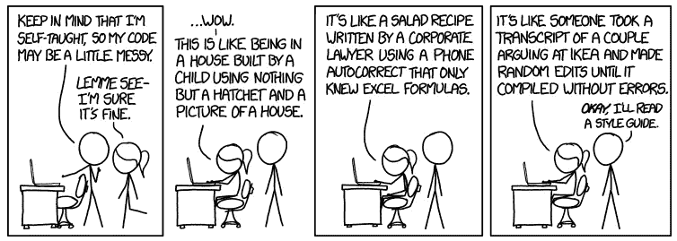
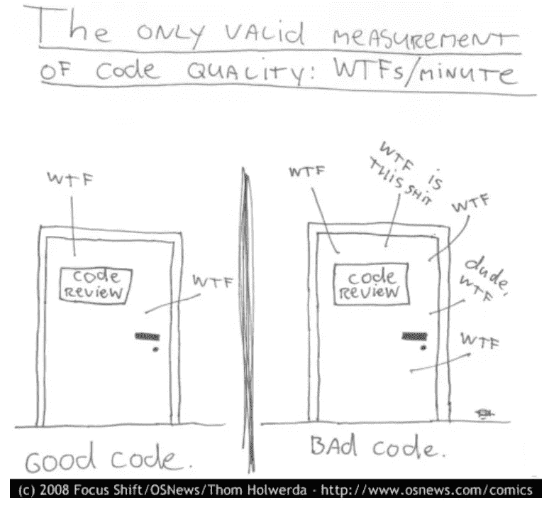

# 为什么代码质量很重要？

> 原文：<https://blog.devgenius.io/why-is-code-quality-important-60f26dec17f9?source=collection_archive---------10----------------------->

克里斯里德在 [Unsplash](https://unsplash.com/s/photos/code?utm_source=unsplash&utm_medium=referral&utm_content=creditCopyText) 上的照片

人们会认为编写任何程序员都能阅读和理解的代码是软件开发人员的固有技能。事实是**只有 20%的程序员有这种能力**。你写的代码不仅要能被机器理解，也要能被人类理解。在软件开发中，质量应该是每个人的首要任务。在整个开发过程中，目标应该是交付高质量的工作代码。

> 任何傻瓜都能写出计算机能理解的代码。优秀的程序员编写人类能够理解的代码。—马丁·福勒

# 什么是代码质量？

代码质量粗略地定义了代码的长期有用性和可维护性。更正式地说，代码质量由一组不同的属性和需求组成，由您的业务来决定和区分优先级。这意味着明天可以扔掉的代码是低质量的。另一方面，能够从一个产品转移到另一个产品，进一步开发，甚至在建立其价值后开源的代码是高质量的。

因此，对于一段被认为是“良好”质量的代码，它应该至少遵循以下要求:

*   它应该做它应该做的事情。
*   它应该遵循一致的风格。
*   应该很好理解。
*   应该有据可查。
*   可以测试。

> *用代码行来衡量编程进度，就像用重量来衡量飞机制造进度一样。—比尔·盖茨*

# 为什么您应该关心代码质量？

我在这里举个例子。每个人都喜欢读好故事。对于一个没有文学知识的普通人来说，一个好的故事是容易阅读和理解的。伟大的作家写的书有引人入胜的故事，易于阅读和理解。就像作者的文章必须易于阅读和全面一样，软件开发人员的代码也应该如此。毕竟，在某种程度上，代码是开发者的故事。

为了满足最后期限而在质量上做出妥协可能很诱人，但是如果你想让你的代码长期坚持下去，那么生产出满足所有代码质量标准的代码是必不可少的。代码的质量决定了你是一名开发人员。你可能是一个非常好的程序员，可以在 10 分钟内写出 100 行代码，但是你需要从可维护性的角度来考虑。维护这个项目的人或者你的同事能够理解你的天才头脑在想什么吗？

此外，高质量的代码可以加速长期的软件开发，因为它可以重用，开发人员不必花太多时间来修复旧的错误和润色代码。这也使得新的项目成员更容易加入项目。所有这些反过来降低了技术债务。

[来源](https://xkcd.com/1513/)

# 如何提高代码质量？

既然代码质量是软件开发不可或缺的一部分这一点已经确定，我相信你会想知道如何提高代码质量？因此，这里列出了一些可以提高代码质量的事情:

*   设置版本控制和代码审查。
*   遵循持续集成。
*   确定并遵循编码约定。
*   运行测试。
*   分析 bug。
*   衡量你的代码质量。

我确信这些看起来像是术语的混合。所以这里有一篇精心编制的[文章](https://medium.com/better-programming/things-that-you-can-do-to-improve-code-quality-c746c30e7521)来帮助你更好地理解每一点。

[这里的](https://www.it-cisq.org/standards/code-quality-standards/)是由信息和软件质量联盟制定的代码质量标准。

如果你像我一样是一个如饥似渴的读者，相信所有的书籍，你可以看看罗伯特“鲍勃叔叔”马丁写的这本书，名为**干净的代码:敏捷软件技术手册**。

代码质量度量= WTFs/min | [来源](https://www.osnews.com/story/19266/wtfsm/)

*感谢您的阅读。希望下一部能见到你。在那之前，别忘了你很棒。*