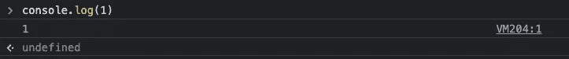
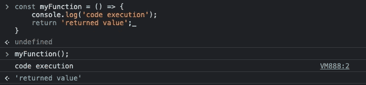
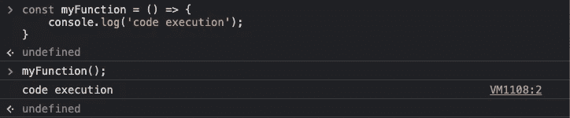

# 为什么 Javascript 函数返回未定义

> 原文：<https://blog.devgenius.io/why-is-javascript-function-return-undefined-f519963d170c?source=collection_archive---------1----------------------->

## 或者函数默认返回的内容。

Web 开发人员每天都与函数打交道。但是你知道一个什么都不返回的函数会返回什么吗？这听起来很奇怪，但让我们弄清楚。

约书亚·阿拉贡在 [Unsplash](https://unsplash.com/s/photos/code?utm_source=unsplash&utm_medium=referral&utm_content=creditCopyText) 上拍摄的照片

*“不返回任何东西的函数返回什么？”*

我有一次在求职面试中收到这个问题，我很困惑。一方面，这个问题很简单，但是你知道它在面试中是怎样的。我开始怀疑自己，说我不知道正确答案，:D

让我们转向 Chrome 开发工具中的控制台(F12 —控制台选项卡)。开发人员经常用它来记录应用程序。同样在这个控制台中，您可以编写 JavaScript 代码，这些代码将立即执行。

作者截图

当我写下`console.log(1)`并按下`enter,`时，日志输出按预期出现。然而，下一行显示的是`undefined`。为什么我们会有这样的双产量？

这是因为开发人员工具控制台首先执行代码，然后显示返回值。它对所有函数都是这样，甚至对变量的赋值也是如此。让我们看一个带有自定义函数的例子。

作者截图

如您所见，输出显示了上面解释的行为。首先，我将函数赋给 myFunction 变量。这个操作没有返回值，所以我们看到了`undefind`输出。在下一行中，我调用了函数，然后我们看到了来自 return 语句的`console.log`输出‘代码执行’,最后是`returned value`输出。

如果我删除 return 语句，我们将看到下面的输出。

作者截图

只要没有 return 语句，函数调用后的输出就是`undefined`。

> 要返回默认值以外的值，函数必须有一个指定要返回的值的`[return](https://developer.mozilla.org/en-US/docs/Web/JavaScript/Reference/Statements/return)`语句。没有 return 语句的函数将返回默认值。在使用`[new](https://developer.mozilla.org/en-US/docs/Web/JavaScript/Reference/Operators/new)`关键字调用`[constructor](https://developer.mozilla.org/en-US/docs/Web/JavaScript/Reference/Global_Objects/Object/constructor)`的情况下，默认值是其`this`参数的值。对于所有其他函数，默认返回值是`[undefined](https://developer.mozilla.org/en-US/docs/Web/JavaScript/Reference/Global_Objects/undefined)`。
> 
> [文档](https://developer.mozilla.org/en-US/docs/Web/JavaScript/Reference/Functions#description)

虽然在文档中描述了这种行为，但是许多开发新手并不知道它，就像我以前不知道它一样。多亏了这些例子，我们现在明白了它是如何工作的。

我希望这证明对某人有帮助。你在求职面试中遇到过哪些令人兴奋的问题？我会对阅读它感兴趣。

 [## 任何 React 应用程序的 7 个必备功能

### 您只需要一个命令就可以实现它们

medium.com](https://medium.com/@kirichuk/7-must-have-features-for-any-react-app-10b086038d9a)  [## 为什么 React 组件要将一个不受控的输入变为受控的

### 和额外提示来优化您的 React 组件

medium.com](https://medium.com/@kirichuk/why-react-component-is-changing-an-uncontrolled-input-to-be-controlled-1f19f9a1ef35)  [## 反应类名反模式

### 试着在你的项目中避免它

medium.com](https://medium.com/@kirichuk/react-classname-antipattern-102f88e62fac) 

谢谢你的时间。下一集再见🙂。