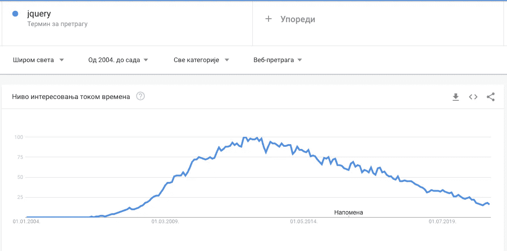

# 为什么 jQuery 今天还活着？

> 原文：<https://blog.devgenius.io/why-is-jquery-alive-today-4cb807d7079c?source=collection_archive---------0----------------------->

## JQUERY |前端|传统

## 揭穿 jQuery 神话

您将 jQuery 用于简单的网站、网店和 WordPress 博客。

jQuery 还能让我们的网站盈利吗？是的，这个图书馆赚钱。很多钱。

*为什么今天放弃？*人们憎恨是因为它还在踢。他们使用所有这些被宣传的软件来建立 3 页的网站。而 jQuery 可以用更少的资源做得更好。

以下是 jQuery 的常见误区，以及为什么你不应该在 2021 年抛弃它。

# 如今，很多网站都在使用 jQuery

这里有一个使用 jQuery 的站点。

[信号源](https://twitter.com/levelsio/status/1352127615482687488)

现场直播，而不是一个遗留项目。当然， **WordPress** 。这个网站的流量很大。Similarweb 称平均每月有 1000 万次访问。该网站也有一个良好的灯塔评分。

[来源](https://twitter.com/wesbos/status/1351957829461155849)

又找到一个项目。这个网站每月赚 10 万美元。一切都是为了商业理念。没人关心 Vue，React，或者 jQuery。你需要提供商业价值并从中获利。

我们也使用 jQuery。我们正在开发一个商店，它每月产生数百万的收入。

我们仍然没有抓取 jQuery。我们正在研究 Vue 的无头方法，并逐步过渡。

Enterprise 并不真正关心它是 Vue 还是另一个库。他们关心成本。*迁移的费用是多少？我们需要额外的人吗？交货的时间表是什么？*

回答完这些问题后，您会发现 jQuery 有它的位置。大多数开发人员知道如何使用它。没有学习曲线或其他障碍，代码可以立即交付。

jQuery 不是万能的。这个库越来越不受欢迎，同时也失去了开发人员。线索必须逐渐过渡到频繁更新的库。jQuery 的受欢迎程度正在下降。我们应该过渡到其他库，但这需要优雅。

连 Bootstrap 都不用。*嗯，Bootstrap 可以用。Bootstrap 留下了一个使用窗口。在引导文件中检查[这个](https://getbootstrap.com/docs/5.0/getting-started/javascript/#still-want-to-use-jquery-its-possible)。*

*如果 Bootstrap 检测到*`*jQuery*`*…jQuery 的插件系统— Bootstrap docs* 的组件可用

# jQuery 仍然主导着网络

看到这些数据，我震惊了。然而，我们在这里:

[历书统计](https://almanac.httparchive.org/en/2020/javascript#fig-21)

还有另一种看待 jQuery 优势的方式。虽然你可以在高流量的网站上看到 jQuery，但这并不意味着它越来越受欢迎。用[谷歌趋势](https://trends.google.com/trends/explore?date=all&geo=US&q=jquery)查人气。

jQuery 的 Google 趋势

*我们知道使用 jQuery 的* [*直播网站有 71803422 个*](https://trends.builtwith.com/websitelist/jQuery) *。—内置于*

受欢迎程度正在下降，但是很多网站仍然使用 jQuery。WordPress 为 30%的内置 WordPress 的网站提供支持。公司有太多的事情要担心，所以他们逐渐远离 jQuery。我认为在接下来的几年里，我们会看到使用率下降。

我们可以得出结论，尽管它被使用，但它的受欢迎程度正在下降。

# 跨浏览器兼容性

*“至少，要确保你知道 jQuery 能为你做什么，不能做什么。”—约翰-大卫·道尔顿，保罗·爱尔兰人*

你可能不需要 jQuery。检查你需要完成什么。这个站点展示了为什么不需要 jQuery 的例子。显示相比 IE 浏览器，而在荒野，有很多更多的浏览器。

以下是 jQuery 解决的错误。简单算一下，有 110 个。当您浏览这些行时，您会看到 jQuery 不仅仅修复 IE 的问题。比我们想象的要好得多。

抛弃 jQuery 会对你的网站产生影响。许多有经验的专业人士都在从事 jQuery 的工作。在跨浏览器兼容性的错误和改进方面做了更多的工作。

*你会选择了解所有可能的浏览器问题的资深人士的体验吗？我会，你也应该。jQuery 团队已经解决了跨浏览器问题。我们应该重复利用这些经验。*

# 摘要

jQuery 正在消失，但还没有。图书馆背后的团队是强大的，很多网站甚至今天还在使用它。

认为 jQuery 不能解决您的业务问题是错误的。我们已经看了几个网站，赚了很多钱。为什么这个库不能为您的业务做同样的事情？

这个库修复了很多跨浏览器的问题。IE 的错误不难用普通的 JS 来复制，但是还有其他我们不知道的错误。

# 多读书！

[订阅 Medium 会员](https://zivce.medium.com/membership)探讨更多有趣话题！你不会后悔的！

# 要访问的网站:

 [## 您可能不需要 jQuery

### jQuery 和它的同类产品都很棒，如果它能让您的应用程序开发变得更容易的话，请使用它们。如果…

youmightnotneedjquery.com](http://youmightnotneedjquery.com/)