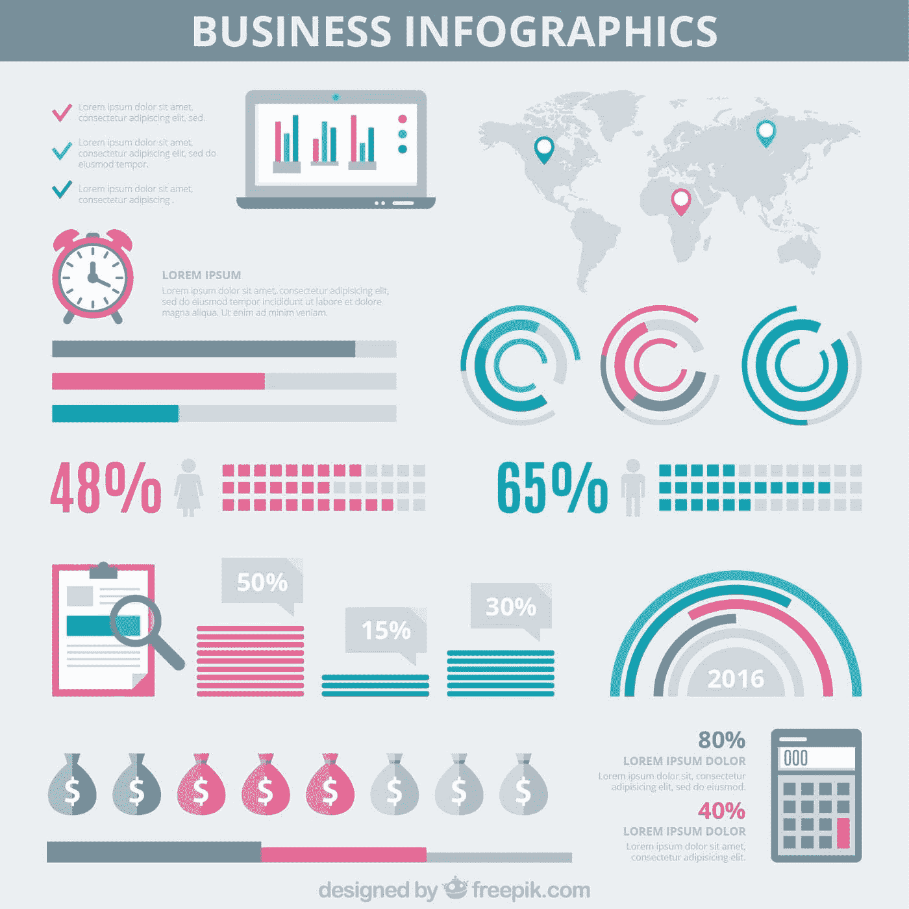

# 为什么机器学习适合你的企业？

> 原文：<https://blog.devgenius.io/why-is-machine-learning-right-for-your-business-df22046cc63c?source=collection_archive---------8----------------------->

## 机器学习是你企业的游戏规则改变者

来源 [FreePik](https://www.freepik.com/free-vector/people-analyzing-growth-charts_12643932.htm#query=business&position=1&from_view=search)

由于机器学习，企业界发生了许多发展。根据描述，这是一个通过预测数据来工作的机器智能领域。企业可以利用这些数据来预测潜在产量。机器的根本目标是自主学习。系统可以在不需要人为干预的情况下改变它们的行为。

企业可以部署机器学习系统来发现当前的市场状态。公司可以在机器学习的帮助下实现普通流程的自动化。机器学习简化了完整的数据分析管道，从而产生更广泛、更繁荣、更快速的见解。

由于部署问题，大多数机器学习系统无法开始运行。将机器学习模型投入生产是一个漫长的过程，需要整个团队的参与。但是机器学习提供了各种选项来克服这个问题，包括 MLOps。

# 什么是 MLOps，它如何帮助部署

MLOps 或机器学习操作是一组旨在有效部署和维护运行中的机器学习模型的过程。它通过增强每个循环的模型来缩短产品生命周期，从而更快地部署值得信赖的见解。

[MLOps](https://www.verta.ai/) 可以改变企业处理大数据并从中受益的方式。这些模型既准确又灵活，而且在较短的时间框架内运行。它还允许团队将更多的精力投入到机器学习模型的科学中。

我们已经从几个方面讨论了为什么机器学习适合您的企业。

# 为什么机器学习适合您的企业

## 改善营销

机器学习适用于数字营销的所有部分，包括:

*   搜索引擎优化
*   社交媒体营销
*   电子邮件营销
*   付费广告
*   内容营销

## 社交媒体营销

机器学习模型可以选择在社交媒体上向观众展示哪些广告。他们从消费者那里收集数据，进行评估，确定他们的兴趣，然后展示与他们相关的广告。这有助于你的企业接触到世界各地的新受众和客户。

机器学习有助于检测社交媒体上的欺诈材料和不良推荐，这两者都会给你的业务带来风险。

## 搜索引擎优化

机器学习可能显著提高谷歌技能的一个最具体的领域是反向链接。此外，机器可以识别页面内容的质量和相关性，并将这些知识纳入计算中。搜索引擎优化中的机器学习也有帮助:

*   简化结构化数据的标记
*   使用 ML 生成新的、未发现的内容建议
*   自动化内容创建过程
*   开发搜索引擎优化友好的文章大纲

智能自动化通过提供有助于加速耗时操作的工具来辅助自动化。自动化流程可以处理广告活动产生的所有流量。通过自动化流程，营销人员可以洞察客户行为和购买体验。

它让公司将数据转化为有意义的信息和见解。这些信息可以在日常商业活动中使用。然后，系统评估市场的当前状态，并对变化做出反应。通过这种方式，机器学习可以帮助企业做出实时的商业决策。

## 内容营销

没有内容，你就无法营销你的业务——内容制作和选择需要数小时的创意和研究。

在这种情况下，机器学习工具可以为你节省大量时间，你可以在其他需要你注意的领域更好地使用这些时间。它可以帮助你提高写作和发表的质量。机器学习技术让人类更容易创造内容。智能手机上的自动纠错功能就是机器学习技术的一个例子。

来源 [FreePik](https://www.freepik.com/free-vector/dashboard-element-collection_6440779.htm?query=business)

## 客户体验

用于关系管理的客户数据收集对企业来说越来越重要。企业可以通过解决客户流失的根本原因来提高客户保持率。公司使用机器学习系统来处理大量的客户数据。您可以从数据中获得客户洞察，从而对未来做出预测。

聊天机器人是提供[客户关怀](https://www.liveagent.com/blog/role-of-machine-learning-in-customer-experience/)的工具。在调查中， [58%](https://www.goboomtown.com/blog/chatbot-statistics-study) 的 B2B 企业使用聊天机器人，相比之下，B2C 网站使用聊天机器人的比例为 42%。如果你经营互联网业务，它们是强制性的。聊天机器人将为客户提供更好的服务，因为它有更多的接触。

聊天机器人是一种使用机器学习来复制人类对话的程序。聊天机器人也被称为“数字助理”，因为它们知道人类的能力。聊天机器人可以解释用户的目的，处理他们的请求，并做出适当的响应。他们可以部署在各种网站和营销活动中。

使用聊天机器人时，你不需要一个人在旁边回答客户。由机器学习驱动的聊天机器人可以高精度地回答问题。这是因为聊天机器人会通过学习来不断改进回答。

在电子商务中，机器学习算法可以鼓励客户购买产品。产品推荐对于成功的商业模式和盈利销售至关重要。推荐系统是基于各种参数引导用户的计算机程序。这些算法预测消费者最有可能购买并感兴趣的商品。

推荐系统通过根据用户给出的信息筛选最重要的信息来处理大量数据。它检测产品之间的潜在模式。通过这种方式，你可以向你的用户提出建议，并提高你的业务销售。

来源 [FreePik](https://www.freepik.com/free-vector/infographic-business-gray-background_949423.htm?query=business)

## 增强安全性和性能

安全漏洞会对您的业务产生严重的负面影响。[百分之六十的小企业会在六个月内破产。您的企业可能会面临其他因素，包括:](https://cybersecurityventures.com/60-percent-of-small-companies-close-within-6-months-of-being-hacked/)

*   滥用私人信息
*   业务中断导致的财务损失
*   从您的网络中移除威胁的高成本

网络安全系统使用机器学习来识别模式。这些系统检测重复攻击，并适应变化的行为。它可以帮助网络安全团队更有效地管理威胁。它可以帮助企业更好地优化利用资源。

企业可以部署机器学习应用程序来识别和应对风险。这些系统可以分析大型数据集，并发现风险活动的模式。使用这些方法可以识别威胁、未发现的恶意软件和违反政策的行为。算法可以识别试图在终端上运行的恶意软件。它根据已知的恶意软件功能和行为检测新的有害文件。

# 最后的想法

机器学习是提高企业绩效最有效的技术。机器学习在处理数据相关问题时起着至关重要的作用。它有助于企业主的日常运营。

机器学习对于将你的机构带到新的高度是必不可少的。任何企业都可以通过包括机器学习来增加销售额和利润。它实现了客户保持、安全性和产品推荐。