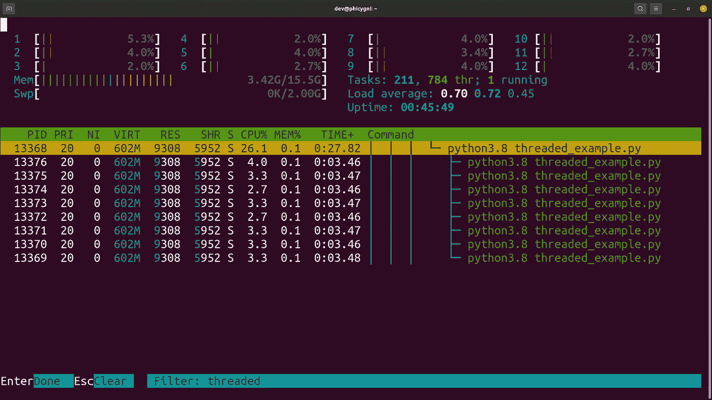
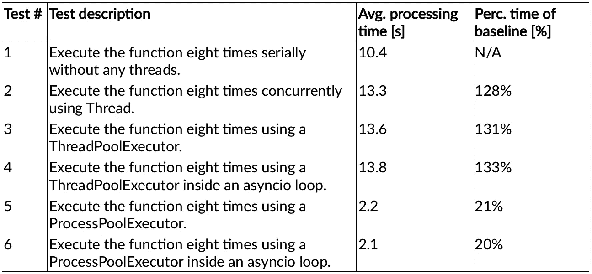

# 多线程 Python 为什么这么慢？

> 原文：<https://blog.devgenius.io/why-is-multi-threaded-python-so-slow-f032757f72dc?source=collection_archive---------2----------------------->

多线程 Python 为什么这么慢？真相和可能的解决方法。

戴维·克洛德在 [Unsplash](https://unsplash.com/s/photos/python?utm_source=unsplash&utm_medium=referral&utm_content=creditCopyText) 上的照片

# TL；速度三角形定位法(dead reckoning)

与人们的预期相反，由于 Python 全局解释器锁(GIL)，当使用多线程来计算纯 CPU 绑定的 Python 代码时，人们不会看到整体处理时间的减少。官方文档解释说，GIL 是阻止线程完全并发执行的瓶颈，导致 CPU 利用率不足[ [1](https://wiki.python.org/moin/GlobalInterpreterLock) ， [2](https://docs.python.org/3/faq/library.html#can-t-we-get-rid-of-the-global-interpreter-lock) ]。

为了有效地使用 CPU，需要避开 GIL，使用[*ProcessPoolExecutor*](https://docs.python.org/3.8/library/concurrent.futures.html#concurrent.futures.ProcessPoolExecutor)或 [*Process*](https://docs.python.org/3.8/library/multiprocessing.html#multiprocessing.Process) 模块 [3](https://docs.python.org/3.8/library/concurrent.futures.html#processpoolexecutor) ， [4](https://docs.python.org/3.8/library/multiprocessing.html#introduction) 。以下代码示例展示了如何使用 *ProcessPoolExecutor* 和 *Process* 模块代替 [*Thread*](https://docs.python.org/3.8/library/threading.html#threading.Thread) 和[*ThreadPoolExecutor*](https://docs.python.org/3.8/library/concurrent.futures.html#concurrent.futures.ThreadPoolExecutor)模块来减少整体处理时间。或者，也可以调用不是用 Python 编写的包，比如 NumPy 或 SciPy，以便更有效地利用 CPU [ [5](https://scipy-cookbook.readthedocs.io/items/ParallelProgramming.html) ]。

# 介绍

当我开始使用 Python 时，经常有人警告我它的多线程太慢了。有人告诉我 Python 本质上是单线程的。受到彻底的警告后，我决定谨慎行事，基本上从不使用 [*线程*](https://docs.python.org/3.8/library/threading.html#module-threading) 包，而是选择使用 [*asyncio*](https://docs.python.org/3.8/library/asyncio.html) 包中的功能，我偶尔会根据需要将它与[*ProcessPoolExecutor*](https://docs.python.org/3.8/library/concurrent.futures.html#concurrent.futures.ProcessPoolExecutor)模块结合使用。因此，Python 多线程速度慢的问题并没有给我带来太大的不便，因为我所需的处理更多地受到 I/O 的限制，这意味着大多数时候我只需要等待外部 I/O，asyncio sleep 非常适合这种情况。

然而最近好奇心战胜了我，我决定自己验证一下多线程 Python 是否真的像我被误导的那样慢。在下面的部分中，我将展示我在查阅官方文档和做一些我自己的测试后的发现。

# Python 真的是单线程吗？

首先，我想确定 Python 是否能够产生线程。因此，我准备了一个非常简单的 Python 多线程测试用例，以便在多核 CPU 上执行。代码被执行，任务管理器被监控以查看父进程是否产生了任何可被操作系统识别的线程。测试显示进程产生的线程肯定存在。下面是任务管理器输出的屏幕截图。因此，很明显 Python 确实具有多线程能力。

*显示 Python 进程及其线程的任务管理器。*

# 关于多线程，官方文档是怎么说的？

多处理包的文档页面声明:“*多处理包提供了本地和远程并发，通过使用子进程而不是线程有效地避开了全局解释器锁。因此，多处理模块允许程序员在一台给定的机器上充分利用多个处理器。* " [ [4](https://docs.python.org/3.8/library/multiprocessing.html#introduction)

此外，下面是关于 FAQ 页面上的 GIL 的内容:“*这并不意味着您不能在多 CPU 机器上很好地使用 Python！你只需要创造性地将工作分成多个进程，而不是多个线程。新的 concurrent.futures 模块中的 ProcessPoolExecutor 类提供了一种简单的方法……*"[[2](https://docs.python.org/3/faq/library.html#can-t-we-get-rid-of-the-global-interpreter-lock)]

众所周知，Python 社区的成员有时会指出他们对多线程 Python 代码的明显性能不佳感到沮丧。Juergen Brendel 在给吉多·范·罗苏姆(Python 的创始人)的一封公开信中写道:“*对于那些不熟悉这个问题的人来说:GIL 是 Python 解释器中的一个锁，它有效地防止了多线程被并行执行，即使是在多核或多 CPU 系统上！* " [ [6](https://www.snaplogic.com/blog/an-open-letter-to-guido-van-rossum-mr-rossum-tear-down-that-gil) ]

因此，毫无疑问，由于 GIL，多线程 Python 无法以最佳方式利用多核 CPU。文档建议使用过程来代替。

# 一系列测试

为了独立验证文档中关于最佳并发性的建议，我们准备了一系列测试来进行评估。所有测试都用纯 Python 编写，执行相同的 CPU 绑定代码，但使用不同的并发策略。这些测试是:

*   测试 1:在没有任何线程或并发方式的情况下，连续执行一个函数八次。这是基线测试。
*   测试 2:使用模块*线程*同时执行一个函数八次。
*   测试 3:使用模块 *ThreadPoolExecutor* 执行一个函数八次。
*   测试 4:在 asyncio 循环中使用模块 *ThreadPoolExecutor* 执行一个函数八次。
*   测试 5:使用模块 *ProcessPoolExecutor* 执行一个函数八次。
*   测试 6:在 asyncio 循环中使用模块 *ProcessPoolExecutor* 执行一个函数八次。

每个测试重复十次，记录平均总处理时间用于比较。测试源代码可通过[Github repo](https://github.com/PhiCygni/is-multi-threaded-python-slow)获得。

# 测试 1:完全串行执行

# 测试 2:使用线程模块

# 测试 3:使用 ThreadPoolExecutor 模块

# 测试 4:在 asyncio 循环中使用 ThreadPoolExecutor

# 测试 5:使用 ProcessPoolExecutor 模块

# 测试 6:在 asyncio 循环中使用 ProcessPoolExecutor

# 试验结果

测试结果显示，与多进程代码甚至串行执行相比，多线程代码确实要慢得多。令人惊讶的是，完全没有并发性的基线测试胜过了所有的线程测试。

测试结果还显示，如文档中所述，与线程解决方案相比，使用进程将提供更好的 CPU 利用率。使用流程后，总体处理时间大大减少，这一点显而易见。

测试结果显示了每种并发方法的平均总处理时间。

# 结论

利用 Python [*线程*](https://docs.python.org/3.8/library/threading.html#threading.Thread) 或[*ThreadPoolExecutor*](https://docs.python.org/3.8/library/concurrent.futures.html#concurrent.futures.ThreadPoolExecutor)模块运行纯 CPU 绑定代码不会导致真正的并发执行。事实上，非线程化的完全序列化设计将优于线程化设计。这是因为 Python GIL 是阻止线程完全并发运行的瓶颈。通过使用[*ProcessPoolExecutor*](https://docs.python.org/3.8/library/concurrent.futures.html#concurrent.futures.ProcessPoolExecutor)或 [*Process*](https://docs.python.org/3.8/library/multiprocessing.html#multiprocessing.Process) 模块，可以实现最佳的 CPU 利用率，这些模块可以避开 GIL，使代码更加并发地运行。

# 参考

[1][https://wiki.python.org/moin/GlobalInterpreterLock](https://wiki.python.org/moin/GlobalInterpreterLock)

[2][https://docs . python . org/3/FAQ/library . html # can-t-we-get-rid-of-the-global-interpreter-lock](https://docs.python.org/3/faq/library.html#can-t-we-get-rid-of-the-global-interpreter-lock)

[3]h[ttps://docs . python . org/3.8/library/concurrent . futures . html # processpoolexecutor](https://docs.python.org/3.8/library/concurrent.futures.html#processpoolexecutor)

[4][https://docs . python . org/3.8/library/multi processing . html #简介](https://docs.python.org/3.8/library/multiprocessing.html#introduction)

[5][https://scipy-cookbook . readthedocs . io/items/parallel programming . html](https://scipy-cookbook.readthedocs.io/items/ParallelProgramming.html)

[6][https://www . snap logic . com/blog/an-open-letter-to-Guido-van-rossum-Mr-rossum-tear-down-that-Gil](https://www.snaplogic.com/blog/an-open-letter-to-guido-van-rossum-mr-rossum-tear-down-that-gil)